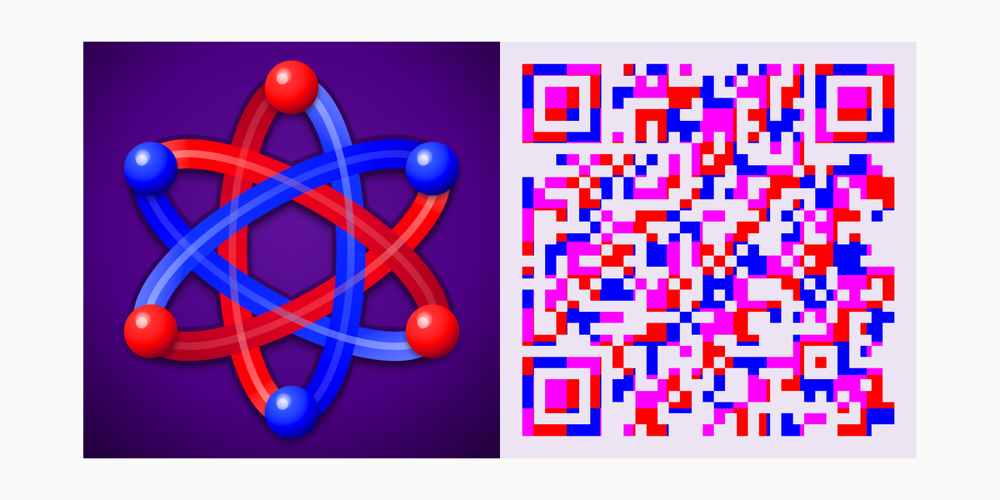

# About the Webapp

The webapp makes the Architrino Assembly Architecture straightforward to explore by presenting it as a connected body of scenes, prose, visualizations, and specialized tools rather than a flat pile of documents. A reader can move through the architecture spatially, open the explanation when needed, and return to the surrounding conceptual neighborhood. This orientation explains the supported content and interactions and the runtime model that joins them; it presents the reader-facing system rather than its development history.

The adjacent guides are:

- [navigation-and-controls.md](navigation-and-controls.md)
- [software-architecture-and-maintenance.md](software-architecture-and-maintenance.md)
- [comparative-glossary.md](comparative-glossary.md)
- [github-presence-and-community.md](github-presence-and-community.md)
- [Coincident-Midpoint Three-Axis Circular Lorentz Geometry Guide](ideal-braid-guide.md)
- [photon-guide.md](photon-guide.md)
- [research-notebook.md](research-notebook.md)

## What the Webapp Is

`architrino.com` is an interactive 3D knowledge graph for the Architrino Assembly Architecture. It combines scene-based navigation, long-form markdown reading, generated document views, and specialized tools and apps inside one reader-facing environment.

The webapp is not merely a document repository with visual decoration. Its central design claim is that conceptual structure should be navigable spatially as well as readable textually.

## Open Architrino

Scan the QR code to open [architrino.com](https://www.architrino.com).

## Primary Content Layers

The current webapp brings together several content layers.

### Scene-based navigation

The main interface presents knowledge branches as scenes composed of spheres and child scene links. This provides the primary traversal model for moving through the corpus.

### Markdown reading surfaces

Much of the explanatory and reference content is authored in markdown. Depending on scene type, the reader may encounter:

- a full document view,
- a section view into one document,
- a split view derived from one heading layer,
- a bounded tree view derived from a local document hierarchy.

The Archie branch also includes reader-facing reference documents that explain the app and its editorial frame from within the corpus itself. Those documents include the scene taxonomy, file-structure and style guides, comparative terminology aids, public GitHub/community guidance, and the research notebook that records major project inflection points.

### Specialized tools and overlays

The webapp also includes non-document surfaces where interaction is primary.

The authored application scene rooted at `content/scenes/archie/applications.json` is the source of truth. It presents the current tools together in this deliberate reader-facing sequence: Animator; It’s Greek to Me!; Molecule Visualization; Periodic Table; Hyde Periodic Table; Atom; Standard Model; Causal Delay Feedback; Borg; Wake Topography; Lorentz Geometry; Lattice Lab; Photon and Polarization Visualization; and Equation Mapping. Borg starts and inspects EOM runs, while Animator authors visual scenes and replays accepted recorded EOM output.

These include display-only lessons, diagnostic workbenches, content-navigation surfaces, and application-specific runtimes. Inclusion in the index is not an evidence or proof grade.

AAA Core is not part of this reader-facing hierarchy. It is the shared headless application platform used through versioned service contracts; it has no public scene, launch control, or browser interface of its own. Applications may expose Core-backed capabilities inside their own bounded user experiences, but they do not treat a Core interface as a product surface.

## Information Architecture Claim

The webapp uses scenes rather than directories as the reader-facing hierarchy and network.

That means:

- scene relationships define navigable branch structure,
- markdown supplies conceptual content,
- generated manifests supply fast runtime lookup,
- filesystem layout supports maintenance rather than public ontology.

This separation makes the system more stable under editorial growth and reorganization.

## Runtime Content Contract

Runtime routing is manifest-driven.

Important generated artifacts include:

- `content/scenes/scenes_index.json`
- `content/markdown/markdown_index.json`
- `content/graph/scene_graph.json`

These generated files support runtime discovery, search, and graph-level linking without requiring the app to infer structure by walking directories at load time.

Additional runtime routes are generated into the graph manifest where needed, including periodic-grid and element-legend targets.

## Reader Experience

From the reader's standpoint, the webapp supports two complementary modes of understanding.

### Spatial understanding

A reader can move through branches, sub-branches, and neighboring topics by traversing scenes. This supports orientation, comparison, and topological understanding of the corpus.

### Documentary understanding

A reader can open notes and read sustained prose, formal derivations, taxonomies, and reference material in a conventional document mode.

The point is not to replace documents with graphics. It is to combine navigable structure with durable reading surfaces.

## Technologies in Use

The current webapp stack includes:

- Three.js for WebGL rendering and CSS2D overlays,
- KaTeX for TeX and LaTeX rendering,
- `markdown-it` for markdown parsing and rendering,
- Mermaid for rendering diagrams authored in fenced Mermaid blocks,
- PubChem PUG REST for molecule formula lookup, compound names, CIDs, and SDF structure retrieval in session molecule workflows.
- local PDG-oriented Python tooling for curated reaction-data ingestion and generated review artifacts.

These technologies matter operationally because they shape what kinds of scenes, mathematical notation, and document behaviors the runtime can support directly.

## Current Scope

The environment is active and still evolving. Content depth and scene bindings vary, supporting Archie references and presentation types are not uniform, and some material or applications remain incomplete.

The governing architecture, however, is already clear: scenes organize the reader-facing graph, markdown carries the long-form content, and generated manifests stabilize runtime access.

## What This Document Is Not

This orientation does not replace:

- a style guide,
- a scene taxonomy specification,
- a navigation instruction sheet,
- or a complete development architecture document.

Those functions belong to adjacent Archie documents with narrower purposes.

## Contact

For a reproducible public webapp problem, use the [privacy-safe feedback page](../../../../feedback.html). It creates a visible browser, device, and public-manifest summary locally before opening the public GitHub issue form. For other project contact, use [architrino@gmail.com](mailto:architrino@gmail.com).
