# Comics

These comics are small public explanations of the project standard. They turn recurring lessons about claims, evidence, history, observation, and public critique into visual jokes that still preserve the serious point.

[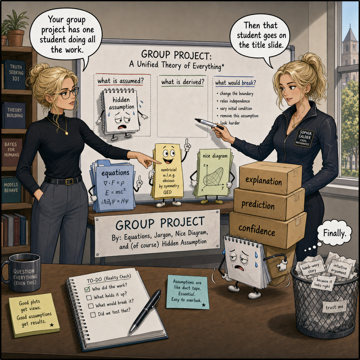](../../../assets/images/comics/group-project-assumption.png)

[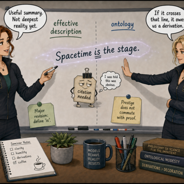](../../../assets/images/comics/citation-needed.png)

[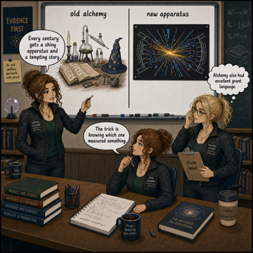](../../../assets/images/comics/old-alchemy-new-apparatus.png)

[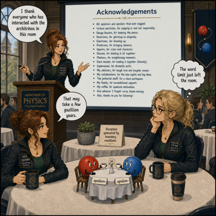](../../../assets/images/comics/acknowledgements-in-architrinos-room.png)

[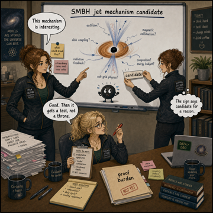](../../../assets/images/comics/candidate-not-a-throne.png)

[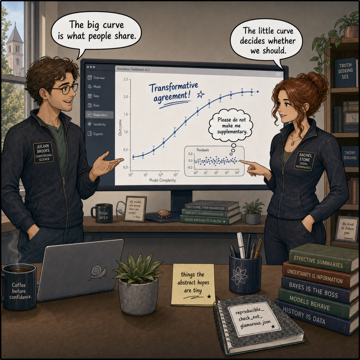](../../../assets/images/comics/show-the-residuals.png)

[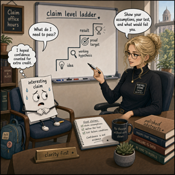](../../../assets/images/comics/office-hours-for-a-claim.png)

[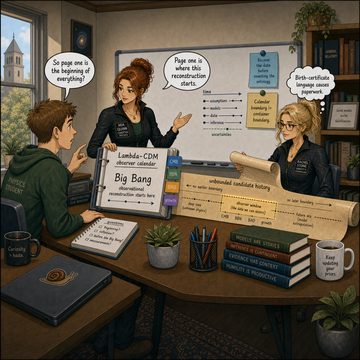](../../../assets/images/comics/first-page-is-not-the-beginning.png)

[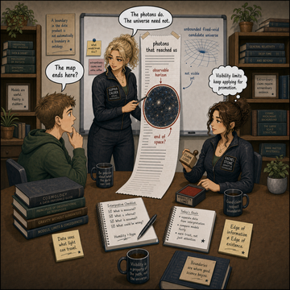](../../../assets/images/comics/observable-edge-receipt.png)

[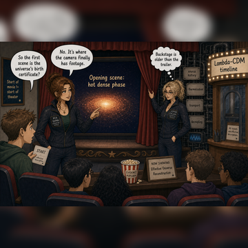](../../../assets/images/comics/first-footage-not-birth-certificate.png)

[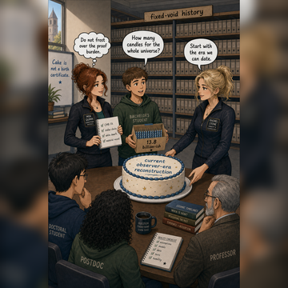](../../../assets/images/comics/birthday-cake-for-observer-era.png)

