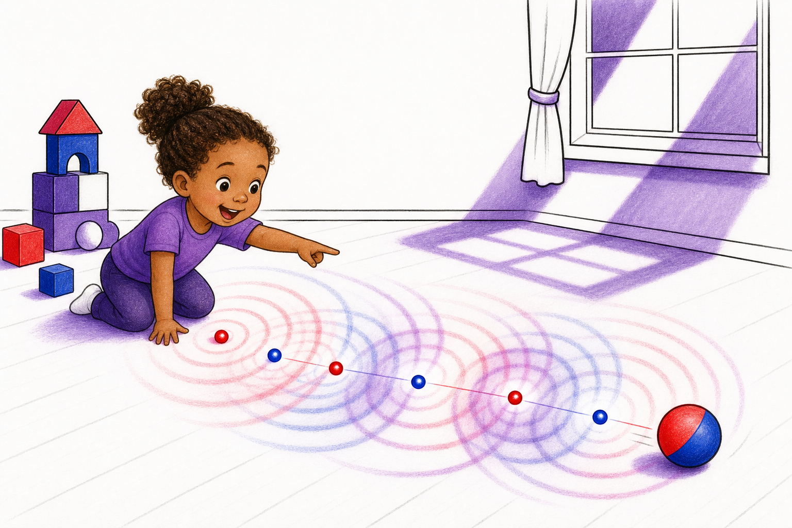
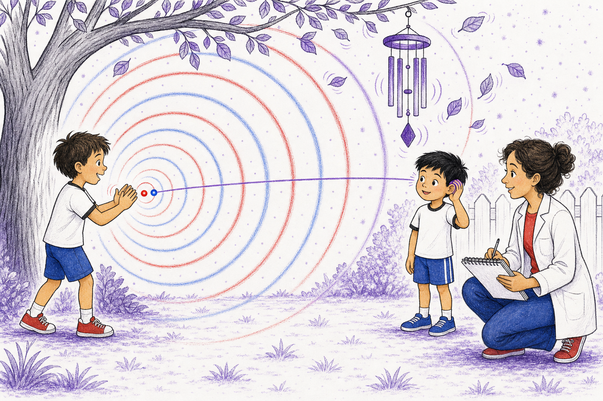
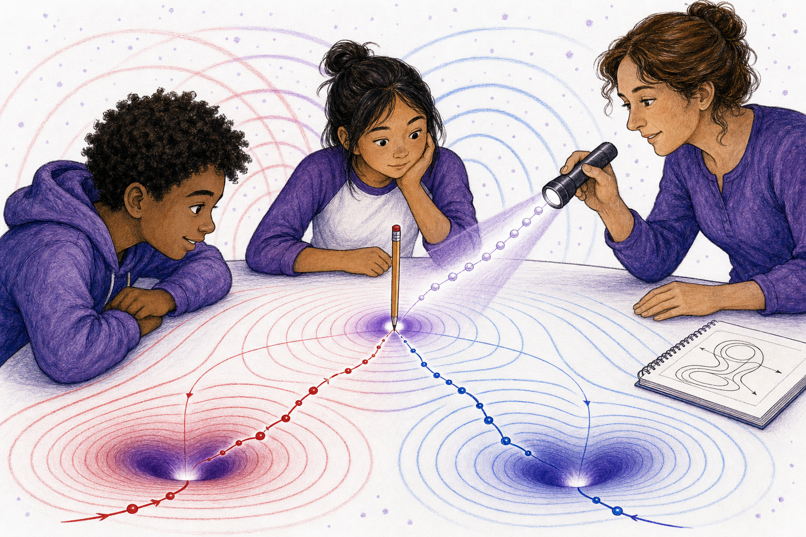

# Approved Visual Exemplars

This page records approved image examples for the $\mathbb{A}\mathbb{A}\mathbb{A}$ children's book series. These examples should guide future prompts, revisions, and production art direction.

Status: approved as style direction for further progress.

## Exemplar Set 1: Natural People, Restricted Physics Palette

Approved qualities:

- children and caregivers have natural skin tones and hair tones;
- the people feel like children worldwide in informal play, not symbolic avatars;
- non-human scenery stays close to white, black, red, blue, and purple;
- red and blue carry polarity and wake meaning;
- purple carries overlap, balance, basins, and medium depth;
- white space keeps the page readable;
- black linework carries expression, boundary, and text-readiness;
- AAA geometry is integrated into the scene rather than isolated as a detached diagram.

Production warning:

These images are exemplars, not final book plates. Later production should preserve their visual logic while tightening any accidental red/blue clothing competition, excess naturalistic environmental color, or geometry that becomes decorative instead of explanatory.

## Nature Remembers Motion

Why it works:

- path-history is visible as alternating red/blue source-position marks;
- wake rings expand from earlier positions, not only from the current ball;
- purple overlap appears where histories intersect;
- the child's natural skin and hair keep the scene warm without weakening the physics palette;
- the room is simple enough for ages 3-5.

Use this as the exemplar for:

- early-childhood motion trails;
- large white space;
- simple visual explanation before terminology.

## The Message That Traveled

Why it works:

- the clap has a clear earlier source point;
- red and blue wake rings travel outward across the page;
- the purple line of action connects the source history to the receiver;
- Noether sea specks are present but quiet;
- the family science scene remains playful and informal.

Use this as the exemplar for:

- causal wake travel;
- source-to-receiver direction;
- child-facing propagation delay.

## The Tiny Transceivers

Why it works:

- red and blue architrino points stay visually distinct;
- multiple wake paths and arrows make superposition readable;
- the central purple-white receiver region communicates combined influence and balance;
- tabletop play grounds the abstraction in a child activity;
- the children are globally representative without assigning polarity meaning to identity.

Use this as the exemplar for:

- polarity;
- line of action;
- superposition;
- 9-11 age-band complexity.

## The Balance Point

Why it works:

- the central threshold is visible as a pencil point inside a purple balance region;
- red and blue basin pathways diverge into different stable regions;
- measurement interaction is shown through the flashlight nudge;
- Noether sea specks sit quietly in the background;
- the image feels more mature while retaining the same palette grammar.

Use this as the exemplar for:

- threshold behavior;
- deterministic multistability;
- basin of attraction diagrams;
- measurement interaction for ages 12-14.

## Exemplar Prompt Addendum

Future prompts should include the style-guide palette rule and this production phrase:

> Match the approved children's-book exemplar style: natural human skin and hair, informal global children-at-play energy, white paper space, black expressive linework, red/blue/purple AAA geometry integrated into the scene, and no non-human colors outside the restricted palette.

If a future image departs from these exemplars, revise the prompt by naming the specific failure:

- too much ordinary full-color scenery;
- clothing competing with polarity colors;
- wake arcs centered on the wrong present-time object;
- no visible earlier source positions;
- Noether sea too noisy;
- geometry floating as decoration rather than teaching the page lesson.
