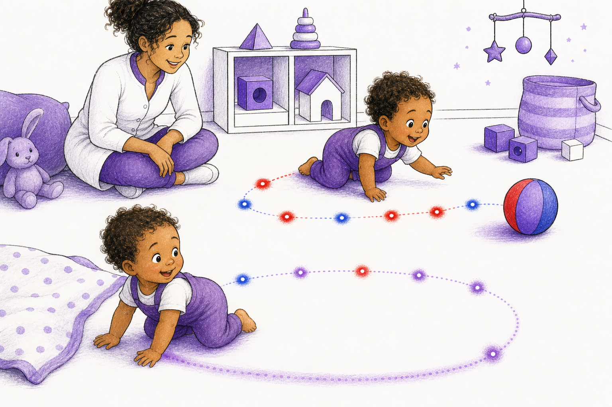

# Here, There, Back

Age band: baby-toddler

Format: board-book foundation, 8 story spreads plus parent note

Core concept: presence and path come before words. A child can feel here, there, away, back, and again before learning formal physics.

## Book Promise

This book teaches three pre-verbal lessons:

1. I am here.
2. I can go there and come back.
3. Motion leaves a felt route.

The parent/teacher layer should use the canonical terms `presence`, `position`, `path`, `return path`, and `path-history`. The read-aloud layer should use very small words: here, there, go, back, again.

## Art Bible

Use case: illustration-story, scientific-educational.

Style: single continuous board-book scenes, warm natural child and caregiver, white page space, black expressive linework, purple shadows, and faint red/blue/purple motion marks.

Recurring characters:

- **Little One:** a curious toddler with natural skin and hair, in white and purple play clothes.
- **Caregiver:** a calm adult nearby, present for safety and warmth but not the physics meaning.

Recurring geometry:

- path appears as soft dotted floor traces;
- earlier positions appear as tiny red/blue/purple marks with no verbal explanation;
- return appears as a gentle purple curve;
- no formal arrows, labels, equations, or in-image text.

Image-generation rule: every prompt inherits the style-guide palette rule. Use only pure red, pure blue, red-blue purples, white, and black for non-human visual systems and $\mathbb{A}\mathbb{A}\mathbb{A}$ geometry. Keep scenery, clothing, and tools in white/purple/black unless a red or blue mark is explicitly part of the physics geometry. Human skin and hair may use natural tones. Do not include book text, captions, labels, equations, watermarks, or logos inside the illustration.

## Page Plan

### Cover

Pilot generated asset:

Read-aloud title:

> Here, There, Back

Lesson:

Presence and return can be felt before they are explained.

$\mathbb{A}\mathbb{A}\mathbb{A}$ geometry:

A simple dotted path runs from blanket to ball and bends back toward the blanket.

Background concepts:

Faint red/blue/purple marks prepare later path-history without naming it.

Illustration prompt:

> Single continuous white playroom scene. Little One crawls near a blanket toward a red-blue-purple ball while a caregiver watches nearby. A soft dotted path on the floor shows here, there, and back again with faint red/blue/purple marks. Natural human skin and hair, white and purple clothing, black linework, no arrows, no labels, no in-image text.

### Spread 1: Here

Read-aloud text:

> Here is Little One.
>
> Here are two hands.

Lesson:

Introduce presence: a child is somewhere.

$\mathbb{A}\mathbb{A}\mathbb{A}$ geometry:

A tiny white glow under the child marks position without becoming a diagram.

Background concepts:

The blanket edge gives a stable reference place.

Illustration prompt:

> Little One sits on a white blanket with purple trim, looking at their hands. A tiny white-purple glow marks the place on the blanket. One continuous scene, natural skin and hair, restricted non-human palette, no labels, no text.

### Spread 2: There

Read-aloud text:

> There is the ball.
>
> Little One sees it.

Lesson:

Introduce there as a reachable place distinct from here.

$\mathbb{A}\mathbb{A}\mathbb{A}$ geometry:

The ball has a faint purple halo; no path line yet.

Background concepts:

The space between child and ball stays open and readable.

Illustration prompt:

> Little One looks across the white floor toward a red-blue-purple ball. The ball has a soft purple halo. Caregiver sits far behind, secondary. One continuous scene, no arrows, no labels, no text.

### Spread 3: Go

Read-aloud text:

> Little One goes.
>
> Hands, knees, go.

Lesson:

Motion begins as ordered body movement.

$\mathbb{A}\mathbb{A}\mathbb{A}$ geometry:

Three faint purple dots appear behind the knees and hands as the first path marks.

Background concepts:

The marks are nonverbal and tactile, not technical.

Illustration prompt:

> Little One crawls from the blanket toward the ball. Behind the hands and knees, three soft purple floor dots mark earlier places. White playroom, purple shadows, natural skin and hair, no arrows, no text.

### Spread 4: Trail

Read-aloud text:

> The ball rolls.
>
> The floor remembers.

Lesson:

Motion leaves a visible trace.

$\mathbb{A}\mathbb{A}\mathbb{A}$ geometry:

The ball leaves a simple dotted red-blue-purple trail.

Background concepts:

The child points to the trail, not to a label.

Illustration prompt:

> A red-blue-purple ball has rolled a short distance across the white floor. A dotted trail of tiny red, blue, and purple marks follows it. Little One points with delight. One continuous scene, no labels, no text.

### Spread 5: There

Read-aloud text:

> Little One gets there.
>
> Hand on ball.

Lesson:

A path can end at a new position.

$\mathbb{A}\mathbb{A}\mathbb{A}$ geometry:

The trail connects the blanket area to the ball area.

Background concepts:

A faint white glint marks the new contact point.

Illustration prompt:

> Little One reaches the ball and touches it. A soft dotted path connects the blanket to the ball. A white-purple glint marks the contact point. Natural skin and hair, white/purple room, no labels, no text.

### Spread 6: Turn

Read-aloud text:

> Little One turns.
>
> The path turns too.

Lesson:

Return begins when motion changes direction.

$\mathbb{A}\mathbb{A}\mathbb{A}$ geometry:

The dotted path curves gently back toward the blanket, without arrows.

Background concepts:

Turning is shown by body posture and path curvature.

Illustration prompt:

> Little One turns the body back toward the blanket while still near the ball. The floor path curves smoothly, made only of dots and soft rings, with no arrowheads. One continuous scene, no labels, no text.

### Spread 7: Back

Read-aloud text:

> Back to the blanket.
>
> Back to here.

Lesson:

An earlier place can be revisited.

$\mathbb{A}\mathbb{A}\mathbb{A}$ geometry:

The return path overlaps the first path in pale purple.

Background concepts:

Overlap begins the idea that a path can carry memory.

Illustration prompt:

> Little One crawls back onto the blanket. The returning dotted path overlaps the first path, making a soft purple overlap region. Caregiver smiles nearby. No arrows, no labels, no text.

### Spread 8: Again

Read-aloud text:

> Here.
>
> There.
>
> Back again.

Lesson:

Repeated motion makes a rhythm.

$\mathbb{A}\mathbb{A}\mathbb{A}$ geometry:

Two gentle path loops are visible, one faint, one fresh.

Background concepts:

The room is not a diagram, but the path pattern is readable.

Illustration prompt:

> Little One and caregiver sit by the blanket with the ball nearby. Two gentle dotted floor loops show here, there, back again, one faint and one fresh. White space, purple shadows, natural skin and hair, no labels, no text.

## Parent Note

### What The Child Just Felt

This book prepares later $\mathbb{A}\mathbb{A}\mathbb{A}$ language without naming it. The child has seen:

- a body has a place;
- motion makes an ordered path;
- a path can turn and return;
- repeated motion can leave a pattern.

### Activity

Roll a soft ball away from a blanket. Let the child crawl or walk after it. Say only:

> Here.
>
> There.
>
> Back.
>
> Again.

### Image Prompt Reuse Notes

For production, keep every page as one continuous illustration. Show past motion with dots, curves, and gentle rings, not duplicate children or diagram panels.
