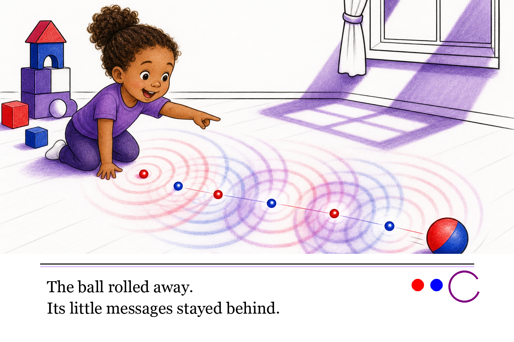
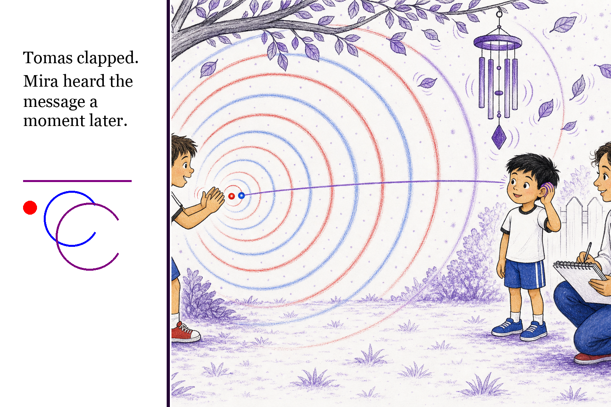
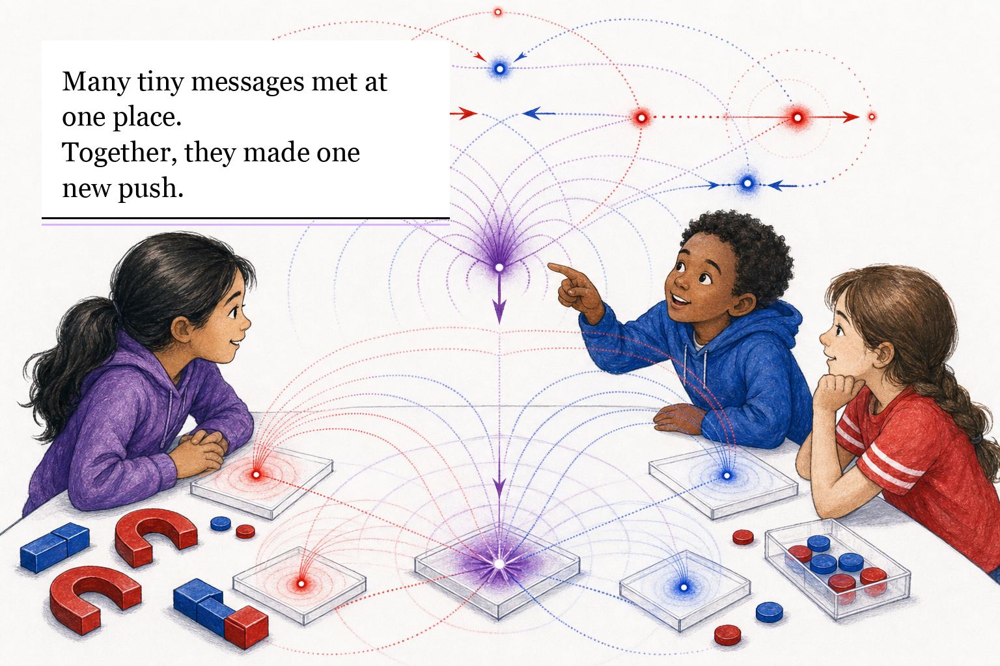

# Text Layout Proposals

This note proposes where and how story text should appear in the $\mathbb{A}\mathbb{A}\mathbb{A}$ children's book series.

Core rule:

> Story text belongs to the layout layer, not inside generated artwork.

The image-generation prompts should continue to say `No in-image text, captions, labels, equations, watermark, or logo.` Text should be added afterward in a deterministic book-layout step so spelling, readability, accessibility, and translation remain controllable.

## Text Color Decision

Default:

- black text on white.

Special cases:

- white text on deep purple or black for title pages, night pages, threshold pages, or deliberate reverse-type moments.

Do not use red, blue, or purple for normal body text. Those colors are reserved for AAA geometry: polarity, causal wakes, overlap, balance, Noether sea, assemblies, and basin structure.

## Typography Direction

Use large, open, print-friendly text:

- ages 3-8: large read-aloud type, one or two short sentences per spread;
- ages 9-14: still generous type, but allow two to four sentences if the art is not crowded;
- adult back matter: smaller type is acceptable, but keep black on white.

Body text should feel literary and warm, not technical. Geometry terms can appear in adult notes and glossaries, but child-facing pages should not need labels inside the art.

## Proposal A: Bottom Read-Aloud Band

Best for:

- ages 3-8;
- short read-aloud lines;
- pages where the artwork has strong action across the middle;
- keeping text predictable for early readers.

Why it works:

- the text never competes with faces or AAA geometry;
- the white band gives high contrast;
- the art can remain immersive above the text;
- small red/blue/purple swatches may sit beside the text as decorative continuity, not labels.

Production guidance:

- reserve roughly the bottom 20-25 percent of the page for text;
- keep the band white;
- use black text;
- add a thin black rule and optional pale-purple rule to connect the band to the visual system;
- do not place crucial causal wakes or source-position dots under the band.

## Proposal B: Left Text Rail

Best for:

- explanation spreads;
- causal travel scenes where the action moves left-to-right;
- pages where the image can be composed with one side intentionally quiet.

Why it works:

- the rail creates a stable reading start;
- the geometry can unfold across the remaining page;
- the purple boundary line keeps the rail part of the book's visual grammar.

Production caveat:

This should not be made by cropping a finished illustration unless the crop was planned. In the mockup, the left source child is partly cropped. For final art, compose the image with a deliberate text rail from the start.

Production guidance:

- reserve 25-30 percent of the spread width for the rail;
- use black text on white;
- put optional small geometry motifs below the text, never essential explanation;
- keep active wakes, faces, and receiver moments outside the rail.

## Proposal C: Quiet-Corner Text Block

Best for:

- ages 9-14;
- pages with rich central geometry;
- spreads where the illustration naturally leaves a quiet sky, wall, page, or tabletop region.

Why it works:

- it keeps the text close to the relevant visual moment;
- it allows more flexible compositions than a fixed bottom band;
- the hard white paper block preserves readability.

Production caveat:

The block must sit in intentionally reserved quiet space. It should not cover the page's primary geometry lesson, source-position marks, faces, or line of action.

Production guidance:

- use a clean white rectangle or reserved blank area, not translucent haze;
- use black text;
- anchor with a thin black rule and optional pale-purple rule;
- do not use rounded card styling;
- keep the text block visually simple.

## Proposal D: Reverse Band

Best for:

- night pages;
- title pages;
- threshold or high-drama moments;
- older age bands where a darker value feels appropriate.

Why it works:

- white text on deep purple is readable and still palette-compliant;
- the reverse band can mark a tonal shift;
- red/blue/white dots can show polarity/neutral continuity without becoming body text.

Production caveat:

Use reverse text sparingly. It is powerful, but too much dark banding will make the series feel heavier than the child-facing subject requires.

Production guidance:

- reserve roughly the bottom 20 percent of the page;
- use deep purple, not pure black, unless the page is explicitly a night page;
- use white text;
- make sure the artwork is composed so no essential basin, wake, or face is hidden under the band.

## Recommended Default By Age

| Age band | Default text placement | Secondary placement |
| --- | --- | --- |
| 3-5 | Bottom read-aloud band | Full white facing page for very simple board-book moments. |
| 6-8 | Bottom read-aloud band | Left text rail for travel/direction lessons. |
| 9-11 | Left text rail | Quiet-corner block for science-story spreads. |
| 12-14 | Quiet-corner block | Reverse band for threshold or measurement moments. |
| 15-18 | Side rail or full facing text page | Diagram caption blocks in black on white. |

## Production Recommendation

Use **Proposal A** as the default for the first picture book, [The Message That Traveled](the-message-that-traveled.md). It is the most robust for read-aloud pacing and the least likely to interfere with causal wake geometry.

Use **Proposal B** when directionality is the lesson and the art can be composed with a rail from the start.

Use **Proposal C** for older or richer spreads.

Use **Proposal D** only when the page needs a darker emotional or conceptual beat.
