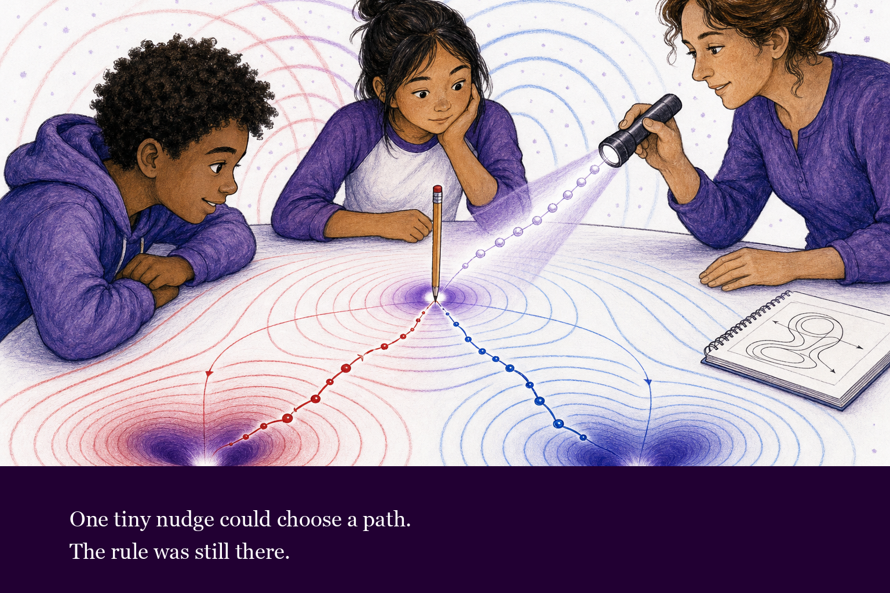
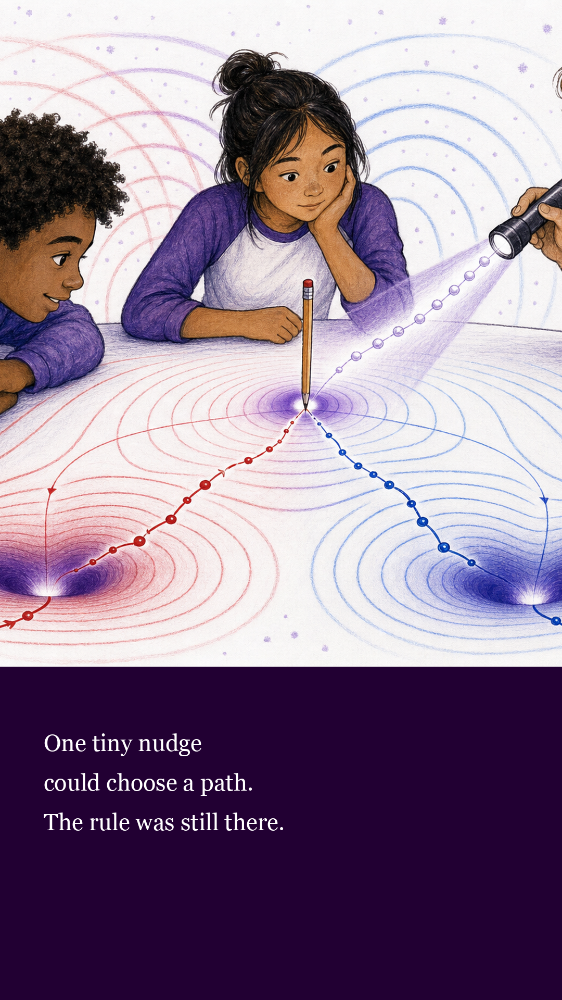
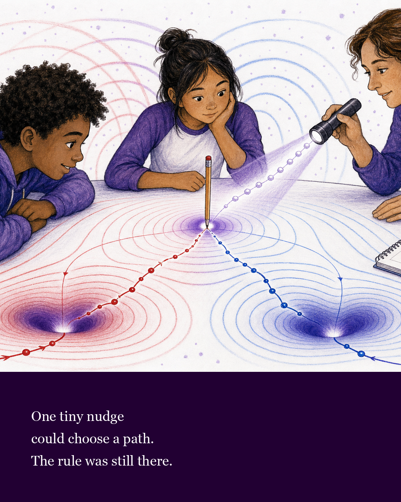

# Reverse Band Text Layout

This note records the selected story-text placement for the $\mathbb{A}\mathbb{A}\mathbb{A}$ children's book series.

Core rule:

> Story text belongs to the layout layer, not inside generated artwork.

The image-generation prompts should continue to say `No in-image text, captions, labels, equations, watermark, or logo.` Text should be added afterward in a deterministic book-layout step so spelling, readability, accessibility, and translation remain controllable.

## Text Color Decision

Selected story-page default:

- white text on a deep purple reverse band.

Supporting use:

- black text on white for adult notes, back matter, production notes, and documentation pages.

Do not use red, blue, or bright purple for story text. Those colors are reserved for $\mathbb{A}\mathbb{A}\mathbb{A}$ geometry: polarity, causal wakes, overlap, balance, Noether sea, assemblies, and basin structure.

## Typography Direction

Use large, open, print-friendly text:

- ages 3-8: large read-aloud type, one or two short sentences per spread;
- ages 9-14: still generous type, but allow two to four sentences if the art is not crowded;
- adult back matter: smaller type is acceptable, but keep black on white.

Body text should feel literary and warm, not technical. Geometry terms can appear in adult notes and glossaries, but child-facing pages should not need labels inside the art.

## Selected Layout: Reverse Band

Best for:

- story pages across the series;
- title pages;
- social-media preview crops;
- threshold, night, and high-drama moments.

Why it works:

- white text on deep purple is readable and still palette-compliant;
- the reverse band can mark a tonal shift;
- the clean band avoids competing with $\mathbb{A}\mathbb{A}\mathbb{A}$ geometry in the artwork.

Production requirement:

The artwork must be composed with the reverse band in mind. Do not hide essential basin structure, causal wakes, source-position marks, line of action, faces, or hands under the band.

Production guidance:

- reserve roughly the bottom 20-25 percent of the page or spread;
- use deep purple, not pure black, unless the page is explicitly a night page;
- use white text;
- do not add horizontal rules inside the text band;
- do not add decorative red/blue/white dots inside the text band;
- keep story text about 20 percent smaller than the first reverse-band mockups;
- use black-on-white only outside child-facing story pages.

## Primary Short-Video Version

Recommended format:

- 9:16 portrait;
- 1080 x 1920 px;
- primary target for YouTube Shorts, TikTok, Instagram Reels, and Instagram Stories;
- artwork in the upper region;
- reverse text band in the lower region;
- story text lifted within the band so platform captions and bottom controls are less likely to cover it;
- keep the right edge relatively quiet because short-video interfaces often place action buttons there.

This should be the default export for short-video-first outreach. If a short is animated later, use the same safe-zone structure: moving art above, reverse text band below, no essential geometry at the extreme bottom or far right.

## Feed Portrait Version

Recommended format:

- 4:5 portrait;
- 1080 x 1350 px for social feeds;
- story text uses the same font size as the landscape reverse-band example;
- artwork in the upper region;
- reverse text band in the bottom region;
- generous safe margins for mobile cropping.

The feed portrait version should be used for Instagram feed posts, Threads feed posts, preview cards, campaign graphics, and series announcements. It should not replace print-book page layout.

TikTok, Instagram Reels, Instagram Stories, and other full-screen vertical placements should receive a separate 9:16 export, typically 1080 x 1920 px, with the art and reverse band recomposed for that taller frame.
