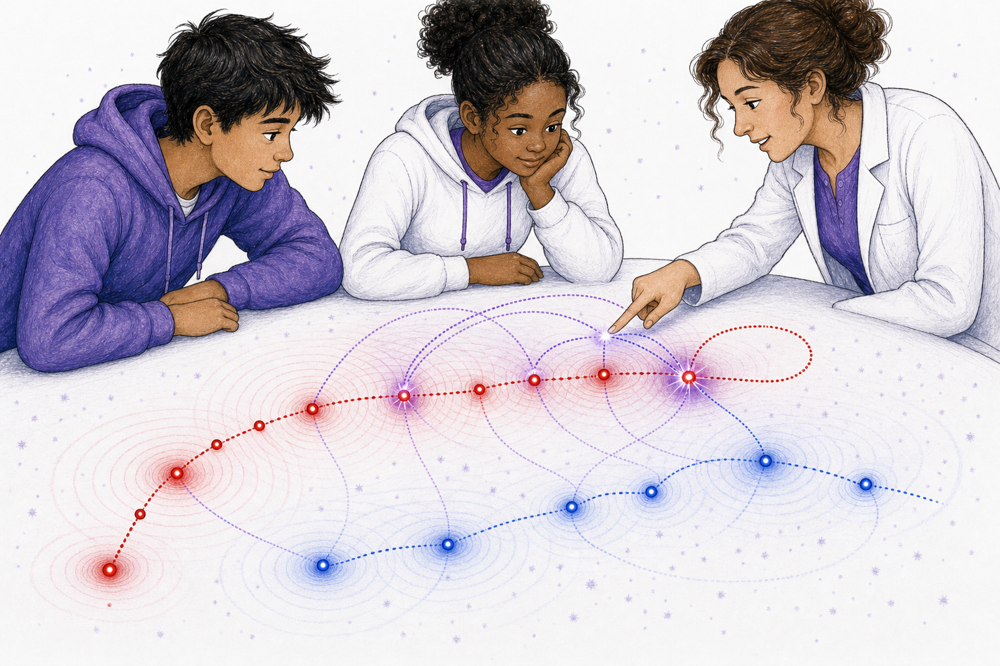

# The History That Pushes Now

Age band: 15-16

Format: illustrated simulator story, 20 story spreads plus back matter

Core concept: present motion is not computed from the visible present alone. Finite field speed and admissible path-history determine which earlier emissions can arrive and act now.

## Book Promise

This book teaches three lessons:

1. Present motion depends on admissible path-history.
2. Finite field speed selects which past waves can arrive now.
3. Self-action occurs when an entity meets its own causal history.

The parent/teacher layer should use the canonical terms `path-history`, `field speed`, `admissible causal history`, `causal-root ledger`, `self-action`, `self-hit`, and `master-equation intuition`. The story layer should use concrete simulation language: current point, old point, wave front, arrival, accepted, not yet, loop, now.

## Art Bible

Use case: illustration-story, scientific-educational.

Style: older-student tabletop simulator, natural teens, white/purple room, black expressive linework, red/blue/purple path-history geometry, and no dense equations inside story art.

Recurring characters:

- **Mira:** now fifteen, careful about which past events are admissible.
- **Tomas:** now sixteen, writes hypotheses and tests shortcuts.
- **Ari:** challenges any explanation that uses only the visible present.
- **Dr. Sol:** frames the simulator and separates story intuition from formal proof.

Recurring geometry:

- a current architrino appears as a bright red or blue point;
- earlier positions are smaller dots along a path;
- emitted wave fronts expand from earlier positions at finite field speed;
- accepted arrivals are highlighted with white-purple glints;
- not-yet arrivals remain faint;
- self-action appears as a loop from an earlier source position to the current point.

Image-generation rule: every prompt inherits the style-guide palette rule. Use only pure red, pure blue, red-blue purples, white, and black for non-human visual systems and $\mathbb{A}\mathbb{A}\mathbb{A}$ geometry. Keep scenery, clothing, and tools in white/purple/black unless a red or blue mark is explicitly part of the physics geometry. Human skin and hair may use natural tones. Do not include book text, captions, labels, equations, watermarks, or logos inside the illustration.

## Page Plan

### Cover

Pilot generated asset:

Read-aloud title:

> The History That Pushes Now

Lesson:

Now is shaped by which past waves can arrive now.

$\mathbb{A}\mathbb{A}\mathbb{A}$ geometry:

A red path carries earlier source positions, expanding wave fronts, accepted arrivals, and a self-action loop.

Background concepts:

The tabletop simulator keeps the master-equation intuition visual.

Illustration prompt:

> Single continuous tabletop simulator scene with older students. A red luminous point has a curved path-history, wave fronts expanding from earlier red source dots, white-purple accepted intersections at the current point, and one elegant self-action loop. Natural skin and hair, white/purple clothing, no labels, no text.

### Spread 1: The Simulator Wakes

Read-aloud text:

> Dr. Sol opened the simulator.
>
> One red point appeared.
>
> "Do not look only at where it is," she said.

Lesson:

The visible current point is not the full state.

$\mathbb{A}\mathbb{A}\mathbb{A}$ geometry:

A bright red current point sits on a white tabletop with a faint path behind it.

Background concepts:

The hidden burden is path-history.

Illustration prompt:

> Older students gather around a white tabletop simulator. A bright red current point sits at the end of a faint curved path. The scene is continuous, no screen labels, no text.

### Spread 2: Old Places

Read-aloud text:

> Mira touched the trail.
>
> "It was here."
>
> "And here."
>
> "And here."

Lesson:

Earlier positions are part of the physical bookkeeping.

$\mathbb{A}\mathbb{A}\mathbb{A}$ geometry:

Small red dots mark ordered prior positions.

Background concepts:

The path is not just a drawing of where the point used to be; it can matter now.

Illustration prompt:

> Mira points to several small red dots along the current point's earlier path. The dots are ordered by size or brightness, not labels. One tabletop scene, no text.

### Spread 3: Emissions From Then

Read-aloud text:

> From each old place, a wave began.
>
> The point moved on.
>
> The waves kept traveling.

Lesson:

Earlier source positions emit potential waves that persist in transit.

$\mathbb{A}\mathbb{A}\mathbb{A}$ geometry:

Red wave fronts expand from multiple old path dots.

Background concepts:

Source history and current source position separate.

Illustration prompt:

> Red wave rings expand from several earlier red dots along a path, while the bright current red point is elsewhere. Students compare current point and old source positions. No labels, no text.

### Spread 4: Field Speed

Read-aloud text:

> The waves did not jump.
>
> They had a travel speed.

Lesson:

Introduce finite field speed.

$\mathbb{A}\mathbb{A}\mathbb{A}$ geometry:

Wave-front radii grow with elapsed time from old source positions.

Background concepts:

Different old positions produce different wave-front sizes.

Illustration prompt:

> Several red wave fronts of different sizes expand from older and newer source dots on the same path. The largest ring comes from the oldest dot. No labels, no text.

### Spread 5: Which Ones Arrive?

Read-aloud text:

> Tomas pointed to the current point.
>
> "Which old waves can reach here now?"

Lesson:

The problem is selecting admissible arrivals.

$\mathbb{A}\mathbb{A}\mathbb{A}$ geometry:

Several wave fronts approach the current point; only one touches.

Background concepts:

Arrival is geometric, not assumed.

Illustration prompt:

> A current red point sits at the end of a path. Several red wave fronts from old positions approach it, with only one just touching the current point. Students lean in. No labels, no text.

### Spread 6: Accepted

Read-aloud text:

> One wave met now.
>
> Mira marked it.
>
> "Accepted."

Lesson:

An admissible history point is one whose wave reaches the receiver now.

$\mathbb{A}\mathbb{A}\mathbb{A}$ geometry:

The accepted intersection glows white-purple.

Background concepts:

Accepted is a physical relation, not a vote.

Illustration prompt:

> The wave front from one earlier red point intersects the current red point, highlighted by a white-purple glint. Mira marks the place with a gesture, but no visible text. Single scene.

### Spread 7: Not Yet

Read-aloud text:

> Another wave was close.
>
> It had not arrived.
>
> Close was not enough.

Lesson:

Near misses are not admissible arrivals.

$\mathbb{A}\mathbb{A}\mathbb{A}$ geometry:

A faint wave front nearly touches the current point but remains separate.

Background concepts:

The criterion is exact geometry, not visual nearness.

Illustration prompt:

> A faint red wave front stops just short of the current red point. A separate accepted intersection glows elsewhere. Students compare them. No labels, no text.

### Spread 8: Too Late

Read-aloud text:

> One old wave had already passed.
>
> Its meeting place was behind now.

Lesson:

A past wave can miss the current event by passing earlier.

$\mathbb{A}\mathbb{A}\mathbb{A}$ geometry:

A large wave front lies beyond the current point, with an old intersection behind it.

Background concepts:

Admissibility depends on current event geometry.

Illustration prompt:

> A large red wave front has passed beyond the current red point, with a faint old intersection behind the current location. The current point is not touched by that front. No labels, no text.

### Spread 9: The Ledger

Read-aloud text:

> Ari made a row of blank cards.
>
> Each card stood for one possible past root.

Lesson:

Introduce causal-root ledger as bookkeeping of candidate histories.

$\mathbb{A}\mathbb{A}\mathbb{A}$ geometry:

Candidate roots appear as small unlabeled cards linked to old path dots.

Background concepts:

The ledger belongs to back matter and simulation thinking, not child-facing labels.

Illustration prompt:

> On the side of the same tabletop, Ari arranges blank white cards with simple dot marks, each visually connected by faint purple threads to an old path dot. No readable writing, no labels, no text.

### Spread 10: The Push From History

Read-aloud text:

> The accepted wave arrived.
>
> The current path bent.
>
> History acted now.

Lesson:

Accepted history changes present motion.

$\mathbb{A}\mathbb{A}\mathbb{A}$ geometry:

A line of action from accepted source history bends the current path.

Background concepts:

The story title is made concrete.

Illustration prompt:

> A white-purple accepted intersection at the current red point sends a clean red line of action from an older source dot. The current path bends after arrival. Continuous tabletop scene, no labels, no text.

### Spread 11: Blue Comparison

Read-aloud text:

> They ran the blue point too.
>
> Different path.
>
> Same question.

Lesson:

The admissible-history method applies across polarity types.

$\mathbb{A}\mathbb{A}\mathbb{A}$ geometry:

A blue path-history with blue wave fronts mirrors the red case.

Background concepts:

Polarity changes response type, not the need for history.

Illustration prompt:

> A blue luminous point has its own path-history and expanding blue wave fronts on the same tabletop, while the red example remains faint. Students compare without labels or text.

### Spread 12: Many Arrivals

Read-aloud text:

> Now was busy.
>
> More than one past wave could arrive.

Lesson:

Present action can receive multiple admissible histories.

$\mathbb{A}\mathbb{A}\mathbb{A}$ geometry:

Several accepted arrivals glow at or near the receiver event.

Background concepts:

This bridges to superposition and master-equation intuition.

Illustration prompt:

> Multiple red and blue wave fronts from earlier source positions meet at a current receiver region, creating several white-purple glints and a combined purple glow. No labels, no text.

### Spread 13: A Loop Appears

Read-aloud text:

> Tomas paused the simulator.
>
> One old wave curved back toward its own path.

Lesson:

Introduce the possibility of self-action.

$\mathbb{A}\mathbb{A}\mathbb{A}$ geometry:

A wave emitted by an entity approaches the same entity's later position.

Background concepts:

The loop is geometric, not mystical.

Illustration prompt:

> The red point's earlier wave front arcs back toward the red point's current position, making a clean loop-like geometry on the tabletop. Students look surprised but focused. No labels, no text.

### Spread 14: Self-Hit

Read-aloud text:

> The old wave met the same traveler later.
>
> "Self-hit," Mira whispered.

Lesson:

Define self-hit in story language.

$\mathbb{A}\mathbb{A}\mathbb{A}$ geometry:

An accepted self-intersection is highlighted at the current event.

Background concepts:

Self-action requires admissible causal history, not immediate self-contact.

Illustration prompt:

> A red wave emitted from an earlier red path dot meets the later current red point, highlighted with a white-purple glint. The loop is visible and clean. No labels, no text.

### Spread 15: No Shortcut

Read-aloud text:

> Ari tried using only the current point.
>
> The prediction failed.

Lesson:

The current visible position alone is insufficient.

$\mathbb{A}\mathbb{A}\mathbb{A}$ geometry:

A hidden accepted wave explains a bend the present-only picture misses.

Background concepts:

This motivates path-history as required state.

Illustration prompt:

> A current red point and its immediate direction are visible, but a faint accepted wave from older history explains the next bend. Ari compares the two views in one continuous scene, no labels, no text.

### Spread 16: The State Is Longer

Read-aloud text:

> "The state is longer than now," Dr. Sol said.
>
> "It reaches through admissible history."

Lesson:

Name the broader state idea.

$\mathbb{A}\mathbb{A}\mathbb{A}$ geometry:

Current point, admissible roots, and accepted waves are shown as one connected object.

Background concepts:

This is the first master-equation intuition.

Illustration prompt:

> The current red point is connected by faint purple threads to several accepted old source positions and wave fronts, making one coherent history structure on the tabletop. No labels, no text.

### Spread 17: A Narrow Gate

Read-aloud text:

> Some histories fit the gate.
>
> Some did not.

Lesson:

Admissibility is a selection condition.

$\mathbb{A}\mathbb{A}\mathbb{A}$ geometry:

Accepted paths pass through a white-purple gate region; non-accepted paths fade.

Background concepts:

This prepares mathematical constraints without showing equations.

Illustration prompt:

> Several faint history arcs approach a small white-purple gate near the current point. Only a few pass through brightly; others fade before or beyond it. No labels, no text.

### Spread 18: Prediction Again

Read-aloud text:

> They ran the scene again.
>
> This time they kept the history.
>
> The next bend made sense.

Lesson:

Prediction improves when admissible history is included.

$\mathbb{A}\mathbb{A}\mathbb{A}$ geometry:

Past roots and current bend align visibly.

Background concepts:

The simulator becomes disciplined by history, not intuition alone.

Illustration prompt:

> Students watch a simulated path bend exactly where accepted red and blue wave fronts arrive. The history arcs and next bend are visually aligned. Continuous tabletop, no labels, no text.

### Spread 19: The Equation Door

Read-aloud text:

> Dr. Sol closed the notebook.
>
> "The exact equation waits behind that door."
>
> "But now you know what it must remember."

Lesson:

Keep the exact formalism out of the story while naming its burden.

$\mathbb{A}\mathbb{A}\mathbb{A}$ geometry:

The notebook is closed; the tabletop history remains visible.

Background concepts:

The formal master equation must encode admissible history.

Illustration prompt:

> Dr. Sol closes a blank notebook beside the active tabletop history simulation. The visible geometry continues: current point, old roots, accepted wave fronts. No readable notebook text, no labels.

### Spread 20: Now Includes Then

Read-aloud text:

> The red point shone at now.
>
> Around it, then was still arriving.
>
> Motion remembered how to act.

Lesson:

Close by integrating path-history, field speed, and present action.

$\mathbb{A}\mathbb{A}\mathbb{A}$ geometry:

The final scene combines current point, accepted arrivals, and self-action loop.

Background concepts:

This bridges to assembly hierarchy and recovery.

Illustration prompt:

> Wide continuous tabletop scene with older students. A current red point shines at the center of accepted red/blue wave arrivals, old path dots, and one self-action loop. Pale-purple Noether sea specks surround the scene. No labels, no text.

## Back Matter For Adults

### What The Student Just Learned

This book introduces the history burden behind delayed interaction. The student has seen that:

- the visible current point is not enough;
- emitted potential waves travel at finite field speed;
- only some past source positions are admissible for action now;
- multiple admissible histories can contribute;
- self-action requires an entity to meet its own causal history.

### Canonical Term Map

| Story phrase | Canonical term | Adult note |
| --- | --- | --- |
| old places | Path-history | Ordered prior positions of an entity. |
| travel speed | Field speed | Propagation speed of potential waves. |
| accepted wave | Admissible causal history | A past emission that reaches the receiver event. |
| row of blank cards | Causal-root ledger | Bookkeeping for candidate roots. |
| old wave meets same traveler later | Self-hit | Causal self-interaction event. |
| exact equation waits | Master-equation intuition | Formal dynamics must encode admissible history. |

### Simulator Activity Sequence

1. Draw a path with ordered prior dots.
2. Draw expanding rings from each prior dot.
3. Mark which rings touch the current point.
4. Fade rings that do not touch now.
5. Add a line of action from accepted source history.
6. Look for a self-action loop.
7. Predict the next bend with and without accepted history.

### Image Prompt Reuse Notes

For production, keep each source PNG as one continuous simulator scene. Use blank cards or geometric marks only in back matter; never place readable ledger text or equations inside generated story art.
