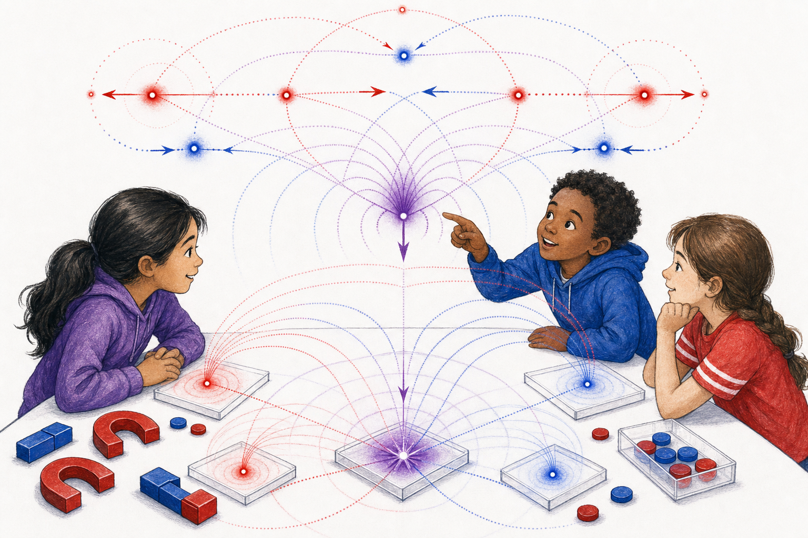

# The Tiny Transceivers

Age band: 9-11

Format: illustrated chapter-picture book, 18 story spreads plus back matter

Core concept: the fundamental entities are not passive specks. Each is a tiny sender-receiver with a path, a polarity, emitted potential waves, and responses to received waves.

## Book Promise

This book teaches three lessons:

1. There are two fundamental sender-receiver kinds.
2. Each keeps a path, emits potential waves, and receives waves from others.
3. Many received influences can combine into stable assemblies.

The parent/teacher layer should use the canonical terms `architrino`, `polarity`, `potential`, `potential wave`, `line of action`, `superposition`, and `assembly`. The read-aloud layer should use story handles first: tiny sender-receiver, red kind, blue kind, path, wave, arrival, bend, together.

## Art Bible

Use case: illustration-story, scientific-educational.

Style: tabletop science lab, global children in informal play, white page space, black expressive linework, natural skin and hair, white/purple clothing, and red/blue/purple $\mathbb{A}\mathbb{A}\mathbb{A}$ geometry.

Recurring characters:

- **Mira:** now nine, patient and observant.
- **Tomas:** now eleven, quick to test predictions.
- **Ari:** a friend who likes naming patterns and checking whether the names are doing too much.
- **Dr. Sol:** caregiver-scientist, guiding without turning the story into a lecture.

Recurring geometry:

- Electra is a blue luminous point transceiver;
- Poz is a red luminous point transceiver;
- emitted potential waves are red or blue arcs from earlier source positions;
- line-of-action moments are clean colored threads from source history to receiver;
- superposition appears as purple overlap at the receiver;
- assemblies are calm white-centered purple patterns made from active red/blue parts.

Image-generation rule: do not include book text, captions, labels, equations, or watermarks inside the illustration. Any labels should be added later by layout.

## Page Plan

### Cover

Pilot generated asset:

Read-aloud title:

> The Tiny Transceivers

Lesson:

Nature's smallest story objects send, receive, and keep paths.

$\mathbb{A}\mathbb{A}\mathbb{A}$ geometry:

Red and blue point transceivers send arcs into a central purple receiver region.

Background concepts:

The tabletop lab grounds the abstraction in play.

Illustration prompt:

> Single continuous tabletop message lab with three children and Dr. Sol. Red and blue luminous point transceivers send potential-wave arcs to a white-centered purple receiver region. Natural skin and hair, white/purple clothing, restricted non-human palette, no labels, no text.

### Spread 1: The Message Lab

Read-aloud text:

> Dr. Sol cleared the table.
>
> "Today," she said, "we watch tiny senders and tiny receivers."

Lesson:

Introduce the tabletop lab frame.

$\mathbb{A}\mathbb{A}\mathbb{A}$ geometry:

The table is blank except for two small red/blue point glints.

Background concepts:

The children begin as observers of a physical rule.

Illustration prompt:

> White tabletop with two small luminous points, one red and one blue. Mira, Tomas, Ari, and Dr. Sol lean in with curiosity. Purple room shadows, no labels, no text.

### Spread 2: A Point With A Path

Read-aloud text:

> The red point moved.
>
> It did not become a smudge.
>
> It kept a path.

Lesson:

An entity has persistent identity through motion.

$\mathbb{A}\mathbb{A}\mathbb{A}$ geometry:

Poz appears as one red point with ordered earlier positions.

Background concepts:

Position and path are not decoration; they carry identity.

Illustration prompt:

> A single red luminous point moves across the tabletop, with smaller red earlier-position dots behind it. The children watch the path. One continuous scene, no labels, no text.

### Spread 3: A Second Kind

Read-aloud text:

> The blue point moved too.
>
> It kept its own path.
>
> "Two tiny kinds," Ari said.

Lesson:

Introduce two fundamental entity types without value judgment.

$\mathbb{A}\mathbb{A}\mathbb{A}$ geometry:

Electra appears as a blue point with its own path, distinct from Poz.

Background concepts:

The two colors mark intrinsic polarity, not teams or identity groups.

Illustration prompt:

> A blue luminous point moves along a separate path from a red point. Their paths are clean and distinct on a white tabletop. Children observe without team symbols. No labels, no text.

### Spread 4: Names For Following

Read-aloud text:

> "Can we name them?" Tomas asked.
>
> "Only to follow them," said Dr. Sol.
>
> "Blue Electra. Red Poz."

Lesson:

Introduce Electra and Poz as mnemonic handles, not personalities.

$\mathbb{A}\mathbb{A}\mathbb{A}$ geometry:

Electra and Poz are still point transceivers, not characters with faces.

Background concepts:

The names track paths and response type only.

Illustration prompt:

> Red and blue luminous points on a tabletop simulation layer, with children pointing carefully. The points have no faces or bodies. Natural children, restricted palette, no labels, no text.

### Spread 5: A Sender

Read-aloud text:

> Poz moved.
>
> From where Poz had been, a wave began.

Lesson:

Introduce emission from an earlier source position.

$\mathbb{A}\mathbb{A}\mathbb{A}$ geometry:

Red potential-wave arcs expand from Poz's earlier position.

Background concepts:

The wake center is not necessarily the current point.

Illustration prompt:

> Red point Poz has moved away from an earlier red source dot. Red translucent arcs expand from the earlier dot, not from the current point. Children notice the separation. No labels, no text.

### Spread 6: A Receiver

Read-aloud text:

> Electra waited in another place.
>
> The wave was real before it arrived.

Lesson:

Introduce reception after travel time.

$\mathbb{A}\mathbb{A}\mathbb{A}$ geometry:

A red wave front travels toward the blue receiver.

Background concepts:

Field speed is implied by the wave not arriving instantly.

Illustration prompt:

> Blue point Electra sits at a receiving position while red wave arcs travel across the tabletop from Poz's earlier source dot. One arc is close but not yet touching. No labels, no text.

### Spread 7: Arrival

Read-aloud text:

> The wave touched Electra.
>
> The next path changed.

Lesson:

Reception changes motion.

$\mathbb{A}\mathbb{A}\mathbb{A}$ geometry:

At arrival, a clean red line of action connects source history to Electra, and Electra's next path bends.

Background concepts:

Action/force enters through changed acceleration, not through a lecture.

Illustration prompt:

> A red wave front reaches blue Electra. A clean red line of action connects the earlier red source dot to the blue receiver, and Electra's dotted path bends after reception. No labels, no text.

### Spread 8: Toward

Read-aloud text:

> One arrival bent a path toward.
>
> The distance grew smaller.

Lesson:

Teach toward as decreasing separation.

$\mathbb{A}\mathbb{A}\mathbb{A}$ geometry:

A receiver path bends toward a source-history point.

Background concepts:

This avoids social attraction language while keeping geometry.

Illustration prompt:

> On the tabletop, a blue receiver path bends toward an earlier red source dot. The separation visibly narrows. Children compare the positions with fingers, no labels, no text.

### Spread 9: Away

Read-aloud text:

> Another arrival bent a path away.
>
> The distance grew larger.

Lesson:

Teach away as increasing separation.

$\mathbb{A}\mathbb{A}\mathbb{A}$ geometry:

A receiver path bends away from a source-history point.

Background concepts:

Toward/away are physical direction words, not emotion words.

Illustration prompt:

> On the same style tabletop, a red receiver path bends away from an earlier red source dot. The separation visibly widens. One continuous scene, no labels, no text.

### Spread 10: Converge And Diverge

Read-aloud text:

> "Converge," said Ari.
>
> "The paths bend together."
>
> "Diverge," said Tomas.
>
> "The paths bend apart."

Lesson:

Introduce challenge vocabulary grounded in visible motion.

$\mathbb{A}\mathbb{A}\mathbb{A}$ geometry:

One pair of paths narrows; another pair widens.

Background concepts:

The roots of converge/diverge carry the geometric idea.

Illustration prompt:

> Children watch two pairs of red/blue paths on the tabletop: one pair narrows together, another pair widens apart. Use no written words or labels. Purple overlap where paths come near.

### Spread 11: Many Waves

Read-aloud text:

> One receiver did not hear one wave.
>
> It received many.

Lesson:

Introduce multiple incoming influences.

$\mathbb{A}\mathbb{A}\mathbb{A}$ geometry:

Several red and blue wave fronts reach one receiver.

Background concepts:

This prepares superposition.

Illustration prompt:

> A central receiver point on the tabletop is reached by several red and blue wave arcs from different earlier source positions. Children lean in. No labels, no text.

### Spread 12: Messages Add

Read-aloud text:

> The waves met at one place.
>
> The answer was purple.

Lesson:

Introduce superposition as combined influence.

$\mathbb{A}\mathbb{A}\mathbb{A}$ geometry:

Red and blue incoming influences overlap into a purple receiver region.

Background concepts:

Purple means combined contribution, not a third group.

Illustration prompt:

> Red and blue arcs meet at a central receiver, forming a white-centered purple glow. The tabletop remains clean and continuous. No labels, no text.

### Spread 13: Balance

Read-aloud text:

> At the middle, neither color won.
>
> Both were still there.

Lesson:

Neutral balance is active cancellation or closure, not absence.

$\mathbb{A}\mathbb{A}\mathbb{A}$ geometry:

A white center sits inside a purple halo with visible red/blue contributions.

Background concepts:

This prepares neutral assemblies.

Illustration prompt:

> A central white point inside a purple halo, with faint red and blue contribution arcs entering from opposite sides. Children study the calm center. No labels, no text.

### Spread 14: A Held Pattern

Read-aloud text:

> The points moved.
>
> The pattern stayed.

Lesson:

Introduce assembly as stable relation among active parts.

$\mathbb{A}\mathbb{A}\mathbb{A}$ geometry:

Several red and blue points form a persistent balanced arrangement.

Background concepts:

Stability is geometric, not social.

Illustration prompt:

> Red and blue point transceivers move in a small balanced tabletop arrangement. Their individual paths are visible, while a purple shared glow shows the held pattern. No labels, no text.

### Spread 15: Not A Team

Read-aloud text:

> "Are red and blue teams?" Tomas asked.
>
> "No," said Dr. Sol.
>
> "They are two ways nature can answer."

Lesson:

Block social interpretation explicitly.

$\mathbb{A}\mathbb{A}\mathbb{A}$ geometry:

Red and blue points participate together in one assembly.

Background concepts:

Human children are not mapped to polarity.

Illustration prompt:

> Children of varied natural skin and hair watch one mixed red/blue assembly. No child is visually assigned to a color side. White/purple clothes, single tabletop scene, no labels, no text.

### Spread 16: The Quiet Room

Read-aloud text:

> Around the bright points, the room was not empty.
>
> Quiet patterns waited.

Lesson:

Introduce Noether sea as quiet background content.

$\mathbb{A}\mathbb{A}\mathbb{A}$ geometry:

Pale-purple balanced specks surround the active tabletop interactions.

Background concepts:

The medium is quiet but structured.

Illustration prompt:

> Bright red/blue tabletop points sit inside a field of quiet pale-purple specks and tiny white-centered clusters. Children notice the background without it overwhelming the main geometry. No labels, no text.

### Spread 17: Predict The Bend

Read-aloud text:

> Mira covered the next path.
>
> "Which way will it bend?"
>
> Everyone made a prediction.

Lesson:

Turn the rule into a prediction game.

$\mathbb{A}\mathbb{A}\mathbb{A}$ geometry:

Incoming waves and prior path are visible; the future segment is hidden.

Background concepts:

Prediction is tied to geometry, not guessing.

Illustration prompt:

> Mira holds a white card over the future part of a tabletop path. Incoming red and blue waves are visible before the covered region. Other children point and predict. No readable card text, no labels.

### Spread 18: Tiny Rules, Big World

Read-aloud text:

> Electra and Poz were tiny.
>
> Their rules were not.
>
> The whole table began to move with meaning.

Lesson:

Close with the idea that simple sender-receiver rules can build larger structure.

$\mathbb{A}\mathbb{A}\mathbb{A}$ geometry:

Paths, waves, receiver glow, and assembly pattern appear together in one readable scene.

Background concepts:

The next books will study thresholds and landscapes.

Illustration prompt:

> Wide tabletop scene with children and Dr. Sol watching red and blue point transceivers, emitted arcs, one purple receiver region, and a small white-centered assembly. One continuous illustration, no labels, no text.

## Back Matter For Adults

### What The Child Just Learned

This book introduces the architrino as a path-keeping sender-receiver. The child has seen that:

- two intrinsic polarity types can be tracked without social meaning;
- emitted potential waves begin from earlier source positions;
- reception changes later path;
- multiple received influences can combine;
- balanced assemblies can persist.

### Canonical Term Map

| Story phrase | Canonical term | Adult note |
| --- | --- | --- |
| tiny sender-receiver | Architrino | A point entity with path, emission, and reception. |
| red kind / blue kind | Polarity | Intrinsic response type, not a social marker. |
| wave from where it was | Potential wave from source history | Emission is tied to prior position. |
| path bends | Acceleration response | Child-facing path change prepares force language. |
| many waves meet | Superposition | Received influences combine at the receiver. |
| held pattern | Assembly | Stable relation among active entities. |

### Classroom Activity Sequence

1. Track two colored beads across a table with dotted paths.
2. Draw rings from old bead positions, not current positions.
3. Ask whether a path bends toward or away.
4. Use the words converge and diverge with hand motions.
5. Combine two incoming arrows at one receiver.
6. Build a red/blue bead pattern that keeps its relation while the table turns.

### Image Prompt Reuse Notes

For production, keep Electra and Poz as luminous points, never as cartoon people. Do not assign human children to red or blue sides. Each source PNG should be one continuous lab scene.
