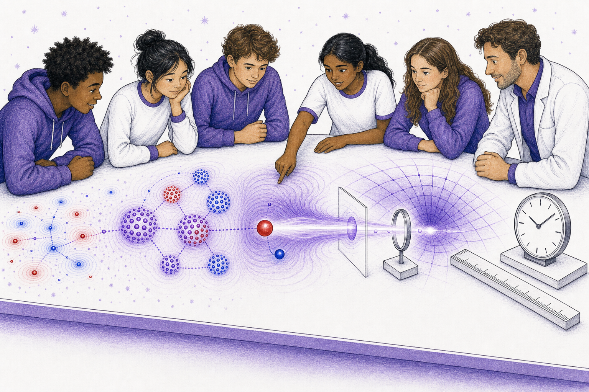

# The World We Recover

Age band: 17-18

Format: illustrated synthesis story, 20 story spreads plus back matter

Core concept: the familiar observer-level world is not the starting ontology. It is what the architecture must recover from architrinos, path-history, potential waves, assemblies, and Noether sea response.

## Book Promise

This book teaches three lessons:

1. Assemblies can build higher-level clocks, rulers, and channels.
2. Noether sea response is the medium context for recovered observer-level behavior.
3. Recovery claims must be separated by level: observed, simulated, derived, and open.

The parent/teacher layer should use the canonical terms `assembly hierarchy`, `Noether sea response`, `photon channel`, `effective metric`, `mass-map`, `Lorentz recovery`, and `claim level`. The story layer should use careful language: must recover, can model, has evidence, remains open.

## Art Bible

Use case: illustration-story, scientific-educational.

Style: older-student synthesis lab, natural teens, white/purple room, black expressive linework, red/blue/purple $\mathbb{A}\mathbb{A}\mathbb{A}$ geometry, and continuous tabletop scenes with no inset diagrams.

Recurring characters:

- **Mira:** now seventeen, asking what has been derived.
- **Tomas:** now eighteen, testing simulation routes.
- **Ari:** careful about claim levels.
- **Dr. Sol:** insists that analogy does not replace derivation.

Recurring geometry:

- red/blue point transceivers form assemblies;
- nested assemblies produce white-centered purple neutral patterns;
- pale-purple Noether sea motifs surround active assemblies;
- photon-channel motifs are purple-white transmission paths through structured medium;
- effective clocks and rulers appear as observer-level objects, not fundamental entities;
- claim levels appear only in back matter or as nonverbal geometric marks.

Image-generation rule: every prompt inherits the style-guide palette rule. Use only pure red, pure blue, red-blue purples, white, and black for non-human visual systems and $\mathbb{A}\mathbb{A}\mathbb{A}$ geometry. Keep scenery, clothing, and tools in white/purple/black unless a red or blue mark is explicitly part of the physics geometry. Human skin and hair may use natural tones. Do not include book text, captions, labels, equations, watermarks, or logos inside the illustration.

## Page Plan

### Cover

Pilot generated asset:

Read-aloud title:

> The World We Recover

Lesson:

The familiar world is the target to recover, not the starting point.

$\mathbb{A}\mathbb{A}\mathbb{A}$ geometry:

Tiny active parts lead to assemblies, medium response, a photon-like channel, and observer-level clock/ruler objects.

Background concepts:

The scene reads left to right from ontology to recovered effective description.

Illustration prompt:

> One continuous synthesis tabletop scene with older students. Red/blue point assemblies embedded in pale-purple Noether sea response lead into a purple-white channel, a curved effective grid, and simple black-line clock and ruler objects. Natural skin and hair, white/purple clothing, no labels, no text.

### Spread 1: Not The Starting Point

Read-aloud text:

> Tomas placed a clock on the table.
>
> Mira placed a ruler beside it.
>
> Dr. Sol moved them to the far end.
>
> "These are things we must recover."

Lesson:

Observer tools are downstream targets, not fundamental starting objects.

$\mathbb{A}\mathbb{A}\mathbb{A}$ geometry:

Clock and ruler sit beyond red/blue assemblies in a left-to-right scene.

Background concepts:

The spread frames recovery rather than assumption.

Illustration prompt:

> Older students place a simple black-line clock and ruler at the far right of a white tabletop, while red/blue point assemblies sit at the left. One continuous scene, no labels, no numbers, no text.

### Spread 2: Tiny Active Parts

Read-aloud text:

> At the left edge, the table was full of tiny action.
>
> Red points.
>
> Blue points.
>
> Paths and waves.

Lesson:

Return to architrino-level ontology.

$\mathbb{A}\mathbb{A}\mathbb{A}$ geometry:

Red/blue point transceivers carry paths and emitted waves.

Background concepts:

This anchors the synthesis in substrate behavior.

Illustration prompt:

> Left side of a white tabletop filled with red and blue point transceivers, path-history dots, and wave arcs. Older students observe. No labels, no text.

### Spread 3: First Assembly

Read-aloud text:

> Some paths closed into a pattern.
>
> The parts still moved.
>
> The relation held.

Lesson:

Assemblies are stable relations among active parts.

$\mathbb{A}\mathbb{A}\mathbb{A}$ geometry:

A small red/blue assembly has a white-centered purple outer glow.

Background concepts:

Neutral appearance contains active interior structure.

Illustration prompt:

> Several red and blue point transceivers form a small white-centered purple assembly on the tabletop. Interior path marks remain visible. No labels, no text.

### Spread 4: Nested Assembly

Read-aloud text:

> The first pattern became part of a larger pattern.
>
> The larger pattern held too.

Lesson:

Introduce assembly hierarchy.

$\mathbb{A}\mathbb{A}\mathbb{A}$ geometry:

Small assemblies combine into a larger nested structure.

Background concepts:

Hierarchy is built from repeated closure.

Illustration prompt:

> Multiple small red/blue white-centered assemblies combine into a larger purple nested assembly. Students look across scales on one continuous tabletop. No labels, no text.

### Spread 5: The Quiet Medium

Read-aloud text:

> Between the assemblies, the table was not empty.
>
> Quiet structure filled the gaps.

Lesson:

Introduce Noether sea response as medium context.

$\mathbb{A}\mathbb{A}\mathbb{A}$ geometry:

Pale-purple specks and paired motifs fill space around assemblies.

Background concepts:

The Noether sea is active but quiet.

Illustration prompt:

> Nested assemblies sit inside pale-purple Noether sea specks and tiny white-centered paired motifs. The medium is visible but low contrast. No labels, no text.

### Spread 6: The Medium Answers

Read-aloud text:

> Ari tapped one assembly.
>
> The quiet structure answered in a wave.

Lesson:

The medium responds to local action.

$\mathbb{A}\mathbb{A}\mathbb{A}$ geometry:

A purple response wave travels through Noether sea motifs.

Background concepts:

Medium response becomes a channel candidate.

Illustration prompt:

> A student lightly touches a tabletop assembly. A pale purple response wave passes through surrounding Noether sea motifs. The scene is one continuous tabletop image, no labels, no text.

### Spread 7: A Channel Forms

Read-aloud text:

> The response did not spread everywhere the same way.
>
> It found a channel.

Lesson:

Introduce photon-channel intuition.

$\mathbb{A}\mathbb{A}\mathbb{A}$ geometry:

A focused purple-white path forms through the medium.

Background concepts:

The channel is an emergent route, not a free-floating ray.

Illustration prompt:

> A purple-white channel forms through pale-purple Noether sea motifs between two assemblies. Red/blue parts remain visible at the endpoints. No labels, no text.

### Spread 8: A Cycle Becomes Clocklike

Read-aloud text:

> One assembly returned to its pattern again and again.
>
> "That could become clocklike," Mira said.

Lesson:

Effective clocks can arise from stable repeated cycles.

$\mathbb{A}\mathbb{A}\mathbb{A}$ geometry:

A cyclic assembly has repeated path marks.

Background concepts:

Clock behavior is recovered from dynamics.

Illustration prompt:

> A small assembly cycles through repeated red/blue positions, forming a white-centered purple rhythm. A simple clock object sits faintly downstream on the same table. No numbers, no labels, no text.

### Spread 9: A Spacing Becomes Rulerlike

Read-aloud text:

> Another assembly kept a steady spacing.
>
> "That could become rulerlike," Tomas said.

Lesson:

Effective rulers can arise from stable relations.

$\mathbb{A}\mathbb{A}\mathbb{A}$ geometry:

Repeated neutral assemblies maintain equal spacing.

Background concepts:

Length measurement is observer-level structure.

Illustration prompt:

> A row of small white-centered purple assemblies keeps steady spacing across a tabletop. A simple black-line ruler object appears downstream without numbers. No labels, no text.

### Spread 10: The Light Path

Read-aloud text:

> The channel carried a bright response.
>
> It crossed the table without becoming a little ball.

Lesson:

Introduce photon-channel behavior without overclaiming.

$\mathbb{A}\mathbb{A}\mathbb{A}$ geometry:

A purple-white channel connects assembly response regions.

Background concepts:

The channel motif prepares photon closure.

Illustration prompt:

> A focused purple-white channel travels from one assembly region to another through quiet Noether sea motifs. Students follow it with their eyes. No labels, no text.

### Spread 11: The Curved Grid

Read-aloud text:

> Dr. Sol laid a soft grid over the scene.
>
> The grid was not the deepest thing.
>
> It helped describe what larger travelers would see.

Lesson:

Introduce effective metric as observer-level overlay.

$\mathbb{A}\mathbb{A}\mathbb{A}$ geometry:

A faint purple curved grid overlays assembly response.

Background concepts:

Metric language is effective, not ontological bedrock.

Illustration prompt:

> A faint purple curved grid overlays the tabletop channel and assemblies, while red/blue substrate parts remain visible underneath. Students compare overlay and underlying parts. No labels, no text.

### Spread 12: What Bends The Path?

Read-aloud text:

> A larger bead crossed the grid.
>
> Its path bent where the medium changed.

Lesson:

Observer-level motion responds to recovered effective structure.

$\mathbb{A}\mathbb{A}\mathbb{A}$ geometry:

A larger neutral bead path bends across a curved purple field.

Background concepts:

This points toward effective metric recovery.

Illustration prompt:

> A larger white-centered purple bead travels across the faint curved grid, and its path bends where the underlying Noether sea response changes. One continuous scene, no labels, no text.

### Spread 13: The Mass-Map Question

Read-aloud text:

> "Why do some patterns resist change more?" Ari asked.
>
> Dr. Sol smiled.
>
> "That is a mass-map question."

Lesson:

Introduce mass-map as an open derivation target.

$\mathbb{A}\mathbb{A}\mathbb{A}$ geometry:

Different assemblies show different response strengths.

Background concepts:

The story names the target without claiming completion.

Illustration prompt:

> Several assemblies of different density and nesting respond differently to the same purple nudge. One moves more, one less. Students compare the responses. No labels, no text.

### Spread 14: The Familiar Picture

Read-aloud text:

> Clocks.
>
> Rulers.
>
> Light paths.
>
> Curved motion.
>
> They all belonged at the recovered end of the table.

Lesson:

Collect observer-level outputs as recovered structures.

$\mathbb{A}\mathbb{A}\mathbb{A}$ geometry:

Clock, ruler, channel, and curved grid are downstream from assemblies.

Background concepts:

The recovered picture is organized, not assumed.

Illustration prompt:

> A continuous tabletop scene reads left to right from red/blue assemblies to Noether sea response to a purple-white channel, curved grid, simple clock, and ruler. No labels, no text.

### Spread 15: What Is Observed

Read-aloud text:

> Mira placed one blank card by the clock.
>
> "Some things are observed."

Lesson:

Introduce claim levels gently.

$\mathbb{A}\mathbb{A}\mathbb{A}$ geometry:

A blank card with a simple geometric mark sits near observer-level objects.

Background concepts:

Claim labels stay out of child-facing art; back matter can name them.

Illustration prompt:

> A blank white card with a simple black check-like geometric mark sits beside the clock and ruler objects. No readable text, no labels, no numbers.

### Spread 16: What Is Simulated

Read-aloud text:

> Tomas placed another blank card by the model.
>
> "Some things are simulated."

Lesson:

Separate simulation evidence from observation.

$\mathbb{A}\mathbb{A}\mathbb{A}$ geometry:

The simulator region has a different nonverbal mark.

Background concepts:

Evidence types differ.

Illustration prompt:

> A second blank card with a different simple geometric mark sits near the tabletop simulator region. Students compare model and recovered objects. No text, no labels.

### Spread 17: What Is Derived

Read-aloud text:

> Ari placed a third blank card by the path.
>
> "Some things must be derived."

Lesson:

Name derivation as stronger than analogy.

$\mathbb{A}\mathbb{A}\mathbb{A}$ geometry:

A geometric proof-route motif connects substrate to recovered channel.

Background concepts:

Analogy is not enough.

Illustration prompt:

> A blank card with a clean triangle-like geometric mark sits beside a continuous path from assemblies to the purple-white channel. No readable text, no equations, no labels.

### Spread 18: What Is Open

Read-aloud text:

> Dr. Sol left one card empty.
>
> "Some things are still open."

Lesson:

Preserve open target discipline.

$\mathbb{A}\mathbb{A}\mathbb{A}$ geometry:

An empty white card sits beside a faint unfinished path.

Background concepts:

The story keeps force without overclaiming.

Illustration prompt:

> An empty white card sits near a faint unfinished purple path extending from the recovered-world model. Students look thoughtful. No readable text, no labels, no equations.

### Spread 19: The Architecture Must Recover

Read-aloud text:

> "If this architecture is right," Mira said,
>
> "it must recover the world we measure."

Lesson:

Frame recovery as obligation.

$\mathbb{A}\mathbb{A}\mathbb{A}$ geometry:

Substrate, assemblies, medium, and observer tools align in one continuous route.

Background concepts:

The book ends with a falsifiable burden, not triumphalism.

Illustration prompt:

> Older students look across the whole tabletop route: red/blue points, assemblies, Noether sea response, channel, curved grid, clock, and ruler. Everything is continuous, no panels, no text.

### Spread 20: The World We Recover

Read-aloud text:

> The familiar world was not ignored.
>
> It was waiting at the end of the work.
>
> Now they knew what had to be recovered.

Lesson:

Close the series arc with recovery as disciplined target.

$\mathbb{A}\mathbb{A}\mathbb{A}$ geometry:

The final spread shows the complete left-to-right recovery map without labels.

Background concepts:

This leaves future theory work visible rather than hidden.

Illustration prompt:

> Final wide synthesis scene. Students and Dr. Sol gather around one continuous tabletop model flowing from architrino paths to nested assemblies, Noether sea response, a photon-like channel, curved effective grid, and simple clock/ruler objects. Natural skin and hair, white/purple clothing, no labels, no text.

## Back Matter For Adults

### What The Student Just Learned

This book frames recovery as a disciplined obligation. The student has seen that:

- architrino-level entities and path-history are the starting ontology;
- assemblies can build stable higher-level structure;
- Noether sea response supplies medium context;
- photon channel, effective metric, clocks, rulers, and mass-map behavior are recovery targets;
- claim levels must remain separated.

### Canonical Term Map

| Story phrase | Canonical term | Adult note |
| --- | --- | --- |
| tiny active parts | Architrino ontology | Red/blue point transceivers with path-history. |
| pattern inside pattern | Assembly hierarchy | Nested stable structures. |
| quiet structure answers | Noether sea response | Medium response to local assembly action. |
| bright response channel | Photon channel target | Recovery target, not assumed as fundamental. |
| soft grid | Effective metric | Observer-level description to recover. |
| resist change more | Mass-map target | Open derivation target unless locally proven. |
| observed / simulated / derived / open | Claim level | Evidence discipline for recovery statements. |

### Studio Activity Sequence

1. Build red/blue point assemblies with beads or tokens.
2. Nest small assemblies into larger structures.
3. Draw a quiet medium around them.
4. Send a purple channel through the medium.
5. Place clock and ruler objects only after the assembly model is built.
6. Mark claims as observed, simulated, derived, or open in back matter, not inside story art.

### Image Prompt Reuse Notes

For production, keep every source PNG as one continuous synthesis scene. Do not use inset proof panels, text labels, or separate mini-diagrams inside the illustration. Claim-level cards may appear only as blank cards with nonverbal geometric marks.
