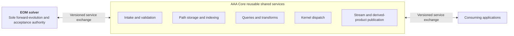
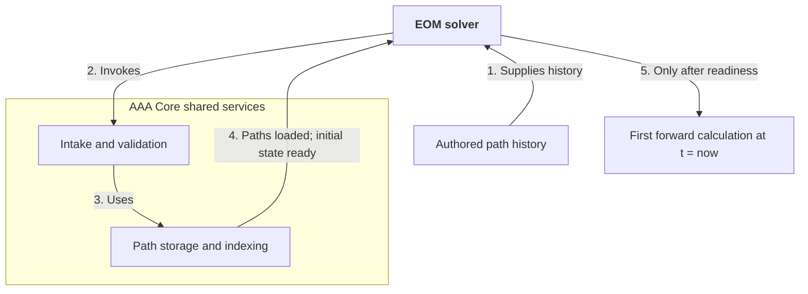

# AAA Core Architecture v0

## Status

- Architecture id: `aaa_core/v0`
- Product classification: shared headless application platform, not an end-user application
- Stage: `accepted logical architecture; service implementation incomplete`
- Implementation authority: path-interchange, codec-registry, accepted-history stream, query/transform/publication, thin-client, and shared Potential API validators, adapters, and synthetic fixtures only
- Contract status: [`aaa_core_path_interchange/v0`](path-interchange-v0.md), [`aaa_core_codec_registry/v0`](codec-registry-v0.md), [`aaa_core_accepted_history_stream/v0`](accepted-history-stream-v0.md), [`aaa_core_query_transform_publication/v0`](query-transform-publication-v0.md), [`aaa_core_client/v0`](client-v0.md), and [`aaa_core_potential/v1`](potential-v1.md) accepted; production service orchestration remains open
- Primary current Potential consumers: Lorentz Geometry and Topo
- Current executable application consumers: Lorentz Geometry through its surface scheduler; Topo through a tested thin consumer boundary not yet composed into its browser root
- Forward solver: [EOM solver](../app-solver/priorities.md)

## Mission

AAA Core is the shared path factory and service substrate for the application ecosystem. It accepts path-related inputs from solvers, authored studies, imports, and existing products; validates and normalizes their contracts; stores and indexes them; converts them into purpose-appropriate encodings; exposes reproducible queries and transforms; schedules shared CPU/GPU work; and publishes versioned outputs for applications.

`Factory` describes the flow of durable products through focused stations. It does not mean one central class, process, database, or executable owns every responsibility.

AAA Core has no visitor-facing product surface of its own. Applications compose its headless services behind their own controls and visual grammar. The retained `app-aaa-core` path and accepted `aaa_core_*` identifiers remain stable compatibility and machine interfaces; they are not catalogue entries.

## Headless Platform Role

AAA Core is the shared scientific platform for causal path-based inquiry. Its headless services enable a reproducible and inspectable route from source paths and declared rules through study design, EOM evolution where eligible, transforms, derived products, comparison, revision, and publication.

Consumer applications may let a user bring in observations or reconstructed records; author hypotheses, initial histories, transforms, and study pipelines; run declared computations; inspect potentials, assemblies, events, and maps; and compare simulation products with observational products. Core preserves the versioned inputs, operations, failures, outputs, and provenance needed for another user or application to review or rerun the study.

Applications are working surfaces for this environment, not separate private worlds. The EOM solver remains its only forward-evolution instrument. AAA Core provides the path, study, provenance, storage, and compute substrate through which applications can interoperate without inventing another solver or obscuring the lineage of a result.

Visual resemblance, a convenient representation, or a successful pipeline does not itself establish scientific agreement. A consumer interface must obtain the route from input to conclusion through Core's contracts and keep it visible enough to test, challenge, and improve.

Plainly: Core supplies the records and services behind places where people formulate, run, compare, revise, and share causal-path studies. It is not one of those places itself.

## Governing Boundaries

| Area | AAA Core owns | AAA Core does not own |
| --- | --- | --- |
| Paths | Logical model, validation, construction tools, representations, chunks, indices, streams, queries, transforms, and publication | Whether a candidate future path is dynamically realized |
| Codecs | Interchange envelope, codec interface and registry, capability negotiation, conformance tests, common codecs, and authority/error propagation | Requiring every domain-specific encoder or decoder to live in Core or forcing every consumer through one encoding |
| EOM | Request/response adapter, accepted-history ingestion, storage, routing, and progress propagation | Master EOM, root logic, integration, or acceptance decisions |
| Scientific computation | Kernel registry, version binding, resource dispatch, input/output envelopes, caching, and provenance | Unreviewed equations or the scientific meaning of an observable |
| Applications | Reusable clients and services | App-specific controls, visual grammar, or product composition |
| Experiments | Import envelopes, calibration and uncertainty carriers, coordinate transforms, and source provenance | Reclassifying observer-level tracks as substrate histories |
| Evidence | Authority propagation, source closure, error metadata, and failure preservation | Promotion of a diagnostic, display, or comparison into theory evidence |

Plainly: Core moves and processes path information; it does not decide what nature does, what the EOM accepts, or what an experiment proves.

## Current Executable Inventory

[Measured by a repository file, import, route, and scene scan on 2026-09-02.] AAA Core currently consists of six headless ECMAScript modules under `src/aaa-core/`, their accepted machine control records under this priority directory, five structural schemas under `src/contracts/`, and focused tests and fixtures under `tests/`. None of these modules imports a browser runtime, mounts a DOM surface, registers a public scene, or supplies a standalone HTML entrypoint. This result is falsified if a Core module acquires browser rendering, a standalone entrypoint maps to Core, or an Applications scene names Core.

| Module | Current responsibility | Composition role |
| --- | --- | --- |
| `src/aaa-core/path-interchange-v0.mjs` | Canonical record identity, logical path-bundle validation, fixture mutation, and contract conformance | Foundational validator used by the codec, stream, query/publication, and client layers |
| `src/aaa-core/codec-registry-v0.mjs` | Provider-shape validation, capability negotiation, Core codecs including the Core-owned Potential fixture codec, registered experimental adapters, and codec conformance | Headless codec service over the path validator |
| `src/aaa-core/accepted-history-stream-v0.mjs` | Bounded in-process broker, ordered subscriptions, replay, backpressure, sealing, halt propagation, and stream conformance | Headless stream service over accepted path bundles |
| `src/aaa-core/query-transform-publication-v0.mjs` | Query normalization and identity, source closure, publication construction, sealing, validation, and receipt-bound retrieval | Headless query/publication service over path and codec contracts |
| `src/aaa-core/client-v0.mjs` | Defensive-copy operation envelopes and one shared facade across validation, codec, stream, query, publication, and retrieval | Current in-process Core composition root through `AAAClientService` and per-consumer `AAAClient` instances |
| `src/aaa-core/potential-v1.mjs` | Potential-sample request validation, prescribed-path analysis dispatch, complete contribution accounting, reduction, and exact unavailable-output failure | Headless application API consumed directly by Lorentz Geometry and through Topo's thin consumer module |

The contract-check functions exported by the first four modules are verification entrypoints, not application composition roots. `AAAClientService` is the composite contract-service root: it receives the accepted contracts and registry as dependencies and creates application-identified clients. `computePotentialSamples` is a separate headless API entrypoint that delegates to the prescribed-path analysis provider. Neither creates a user interface.

Plainly: the modules can be assembled in one process and tested end to end, but nothing in Core creates a page for a visitor to open.

### Current composition roots

| Root | What it composes | UI ownership |
| --- | --- | --- |
| `AAAClientService` in `src/aaa-core/client-v0.mjs` | Path validation, codec negotiation, accepted-history streams, query/publication, cache, retrieval, and per-application operation records | None; headless in-process service root |
| `createIdealBraidSurfaceSolverScheduler` in `src/apps/ideal-braid/IdealBraidSurfaceSolverScheduler.js` | Lorentz Geometry's sample points and display scheduler with `aaa_core_potential/v1` | Lorentz Geometry owns the browser runtime and presentation |
| `src/apps/topo/TopoPotentialConsumer.js` | Topo-identified request and compute wrappers over `aaa_core_potential/v1` | No browser composition yet; the module is a tested thin consumer boundary |
| `tests/aaa-core-client-v0.test.js` | Topo and Equation Mapping identities over one `AAAClientService` fixture | Test-only composition; no public UI |

Plainly: actual app wiring ends at a headless Core call. Controls, scenes, and drawing stay in the consuming app.

### Current consumers

| Consumer | Current dependency | Executable boundary |
| --- | --- | --- |
| Equation Mapping | Equivalent-query, shared-stream, sealed-publication retrieval, and shared-client conformance | The conformance fixture uses `AAAClient`; the existing browser application does not import Core and therefore does not depend on a Core UI |
| Lorentz Geometry | Direct `aaa_core_potential/v1` sampling through its surface-solver scheduler | Executable browser consumer; its application runtime owns presentation and imports no Core UI |
| Topo | Thin `TopoPotentialConsumer` wrapper over `aaa_core_potential/v1`, plus documented downstream use of Potential products and Core interchange | Executable/tested consumer module not yet composed into `src/apps/topo/main.js`; no Core UI dependency |
| EOM solver | Documented producer/request relationship for accepted histories | Planned adapter boundary; the EOM solver remains independent and no current EOM composition root imports Core |
| Borg and Photon | Documented future/shared-history relationships | Existing browser runtimes remain direct application owners and do not import Core |
| Future path, reaction, and experimental tools | Proposed contract consumers | No executable consumer exists |

[Measured by the same import and route scan.] No executable consumer depends on an accidental Core public UI. Lorentz Geometry and Topo call the headless Potential API directly, while the client-conformance consumers call `AAAClient`. The prior architecture language assigning a Study Pipeline Workbench interface to Core was therefore an ownership error in the design, not a deployed dependency; the interface responsibility now remains with a separate consuming application. A browser consumer importing a Core DOM surface or navigating through a Core route would falsify this finding.

### Current tests

| Test family | Boundary established |
| --- | --- |
| `tests/aaa-core-path-interchange-v0.test.js` | Logical record families, immutable identity, fail-closed mutations, and Potential field mapping |
| `tests/aaa-core-codec-registry-v0.test.js` | Registry/provider negotiation and positive and negative codec conformance |
| `tests/aaa-core-accepted-history-stream-v0.test.js` | Dual-consumer sequencing, backpressure, replay, sealing, halt, and refusal behavior |
| `tests/aaa-core-query-transform-publication-v0.test.js` | Query/cache identity, transform order, source closure, publication, retrieval, and refusal behavior |
| `tests/aaa-core-client-v0.test.js` | Shared in-process composition across Topo and Equation Mapping identities |
| `tests/aaa-core-potential-v1.test.js` | Shared Potential API ownership, Lorentz Geometry and Topo consumption, complete-row refusal, and absence of a standalone Potential product route |
| `tests/potential-consumer-publication-contract.test.js` and `tests/potential-live-timespace-pipeline-contract.test.js` | Core-owned Potential product publication and live-pipeline refusal behavior |
| `tests/standalone-app-launch.test.js` | Public catalogue and standalone-launch exclusion for the headless platform |

Plainly: the tests establish contract and in-process software behavior. They do not establish a deployed Core service, a production application integration, or a scientific result.

## Core Shared-Service Map

Plainly: Core offers composable capabilities rather than a required processing sequence. The EOM solver and consuming applications use those shared services as needed, but only the EOM solver advances the forward state and decides whether an evolved step is accepted.

## EOM Solver Setup Flow

Plainly: authored path history reaches the EOM solver before evolution begins. The EOM solver uses Core to validate and load the paths through Core-owned storage and indexing; Core returns readiness but performs no forward evolution. Only the EOM solver may then perform and accept the first forward calculation at t = now.

## Logical Product Family

The accepted `aaa_core_path_interchange/v0` contract defines the five logical record classes below, and the accepted `aaa_core_codec_registry/v0` contract defines codec capabilities. Kernel requests and resource profiles remain later contracts.

| Product | Purpose |
| --- | --- |
| Path-set manifest | Binds path membership, semantics, frames, units, scale map, coverage, numeric policy, provenance, authority, chunks, and indices |
| Path chunk | Immutable path segments for a declared membership and time slab, with representation and error metadata |
| Codec capability | Identifies a versioned codec provider, its logical input/output types, representation profile, precision and error contract, access pattern, device layout, and permitted consumers |
| Stream envelope | Orders accepted chunks or other products and carries predecessor, watermark, completion, halt, and replay state |
| Query manifest | Selects paths, time, space, provenance, scale, uncertainty, or other declared fields without mutating sources |
| Transform manifest | Records an ordered shaping or coordinate-transform pipeline with parameters and error/authority effects |
| Kernel request | Binds a versioned scientific or analytical kernel to exact inputs, domain, numeric policy, and resource posture |
| Derived-product manifest | Binds maps, summaries, ledgers, optimized candidates, or comparison outputs to complete source and operation provenance |
| Resource profile | Declares latency, throughput, memory, storage, backend, precision, and failure limits |

Plainly: applications exchange durable records with stable identities, not undocumented arrays whose meaning depends on which app happened to create them.

## Canonical Logical Path Model

A logical path record must be able to express:

- stable dataset, path, segment, chunk, and version identities;
- path semantics and source authority;
- absolute-time coverage and a stable epoch-plus-offset or equivalent representation;
- spatial coordinates, derivatives required by declared consumers, and coordinate frame;
- normalized units and explicit scale maps, with $c_f=1$ in new numerical fixtures;
- interpolant or segment basis and its domain;
- numeric representation, precision, rounding or enclosure policy, and nonfinite behavior;
- approximation, interpolation, source, and measurement uncertainty without conflating them;
- event, discontinuity, branch, or topology markers that a codec may not smear across;
- predecessor, content hash, provenance, and compatibility information;
- indices and summaries that can be regenerated from the immutable source.

Plainly: the logical model says what a path means. A codec says how that same meaning is stored and moved for a particular job.

## Representation Profiles

AAA Core should expose one logical model through at least three profiles:

1. **Authoritative history:** lossless or certification-preserving, continuation-safe, and able to retain strict numeric and event information.
2. **Precision-bounded analysis:** adaptive approximation accepted against a declared path or observable error budget.
3. **Display stream:** multiresolution, low-latency, and GPU-ready, but prohibited as solver continuation input or stronger evidence.

The profile selection is part of the request and output manifest. Core may transcode between profiles only when the target profile's error, provenance, event, and authority requirements can be met. Failure to meet them returns an exact refusal rather than a silently weaker product.

Plainly: the same run can have a large authoritative record, a compact analysis record, and a very fast visual stream, while every consumer can tell which one it received.

## Codec Placement And Extensibility

AAA Core owns the codec control plane, not every codec implementation. The control plane defines the common interchange envelope, codec-provider interface, registry, version negotiation, source and output identities, error and authority rules, and conformance fixtures. Concrete encoder and decoder providers are placed according to the semantics they own:

1. **Core interchange codecs:** common path chunks, manifests, streams, indices, and broadly reusable representation profiles live with AAA Core.
2. **Domain or specialized codec providers:** EOM accepted-history codecs, detector-family decoders, and other purpose-specific representations live with their owning solver or import package and register capabilities with Core. Reusable Potential map and tile codecs are Core providers; transient renderer buffers remain application-private.
3. **Private transient layouts:** an app-only vertex buffer, texture, or ephemeral cache may remain entirely inside the app when it is never published or treated as interchange. Once a second process or application consumes it, it must use a registered interchange contract.

A registered codec capability must declare its logical input and output types, supported representation profiles, numeric and error behavior, event/branch preservation, streaming and random-access properties, CPU/GPU decode layout, deterministic version, authority effects, permitted consumers, and exact refusal cases. Capability negotiation selects a compatible provider; it may not silently weaken precision, coverage, provenance, or authority.

Plainly: Core supplies the loading dock rules and provider catalog. The EOM solver and experiment adapters can build specialized loading equipment, but anything crossing the dock has a common label, measured limits, and a reproducible version.

### Experimental Source And Derived Paths

An experimental adapter first stores the source-native measurement payload without reinterpretation, together with detector schema, calibration, timing basis, uncertainty, selection history, reconstruction provenance, and content identity. Decoding or normalization then creates a new derived path product that references the immutable source payload and records every transform. Alternate experiment-specific path variants may coexist as siblings; none overwrites or masquerades as the raw measurement.

Plainly: the original instrument record stays intact. A cleaned track, calibrated path, filtered signal, or model-coordinate view is a traceable derivative, so a later study can reproduce the conversion or choose a different one.

## Service Modules

The first draft separates these services behind contracts:

1. **Path construction and validation:** build declared prescribed or imported paths, validate EOM histories, and reject incomplete semantics.
2. **Manifest and identity:** content hashes, version compatibility, predecessor closure, authority, and source provenance.
3. **Codec registry and negotiation:** common envelopes, provider discovery, capability matching, compatibility, conformance, and exact refusal behavior.
4. **Shared codec providers:** broadly reusable encoding, decoding, adaptive chunking, and device-ready layouts; domain-specific providers remain with their owners.
5. **Storage:** source-native evidence, authoritative and derived products, local and remote stores, caching, retention, and garbage-collection reachability.
6. **Index and selection:** temporal, spatial, identity, provenance, event, and scale-aware random access.
7. **Stream broker:** accepted-through watermarks, subscriptions, replay, reconnect, backpressure, halt propagation, and sealing.
8. **Query and transform:** immutable filters, coordinate transforms, resampling, shaping, and derived-view cache identity.
9. **Kernel registry and compute dispatch:** versioned scientific kernels, CPU reference routes, GPU bulk queues, difficult-row return, precision escalation, and bounded reductions.
10. **Publication and catalog:** provisional and sealed products, discovery, source closure, retention, and application subscriptions.
11. **Application client:** thin typed access to the same contracts without app-local path logic.

These are responsibility boundaries, not yet deployment boundaries. Several may begin in one process, but they should not merge their contracts or data ownership.

Plainly: Core can start small without becoming tangled; services can later split across processes or machines without changing what their data means.

## Real-Time Data Plane

For an accepted EOM stream, Core should perform this sequence:

1. receive and validate an immutable accepted history chunk;
2. verify stream identity, predecessor closure, content hash, scale map, and numeric policy;
3. commit it to the authoritative store and advance the source watermark atomically;
4. update indices and schedule subscribed queries or kernels;
5. transcode only the products required by active consumers;
6. publish derived chunks with source, consumer, and product-completion watermarks;
7. preserve replay and exact halt state.

Applications may prioritize low-latency provisional products, but a product becomes sealed only when its declared source and output coverage are complete. No cache miss, dropped message, or unavailable device is interpreted as zero contribution or absent data.

Plainly: a live app can update continuously while still showing exactly how much accepted history it has processed and which parts of its current result remain incomplete.

## Multi-Axis Scalability

AAA Core must not describe scale as path count alone. A workload can become difficult through any combination of active path identities, retained-history duration and depth, time and spatial scale span, path curvature and event density, causal-root multiplicity and conditioning, precision escalation rate, query fan-out, stream arrival rate, consumer latency tolerance, storage footprint, network transfer, and the number of concurrent studies or users.

The platform must record these dimensions in representative workload manifests and expose them in resource profiles. A consumer may trade lower latency, coarser derived representation, delayed delivery, bounded spatial or time coverage, or a partial provisional product against resource use, but the chosen trade must be declared. In particular, a consumer or upstream instrument may not silently discard, decimate, or replace source material while presenting the resulting product as complete source coverage.

Stream subscriptions therefore need negotiated representation profiles, flow control, replay, and explicit coverage and loss state. A slow consumer may receive a purpose-appropriate lower-rate or coarser derived stream, then retrieve authoritative or higher-detail products later; it must be able to tell which source interval, scale range, uncertainty, and events are absent, delayed, or approximated.

Different scaling pressures can require different platform responses: history indexing and storage for long-delay work; adaptive segmentation and stricter arithmetic for difficult roots; GPU queues for regular bulk rows; CPU or enclosure services for hard rows; progressive tiles for real-time visualization; and quotas, caching, and scheduling for many concurrent cloud workspaces. No one response is presumed to solve every scaling axis.

A single assembly may itself contain strongly separated time scales. For example, a study may contain components whose characteristic frequencies differ by factors such as $1$, $10^2$, and $10^4$, or by a larger measured span. A fine evolution window around the fastest component must not require a uniform dense record of every slow component. Subject to the EOM solver's completeness and error obligations, slower or well-behaved history intervals should be carried as compact certified segments, declared analytical representations, or separately indexed coarser views; local refinement occurs only where the causal geometry, requested analysis, or error budget requires it.

The compact representation must still support the causal-root and acceleration decisions for which it is offered. A slow component that is visually unchanging is not automatically irrelevant to a fast receiver, and a display simplification cannot replace retained solver history. Every multirate representation therefore declares its coverage, approximation or enclosure behavior, scale range, and permitted consumers.

Plainly: a study may be large because it has many paths, a long past, fine local detail, hard causal geometry, many viewers, or a very fast data source. The system must say which pressure it is handling and what information a speed or storage trade leaves out.

## Localized Keyhole Study Profiles

AAA Core must support a localized keyhole study profile for simulations and analysis that need fine spacetime resolution around a selected assembly, release, encounter, or other bounded event while handling the wider exterior through a separately declared representation. A keyhole request identifies the focal region and interval, focal paths or assemblies, requested local resolution and precision, initial and boundary inputs, exterior coverage, and the treatment of any incoming or outgoing path products.

The EOM solver remains the only forward-evolution instrument for any simulated future in the focal region. Core may schedule fine local history and root work there while storing or serving wider exterior histories at a coarser declared representation, by certified exclusion, through a separately defined boundary input, or as a plainly labeled approximation. A local window may not silently omit a history or exterior contribution that can affect its declared causal result.

Keyhole products must record the focal geometry, source and boundary closure, exterior representation policy, precision and scale policy, all crossings or unresolved boundary conditions, accepted-through coverage, and every approximation or failure. This lets a user inject or release a selected assembly into a local study, compare variations, and visualize the detailed result without claiming that a short local window stands in for an unrepresented universal history.

Plainly: a user can zoom computation onto an important interaction, while the system states exactly what surrounds that window and whether the outside has been resolved, bounded, modeled, or left open.

## Path Representation Optimization

AAA Core must support a governed ecosystem of path-representation and optimization providers. A provider may propose a compact functional segment, adaptive approximation, multiresolution hierarchy, root-search index, experimental reconstruction encoding, or accelerator-oriented layout for a particular path class or consumer need. It must not become an unexamined application-local shortcut.

Every provider and produced representation must declare: its logical input and output types; covered path class, time and spatial domain; preserved state and event semantics; interpolation or reconstruction rule; error, uncertainty, or enclosure behavior; root-search and acceleration obligations it can support; precision limits; random-access and indexing behavior; storage and decode cost; device layout; permitted consumers; authority effect; compatibility version; and exact refusal or fallback behavior. A provider that cannot preserve a required causal-root, branch, coverage, or uncertainty obligation must refuse that use or route the request to a stricter representation.

Core conformance fixtures must test each proposed optimization against a separately authored reference or analytical case where one exists. The tests distinguish semantic round-trip, purpose-specific error behavior, root-search suitability, and measured end-to-end resource behavior. Agreement with the provider's own input or a golden record derived from the same implementation establishes deterministic replay only; it does not independently validate the optimization rule.

A separate consuming application may let a user compare qualified representations for a selected source interval, see their declared tradeoffs, choose one for a permitted consumer, and record the choice through Core's study-manifest contract. This supports future specialist contributions without letting a compact display curve silently become an authoritative solver input or making Core itself a visitor-facing product.

Plainly: creative compression and indexing ideas are welcome, but each one must say what it keeps, what it loses, when it is safe to use, and how its claims are checked.

## Query, Filters, And Shaping

A query selects source material without changing it. A transform creates a derived product and records its ordered operations. Candidate operations include:

- path and group selection;
- time interval and spatial region selection;
- provenance, authority, uncertainty, and source-class filters;
- scale-band, contribution, event, or diagnostic selection;
- coordinate and observer-chart transforms;
- resampling and level-of-detail construction;
- experiment-specific masking, weighting, or shaping;
- composition of saved query and transform manifests.

Equivalent requests should have stable cache identity. Reordering noncommuting transforms changes identity. Every transform declares its effect on precision, uncertainty, coverage, and authority.

Plainly: an experiment can ask for exactly the part of a signal it needs, and another researcher can reproduce the selection and shaping from the saved manifest.

The accepted [`aaa_core_query_transform_publication/v0`](query-transform-publication-v0.md) contract makes this behavior executable. Set-like source, path, and event selections normalize canonically; request ids do not enter computation identity; transform order remains semantic; numeric and output contracts enter the cache key; and a sealed receipt binds the exact view, product, source manifests, authority, completeness, codec, publisher, and permitted consumers. An incomplete source can yield a provisional product but cannot seal.

Plainly: the design rule now has a tested identity and refusal model. Production storage, catalog, authorization, and transform execution remain later service work.

The accepted [`aaa_core_client/v0`](client-v0.md) exposes these contracts without another data model. Topo and Equation Mapping use the same methods for validation, query identity, shared stream subscription and progress, sealed-publication reuse, exact retrieval, and failure inspection. Each operation preserves the originating contract's refusal code and returns defensive copies.

Plainly: apps now share one local loading-dock client. A network service, durable cache, and real workload remain unbuilt and unmeasured.

## Study Pipeline Application Contract

AAA Core must eventually provide the headless contracts needed by a separate study-pipeline application. That consumer may compose declared source products, queries, transforms, codec or representation choices, kernel requests, resource profiles, publications, and optional EOM requests without embedding their private semantics in Core.

For every pipeline stage, Core must return the exact inputs, declared output type, coverage, scale range, numeric policy, uncertainty or error behavior, provenance, authority effect, supported consumers, failure conditions, and resource/cost envelope available from the selected profile. The consuming application decides how to present compatibility failures, missing source coverage, unsupported precision or codec capabilities, and provisional versus sealed state. Core preserves the immutable manifest, result, logs, and exact failure record needed to replay or audit the study.

A consuming interface may help a user author or transform a path, compare representations, choose a lower-rate stream, or prepare an EOM request. It does not make a transformation scientifically valid, turn a display product into evidence, or allow a prescribed future to appear as an EOM-evolved result.

Plainly: Core supplies the complete route and its limitations; a separate application decides how people see and edit it.

## Study Revision And Archival

A study pipeline is a durable executable specification, not a disposable UI session. AAA Core must preserve versioned study definitions, immutable run manifests, named revisions, parent and successor relationships, comparison records, release or publication state, and reproducible rerun parameters. A user must be able to branch a study, vary a declared parameter or representation choice, compare the resulting products, and retain the exact lineage of each result.

The platform should support export to and integration with Git, Git-hosting services, or an equivalent archival and change-management system for human-readable study definitions, manifests, review records, and release notes. Large path chunks, recordings, and derived binary products should normally reside in immutable content-addressed storage, with the revision record carrying their identities, integrity hashes, retention policy, and access controls rather than duplicating bulk data in a source-control repository.

Every archived revision must bind the source inputs, transform order, implementation and kernel versions, numeric policy, resource profile, output identities, authority state, and exact failure or completion record. A rerun is a new recorded execution even when it intentionally uses the same study revision.

Plainly: a study should be as reviewable and repeatable as code. Its design history lives in a change record, while its large data remains safely stored and precisely referenced.

## Heterogeneous Compute

Root finding makes the accelerator boundary especially strict. Causal-root workloads can have different root counts, root births or mergers, branch continuation, variable iteration counts, near-degenerate derivatives, and precision escalation. One receiver-transmitter pair per long-lived GPU thread would therefore diverge badly and would make discrete root completeness hard to audit.

The scientific owner remains responsible for the root equation, bracketing rules, continuation identity, completeness criterion, and acceptance. In particular, EOM root logic remains in the EOM solver. AAA Core provides reusable queue, data-movement, codec, and resource-dispatch machinery without becoming another root solver.

Plainly: Core can run the factory floor, but the EOM solver still owns the instructions that decide which causal roots exist and whether a step is accepted.

The proposed root-capable execution pipeline is:

1. place immutable history chunks in structure-of-arrays device buffers with local time and coordinate origins;
2. run regular interval bounds or other conservative candidate screens in large GPU batches;
3. compact surviving candidates with prefix sums rather than carrying empty work forward;
4. isolate brackets in batches, preserving pair, interval, and branch identity;
5. bucket refinement work by conditioning, precision, and expected iteration count;
6. return ambiguous, near-degenerate, or precision-exhausted rows to a stricter GPU queue or CPU binary64, extended-precision, arbitrary-precision, or enclosure service;
7. perform deterministic receiver-owned accumulation and publish complete/disjoint accounting for accepted, rejected, deferred, and failed work.

Plainly: the GPU repeatedly handles uniform batches. Hard cases leave the batch with their identities intact, so they can receive slower mathematics without stalling or weakening every easy case.

More generally, Core should treat accelerator execution as a queue architecture:

- regular decode, sampling, indexing, and kernel rows enter GPU-ready structure-of-arrays batches;
- irregular or ill-conditioned rows are compacted into explicit difficult-work queues;
- stricter GPU, CPU extended-precision, arbitrary-precision, or enclosure services resolve difficult work;
- deterministic or bounded reductions combine results;
- output records retain backend, precision, fallback, timing, and error metadata.

This is a proposed architecture, not a performance result. Its falsifier is an end-to-end workload profile showing that decoding, transfer, divergence, fallback, or synchronization eliminates the expected gain or violates the required error and replay contracts.

Plainly: GPUs do the large regular batches; unusual rows leave the fast lane rather than forcing the GPU either to guess or to stall every row.

The dated hardware and cloud-cost alternatives are recorded in [Root GPU and operations options](root-gpu-and-operations-options-2026-08-02.md). No backend is promoted until an end-to-end root workload establishes correctness, difficult-row rate, data-movement cost, memory residency, latency, and total spend.

## Deployment Postures

The same logical contracts should support:

1. in-process calls for small local applications;
2. local shared-memory or memory-mapped exchange for high-throughput app/compute separation;
3. file and content-addressed chunk exchange for durable studies;
4. local or remote streams for live applications;
5. distributed storage and compute for large path populations.

Transport-specific metadata must not redefine path semantics. A path set means the same thing whether it crosses a function boundary, shared memory, a file, or a network stream.

Plainly: deployment can change with scale without creating a new data model for every machine arrangement.

## Cloud Platform Components

The cloud deployment should be a layered path-and-product laboratory rather than a single compute server:

1. **Application consumers:** separately owned browser-facing study design, path inspection, Potential and other application views, sharing, and administration, all using Core contracts rather than a Core-owned public UI.
2. **Identity and control plane:** accounts, workspaces, permissions, quotas, budgets, study revisions, publication rules, audit records, and job scheduling.
3. **Path and product data plane:** immutable path chunks, manifests, indexes, stream watermarks, queries, transforms, codec registration, and product discovery.
4. **Compute fabric:** CPU reference, orchestration, and difficult-row services alongside scheduled GPU workers for regular tiled screening, decoding, sampling, and map work.
5. **Tiered storage:** fast local or network-attached storage for active chunks, cache, and device staging; durable object storage for immutable products; and lower-cost archive tiers for sealed history and reproducibility artifacts.
6. **API, stream, and observability services:** request APIs, accepted-history and progressive-product brokers, asynchronous workers, checkpoint/recovery support, and telemetry for coverage, queue depth, memory, transfer, cost, failures, and replay.

A compute job receives a bounded immutable working set selected through the data plane, executes under a declared resource and numeric policy, and publishes a separately identified result or exact failure record. Device-local memory and worker caches are performance resources, never the sole durable location of a path product or study state.

Plainly: paths, wakes, potential products, and other derived results move through one durable environment. GPUs accelerate bounded jobs, while the platform keeps the records, permissions, history, and recovery state safe around them.

## User-Owned Study Workspaces

When AAA Core operates in a cloud environment, an account may own a private or intentionally shared study workspace. A workspace can retain imported records, authored or analytical paths, saved queries, reproducible transforms, derived products, and their manifests. Users may create, modify, transform, and store these products under their account without making them global application state.

Every workspace product remains immutable once published: a modification creates a successor with explicit parent identities, ordered transform records, numeric policy, provenance, authority, access policy, and retention state. Workspace ownership and sharing control who may read, run, or publish a product; they do not alter its scientific or solver authority.

An authored or transformed workspace path may support study, visualization, comparison, or a declared EOM input-history request. It may not present a prescribed future as an EOM-evolved extension. Only an accepted EOM result can publish a simulated future path product.

Initial cloud design must therefore include account and workspace identity, access control, quotas, storage lifecycle, cost attribution, audit records, reproducible export, and controlled publication. The exact authentication and authorization mechanism remains an open deployment decision until Core leaves one trusted local machine.

Plainly: people can build and keep their own studies in the cloud, share them when they choose, and reproduce the work later. Their changes create traceable new products; they do not overwrite the source record or acquire solver authority.

## Application Relationship

AAA Core is excluded from the application portfolio and public catalogue because it has no end-user problem, scene, launch route, or browser composition root of its own. The application relationships below are consumer relationships, not peer-product listings.

The current Core-owned product service and intended application relationships are:

- **AAA Core Potential service:** is the sole shared Core route from selected path histories to declared Potential products. It dispatches versioned sampling and publishes exportable samples, spatial or timespace maps, volumes, and progressive views. Lorentz Geometry and Topo may render or query those products, but do not independently recreate the path-to-Potential conversion. This service is not a standalone application.
- **Borg:** consumes EOM runs and sealed assembly records without reconstructing missing physics.
- **Photon:** consumes shared path/history analysis while retaining its candidate and diagnostic boundaries.
- **Future Path Studio:** constructs, imports, inspects, filters, transforms, and exports path products.
- **Future Reaction app:** composes initial histories, EOM results, event/interaction ledgers, optimization records, potential maps, and experimental comparisons.
- **Future experimental app:** imports and compares observer-level reconstructed tracks with explicit uncertainty and mapping.

No application is the private transport layer for another application. Applications meet through AAA Core contracts, never through a Core public interface.

## First Vertical Slice

The first implementation slice should be deliberately small:

1. create one synthetic path set with known analytical interpolation;
2. encode it as an authoritative chunk and a display-stream chunk;
3. verify semantic round-trip and declared error behavior;
4. stream a sequence of accepted chunks through predecessor and watermark checks;
5. run one independently defined potential reference sampler;
6. publish one fixed-$T$ spatial slice and one small timespace map;
7. replay the stream and reproduce the same sealed product;
8. reject negative cases for missing chunks, incompatible scale, unsupported precision, incomplete source coverage, and authority escalation.

This slice proves contract composition and failure behavior only. It does not establish production throughput, full EOM integration, GPU promotion, or physical acceptance of a studied configuration.

Plainly: the first build should prove that one trustworthy path can travel through the whole factory and emerge as a reproducible Potential product before scaling to millions of paths.

## Open Decisions

1. Production transport envelope and binary representations beyond the accepted conformance payloads.
2. Canonical source-code homes for service orchestration, production domain-owned providers, and accelerator kernels beyond the accepted logical-model and registry modules.
3. Whether the first production transport is in-process, memory-mapped, or streamed over a local service boundary; the accepted stream and publication conformance harnesses are in-process only.
4. Production provider selection and workload acceptance beyond the conformance-only Core, Potential, and experimental fixture capabilities.
5. Kernel plug-in and versioning mechanism.
6. Retention and eviction policy for authoritative versus derived products; computation and publication identities are fixed by the accepted v0 contract.
7. Authentication and authorization requirements once services leave one trusted local machine.
8. First real experimental dataset and observer-to-model comparison mapping.
9. Measured latency, throughput, memory, storage, and energy/cost targets for each representative workload.

## Eventual Application Migration

AAA Core does not commit the suite to the current application list, names, or internal structures, and Core itself is not a member of that list. Existing applications are useful consumer evidence and may supply temporary adapters, but they are not the target product taxonomy.

Before adopting a migration plan, the suite needs an explicit application portfolio review: identify the enduring user problems, decide which products should exist, choose their reader-facing names, and assign each product a bounded responsibility. `Borg`, for example, is a current EOM-facing and assembly-view surface, not a commitment to an eventual product name or final application shape.

Migration should then proceed contract-first and product-by-product:

1. classify each existing application as retain, reshape, split, merge, replace, or retire;
2. map its durable inputs and outputs to ratified AAA Core contracts, retaining explicit provenance and authority boundaries;
3. replace private path transport, caching, and reusable compute only after the shared equivalent has conformance fixtures;
4. keep app-specific interaction, visual language, and product composition local to the application;
5. decommission a legacy route only after its successor reproduces its declared user-facing capability and preserves any required replay or record access.

The first portfolio review should consider the current Topo, Lorentz Geometry, Borg, Photon, authoring and path-inspection surfaces, and planned reaction and experimental-comparison work. It should not pre-approve all of them as permanent products or force them into a single interface.

Plainly: first decide which applications people should ultimately use. Then move each one onto shared contracts at a pace that preserves its useful behavior, rather than preserving today’s app names or private plumbing.
