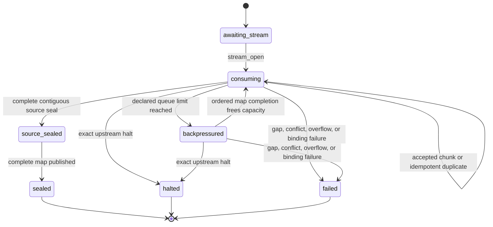
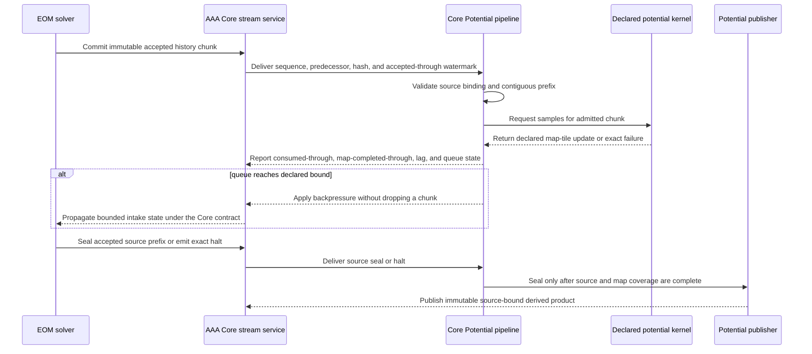

# AAA Core Potential Live Pipeline Contract V1

## Status And Authority

This accepted Core product contract defines how AAA Core Potential consumes a semantically ordered stream of immutable EOM-accepted history chunks, advances map coverage, exposes progressive state, and seals a derived product. AAA Core owns the shared stream envelope and transport. The machine-readable contract now consumes the accepted [`aaa_core_accepted_history_stream/v0`](../accepted-history-stream-v0.md) capability without redefining its payload or production transport.

Plainly: this document fixes Potential's behavior when chunks arrive. It does not create a private wire format, decide whether an EOM step was accepted, or take over the shared data service.

The executable event envelope `potential_live_pipeline_fixture_event/v1` exists only inside the synthetic conformance harness. It is not a production interchange format. Only an accepted Core contract may replace that harness at an application boundary.

## State Machine

Plainly: Potential can wait, consume, temporarily stop intake when its declared queue is full, and finish only after both source and map coverage are complete. A missing chunk, changed duplicate, upstream halt, or broken identity ends authoritative advancement rather than being interpreted as zero data.

Every nonterminal state reports source accepted-through time, app consumed-through time, map completed-through time, lag, queue depth, buffered bytes, missing tiles, and whether backpressure is active. A provisional snapshot is allowed while any declared tile remains missing. A sealed product requires a complete predecessor chain, an exact source seal, an empty queue, and contiguous map completion through the target end time.

## Cross-Owner Sequence

Plainly: the EOM solver decides and commits accepted history; Core transports it; Potential validates and consumes it; a separately owned kernel supplies declared samples; and Potential publishes the derived map. No stage silently fills a gap or gains the authority of an earlier stage.

## Sequencing, Duplicate, And Backpressure Rules

The next unique chunk must have the next integer sequence, the exact predecessor content hash, and an accepted interval beginning at the current accepted-through time. Repeating the same sequence and content hash is an idempotent no-op. Repeating a sequence with different content is a conflict. A higher-than-expected sequence is a missing predecessor. None of these failures permits a watermark to advance.

Plainly: receiving the same sealed package twice is harmless; receiving a changed package under the same number is corruption; and receiving package 3 before package 2 is a gap.

The consumer profile declares both a maximum chunk count and maximum buffered bytes. Reaching either limit enters `backpressured`. A duplicate remains harmless at the limit, but another unique chunk is refused until ordered map completion frees capacity. A buffer limit is therefore an enforced resource boundary, not permission to discard old or inconvenient history.

## Fixture And Claim Boundary

The synthetic fixture contains three contiguous accepted chunks covering $T=0$ through $T=3$, three corresponding map tiles, one exact duplicate, two provisional snapshots, one bounded backpressure interval, a source seal, and a sealed product. The checker replays the same accepted prefix without the duplicate and requires the identical sealed content hash. Negative fixtures cover a candidate EOM step, a missing sequence, a changed duplicate, a broken predecessor, buffer overflow, out-of-order map completion, premature sealing, source rebinding, exact producer halt, and attempted mutation after sealing.

Plainly: the fixture proves the consumer bookkeeping and failure behavior for a small artificial stream. It does not prove a production Core transport, a production potential kernel, live latency, GPU suitability, or any physical result.

Claim grade: `measured-software-conformance` when the checker and focused tests pass. The claim is falsified by any fixture that advances across a missing or rejected chunk, drops a unique chunk at the limit, changes the sealed identity under duplicate-only replay, seals before full coverage, or accepts an event after terminal sealing.
