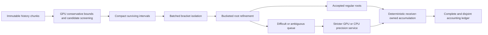

# Root GPU And Operations Options — 2026-08-02

## Status And Decision Boundary

- Snapshot date: `2026-08-02`
- Claim level: measured vendor specifications and prices plus an engineering proposal
- Decision status: no hardware purchase or backend promotion
- Owning queue items: [CORE-006 and CORE-009](work-queue.md#core-006--heterogeneous-path-compute-architecture)

Vendor specifications and public prices in this packet can change. They establish candidate envelopes and a benchmark budget, not application performance. Cost comparisons below exclude taxes and, unless a vendor explicitly bundles them, host CPU/RAM, persistent storage, data transfer, idle capacity, support, and engineering time.

Plainly: this document is a shopping and test map, not evidence that any machine solves the actual root workload correctly or cheaply.

## What Root Finding Demands

Causal-root work is not one uniform arithmetic loop. Different path pairs or intervals may have no roots, one root, several roots, roots that approach or separate, near-degenerate derivatives, variable refinement counts, or a need for stricter precision. Discrete obligations such as root count, root identity, branch continuation, and interval completeness must survive acceleration in addition to continuous numerical error bounds.

The proposed execution shape is:

Plainly: the GPU gets repeated batches whose rows need similar work. It discards proven-empty intervals early, packs the survivors together, and sends only genuinely difficult rows to slower precision routes.

The architecture therefore requires:

- immutable, indexed history chunks with structure-of-arrays device layouts and local time/coordinate origins;
- conservative screens whose `root-free` result is independently justified, not inferred from a cache miss or missing output;
- work compaction and bucketing to limit thread divergence;
- stable pair, interval, root, and branch identities across every queue transition;
- explicit precision escalation rather than silent clamping or iteration exhaustion;
- deterministic or bounded accumulation separated from root discovery;
- end-to-end telemetry for decode, upload, screening, compaction, isolation, refinement, fallback, reduction, memory, publication, and dollar cost;
- complete/disjoint counts for accepted, rejected, deferred, failed, and unprocessed work.

Plainly: raw floating-point speed is only one requirement. The system also has to prove that no candidate vanished between queues and that a fast answer has the same root identities and completeness obligations as the reference answer.

The EOM solver continues to own its root equation, isolation rules, continuation semantics, completeness criterion, and step acceptance. AAA Core owns reusable codec, queue, resource-dispatch, and accounting services. An application-specific analytical kernel similarly retains its own scientific owner.

## Hardware Capability Snapshot

| Option | Public capability relevant to this study | Best proposed role | Important limitation |
| --- | --- | --- | --- |
| Apple Mac Studio, M4 Max | Up to 40-core GPU, 546 GB/s unified-memory bandwidth, and up to 128 GB unified memory; base store configuration starts at $1,999 | Local operations, development, CPU reference work, Metal float32 bulk screening, codecs, live Potential rendering, and modest resident datasets | Apple's Metal Shading Language does not support `double`, so the GPU cannot be the sole strict binary64 root backend |
| Apple Mac Studio, M3 Ultra | Up to 80-core GPU, 819 GB/s unified-memory bandwidth, and up to 512 GB unified memory; base store configuration starts at $3,999 | Same roles as M4 Max when measured resident history or map working sets exceed 128 GB | More unified memory and GPU width do not remove the Metal `double` limitation |
| NVIDIA H100 | 80 GB GPU memory and hardware FP64; the PCIe card advertises more than 2 TB/s memory bandwidth | First rented CUDA benchmark for strict bulk root work and large resident queues | 80 GB may still require chunking; cloud host, storage, and transfer costs vary |
| NVIDIA H200 | 141 GB GPU memory and 4.8 TB/s memory bandwidth | Larger resident root/history batches after H100 proves a memory-bound workload | Higher hourly cost is unjustified until memory capacity or bandwidth is measured as the bottleneck |
| AMD Instinct MI300X | 192 GB HBM3, 5.3 TB/s, and 81.7 TFLOPS peak vector FP64 | Later high-memory ROCm comparison or deployment | Adds a second backend and validation burden; peak specifications do not establish application throughput |
| NVIDIA RTX PRO 6000 Blackwell | 96 GB ECC memory and 1,792 GB/s memory bandwidth | Possible local CUDA development, decoding, visualization, and memory-heavy preprocessing | The vendor workstation page does not establish the FP64 root performance needed here; purchase price and application behavior require a quote and benchmark |

Sources: [Apple Mac Studio specifications](https://www.apple.com/mac-studio/), [Apple Mac Studio store](https://www.apple.com/shop/buy-mac/mac-studio), [Metal Shading Language specification](https://developer.apple.com/metal/Metal-Shading-Language-Specification.pdf), [NVIDIA H100 product brief](https://www.nvidia.com/content/dam/en-zz/Solutions/gtcs22/data-center/h100/PB-11133-001_v01.pdf), [NVIDIA H200 technical overview](https://developer.nvidia.com/blog/taking-computational-fluid-dynamics-to-the-next-level-with-the-nvidia-h200-tensor-core-gpu/), [AMD MI300X specifications](https://www.amd.com/en/products/accelerators/instinct/mi300/mi300x.html), and [NVIDIA RTX PRO 6000 specifications](https://www.nvidia.com/en-us/products/workstations/professional-desktop-gpus/rtx-pro-6000/).

Plainly: an Apple Studio is a strong local application and data machine, especially because CPU and GPU share memory. It is not a substitute for an H100-class FP64 experiment when the root calculation itself needs hardware binary64 on the GPU.

## Current Cloud Price Alternatives

The listed prices are public on-demand, capacity-block, or provider headline prices observed on the snapshot date. Spot capacity can disappear and should be used only for checkpointed, replayable batches.

| Provider and device | Public price | Proposed use |
| --- | ---: | --- |
| Google Cloud T4 | $0.35 per GPU-hour, plus the surrounding VM | Cheap CUDA pipeline development, codec/decode tests, visualization, and float32 screening experiments |
| Google Cloud V100 | $2.48 per GPU-hour, plus the surrounding VM | Older FP64-capable comparison when availability or software compatibility makes it useful |
| RunPod H100 PCIe / SXM | About $2.89 / $2.99 per GPU-hour | Lowest-friction first single-GPU H100 benchmark among the prices recorded here |
| RunPod H100 NVL 94 GB | About $3.19 per GPU-hour | Slightly larger memory experiment when 80 GB is the measured boundary |
| AWS Capacity Blocks, one H100 | $5.191 per GPU-hour for `p5.4xlarge` | Controlled scheduled benchmark with AWS operational integration |
| AWS Capacity Blocks, eight H100 | $41.528 per hour for `p5.48xlarge` | Multi-GPU scaling only after one-GPU correctness and utilization are established |
| AWS Capacity Blocks, eight H200 | $47.76 per hour for `p5e.48xlarge` | High-memory scale campaign after H200 need is measured |
| AWS Capacity Blocks, eight A100 | $11.80 per hour for `p4d.24xlarge` | Lower-cost eight-GPU comparison where A100 memory and FP64 behavior fit |
| CoreWeave, eight H100 on-demand / spot | $49.24 / $19.71 per hour | Repeatable multi-GPU or replay-safe spot campaign |
| CoreWeave, eight H200 on-demand / spot | $50.44 / $20.93 per hour | High-memory multi-GPU campaign after workload qualification |
| CoreWeave, eight A100 on-demand / spot | $21.60 / $9.65 per hour | Lower-cost multi-GPU baseline |

Sources: [Google Cloud GPU pricing](https://cloud.google.com/products/compute/gpus-pricing?hl=en), [RunPod H100 guide](https://www.runpod.io/articles/guides/h100-clusters-on-runpod-for-distributed-ai-training), [RunPod pricing](https://www.runpod.io/pricing), [AWS EC2 Capacity Blocks pricing](https://aws.amazon.com/ec2/capacityblocks/pricing/), and [CoreWeave pricing](https://coreweave.com/pricing).

Plainly: cloud rental lets the project test the real workload before buying hardware. The cheapest device is useful only if it supports the required precision and finishes the complete pipeline; a low hourly price cannot compensate for an unusable numeric route.

## Spend Comparisons, Not Performance Equivalence

Using the public base Mac Studio prices and the approximately $2.99 RunPod H100 SXM headline rate:

$$
\frac{\$1{,}999}{\$2.99/\mathrm{hour}} \approx 669\ \text{H100-hours},
\qquad
\frac{\$3{,}999}{\$2.99/\mathrm{hour}} \approx 1{,}337\ \text{H100-hours}.
$$

At the AWS one-H100 Capacity Block price of $5.191 per hour, the same sticker-price divisions are approximately 385 and 770 H100-hours. These are cash-spend ratios only. They do not compare performance, memory capacity, host resources, utilization, ownership life, resale value, electricity, support, storage, transfer, or engineering cost.

Plainly: a base M4 Max costs about the same cash as roughly 669 hours at one quoted H100 rate, but the two machines do different jobs. The calculation helps cap an experiment budget; it does not say which machine is faster or better.

## Recommended Operating Posture

### Phase 1 — Local Reference And Product Work

Use a Mac Studio M4 Max as the default new local option if an operations machine is needed, with 64–128 GB chosen from measured resident data rather than aspiration. Use its CPU for binary64 and arbitrary-precision reference or difficult rows, and Metal for float32-conforming screening, decoding, indexing, map construction, and display. Choose an M3 Ultra only if profiling shows that more than 128 GB of unified resident history/maps materially changes the workload; its larger memory does not solve GPU FP64.

Plainly: the M4 Max is the cost-conscious operations recommendation. The M3 Ultra is a memory-capacity decision, not the automatic “serious compute” choice.

### Phase 2 — Rent The Missing Capability

Build one versioned root benchmark and rent a single H100 for an initial 20–100 GPU-hour envelope. At the prices above, the raw accelerator budget is approximately $58–$299 on RunPod or $104–$519 on AWS before surrounding costs. Run the same input hashes through the local reference, record every queue stage, and use an independently defined analytical or enclosure check for root identity and completeness.

Plainly: a few hundred dollars can answer whether CUDA FP64 materially advances the actual root workload before the project commits thousands of dollars or months of backend engineering.

### Phase 3 — Scale Only From Evidence

Move to H200 only if 80 GB capacity or H100 memory bandwidth is measured as the limiting factor. Compare MI300X only after the kernel and contract are stable enough that ROCm porting cost can be measured. Use spot capacity only for sealed-input, checkpointed, idempotent workloads; use on-demand or scheduled capacity for live sessions. Consider an on-premises CUDA or ROCm workstation only after sustained utilization, data-transfer constraints, confidentiality requirements, or cloud spend make ownership favorable.

Plainly: cloud first keeps the architecture portable and the purchase decision reversible. Local accelerator ownership becomes attractive only when actual duty cycle and workload fit are known.

## Benchmark Ladder And Falsifiers

1. **Correctness reference:** small analytical or independently enclosed cases establish expected root counts, intervals, identities, and tolerances.
2. **CPU baseline:** record codec, indexing, screening, isolation, refinement, accumulation, memory, and wall time on the local strict route.
3. **Metal pipeline trial:** measure float32-safe preprocessing, decoding, map generation, and difficult-row return; do not promote unsupported strict root work.
4. **Single H100 trial:** port the stable regular queues, retain the same difficult-row semantics, and record end-to-end cost rather than kernel throughput alone.
5. **Capacity test:** increase path count and history depth until memory residency, transfer, compaction, divergence, or fallback becomes the limiting resource.
6. **Operating decision:** select local, cloud, or hybrid posture only for the measured workload envelope and record the observation that would reverse the decision.

Plainly: each rung earns the next expense. If decoding, transfers, divergence, fallback, or root-accounting overhead erases the GPU gain, the architecture must change or the accelerator must be rejected for that workload.

The main proposal is falsified if the staged queues cannot preserve the independently checked root set and completeness ledger, or if end-to-end profiles show no useful latency, throughput, or cost advantage over the strict CPU route. The M4 Max recommendation is falsified if representative local working sets consistently require more than 128 GB, if required application software cannot use Metal effectively, or if measured cloud-first workflows make a new local machine unnecessary. The cloud-first accelerator recommendation is falsified if data governance, transfer volume, sustained utilization, or measured total cost makes an owned FP64-capable system clearly preferable.

## Immediate Next Artifact

CORE-002 should define one small root-correctness workload and one representative production-shaped workload. CORE-003 should bind their source chunks and device layouts to registered codec capabilities. CORE-006 should then specify the queue state machine, and CORE-009 should execute this benchmark ladder.

Plainly: the next decision is not which large machine to buy. It is which exact workload will make the machines answerable to the same correctness and cost test.
