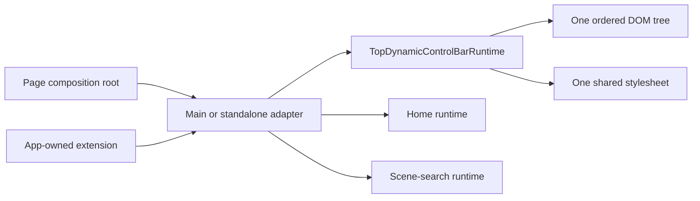

# Top Dynamic Control Bar Runtime Design V1

## Status

This accepted design selects one canonical implementation path for the top dynamic control bar. Every declared full-bar surface now uses that path: the main webapp, Animator, Lattice Lab, Wake Topography, Photon, Causal Delay Feedback, Greek Letter Match, Equation Mapping, PDG Edit, Molecule, Ideal Braid, Braid Search, Borg, and Borg Library.

Plainly: all fourteen full-bar surfaces now use one architecture, with one runtime and one stylesheet rather than copied navigation shells.

## Current Duplication

The migration removed the repeated static `scene-hud-tools` markup from Ideal Braid and Borg, the runtime-built copy from Braid Search, and Borg Library's text-only Applications link. Every standalone full-bar surface now uses `StandaloneAppNavigationRuntime.js`. Equation Mapping retains a separate local icon-button family only for equation Search, Edit, and Settings; Borg retains Diagnostics as a declared app-mode extension.

Plainly: shared navigation changes now have one implementation path, while each app still owns the controls that operate its subject matter.

## Canonical Ownership

| Responsibility | Canonical owner after migration |
| --- | --- |
| Action kinds, stable order, button metadata, SVG icon fragments, DOM construction, pressed/expanded/disabled state, and destruction | `src/runtime/TopDynamicControlBarRuntime.js` |
| Shared dimensions, shell colors, focus, popover placement, safe-area offsets, wrapping, and reduced-motion treatment | `src/runtime/top-dynamic-control-bar.css` |
| Standalone Applications Home destination and history-preserving navigation | `src/apps/navigator/StandaloneAppHomeRuntime.js` |
| Global scene-search data, filtering, focus, dismissal, and scene-route resolution | `src/apps/navigator/StandaloneAppSceneSearchRuntime.js` |
| Standalone composition of TOC, history, Home, global Search, and declared extension actions | `src/apps/navigator/StandaloneAppNavigationRuntime.js` |
| Main scene and Animator adapters | Their thin composition roots, consuming the shared runtime rather than copying its markup or icons |
| App-local domain controls and specialized searches | The owning app, outside the global bar unless accepted as a declared mode-entry extension |

Plainly: the generic runtime draws and manages the bar. Navigator modules decide where global actions go. Each app keeps only controls that operate its own subject matter.

Icon elements must be created with the SVG namespace rather than by using the HTML element factory with an `svg` tag name. Focused tests must inspect the resulting namespace, and rendered checks must establish nonzero icon-geometry bounds; the presence of a circular button shell or SVG-looking serialized markup is not evidence that a glyph painted. The canonical action rule also owns `box-sizing` and an explicit `32px` minimum height so app-wide button defaults cannot enlarge the shared controls.

Plainly: a shared button is complete only when its icon is actually visible and its outside dimensions remain 32 pixels on every adopting page.

The final migration deleted the superseded `src/apps/navigator/standalone-app-navigation.css` file and its remaining imports. `src/runtime/top-dynamic-control-bar.css` is the sole shared style owner.

## Runtime Shape



Plainly: a page asks an adapter for the standard bar. The adapter connects existing navigation services and any permitted app-level extension; the shared runtime alone creates the buttons.

The generic constructor should accept one host and ordered action descriptors:

```js
createTopDynamicControlBar({
  host,
  label,
  actions,
  document,
  window,
})
```

Each action descriptor declares `kind`, `id`, `label`, `title`, `onActivate`, and optional `pressed`, `expanded`, `disabled`, `controls`, `popover`, `className`, and centrally registered `iconKind` fields. The runtime rejects duplicate kinds, duplicate IDs, unknown shared kinds or icons, missing accessible labels, and an order that violates the accepted standard. It returns element references plus `update(nextState)` and `destroy()`.

Plainly: every button arrives with the information needed for appearance, accessibility, state, and behavior. Apps cannot silently reorder shared actions or create an unlabeled look-alike.

## Extension Contract

The shared action kinds are `toc`, `back`, `forward`, `home`, `search`, `notes`, `documents`, `layout`, `print`, `settings`, `edit`, and `close`. A full standalone adapter normally supplies `toc`, `back`, `forward`, `home`, and `search`. A missing capability is omitted rather than disabled indefinitely.

An application may add an app-mode action after `settings` when the action changes the whole application mode and has an accessible name, a versioned icon, an explicit pressed/expanded state where applicable, and an anchored panel contract. Borg Diagnostics and Equation Mapping Edit are examples of eligible mode entries. Playback, reset, scrubbers, filters, solver execution, canvas view controls, local collection search, and local document selection remain outside the shared bar.

Plainly: a whole-app mode can join the strip; controls that operate a timeline, dataset, canvas, or form stay beside that object.

Local equation, molecule, reaction, document, and collection searches remain owned by their apps. They cannot register as the shared `search` kind. The full-bar search action always uses the global scene-search adapter.

## Focus And Popovers

Only one shared-bar popover may be open at a time. Opening a popover sets `aria-expanded=true`, closes the previous popover, clears and focuses the target input when the action contract calls for it, and records the opener. `Escape` closes the popover and restores focus to the opener. Safe outside interaction closes it. Destroying the bar aborts every listener and restores no stale focus.

Plainly: Search and Settings cannot stack over each other or lose the keyboard user. Closing returns the user to the button that opened the panel.

The adapter may preserve the existing element IDs required by the scene-search runtime, but those IDs are emitted by the shared builder. A page must not keep a second hidden copy of the same controls for compatibility.

## Responsive And Layout Contract

The stylesheet keeps `32px` circular shared icons, `8px` gaps, top/right safe-area anchoring, and visible keyboard focus. It never shrinks the shared shell below `32px`. At constrained widths, optional document and mode actions collapse or wrap before the required navigation set. A popover remains within the viewport and no app content may rely on fixed empty space beneath an assumed one-row bar.

Plainly: mobile can use fewer visible optional actions or an extra row, but it does not produce tiny buttons or change their meaning.

## Migration Rule

Each migrated surface replaces its old markup and local icon construction in one edit, mounts one declarative host, consumes the shared runtime, and deletes every now-unused page rule or helper. No compatibility shim or dual active path is retained. Main webapp and Animator should migrate together because their forked scene-HUD structures answer the same responsibility.

Plainly: migration removes duplication as it goes. It does not add a new component while leaving the old bar underneath it.

## Verification

Focused tests must prove canonical order, unique IDs, accessible labels, state updates, one-popover behavior, focus restoration, listener cleanup, Home targets, history calls, scene-search integration, extension placement, missing-capability omission, and rejection of domain-control kinds. Each migrated surface also requires existing app tests plus desktop and mobile browser evidence for action order, wrapping, focus, popover clearance, and unchanged local controls.

Claim grade: `accepted-software-design`. The design is falsified if implementation requires a second shared markup or style owner, cannot preserve the accepted action order and focus behavior, forces domain controls into global chrome, or leaves a migrated page with two active implementations.
