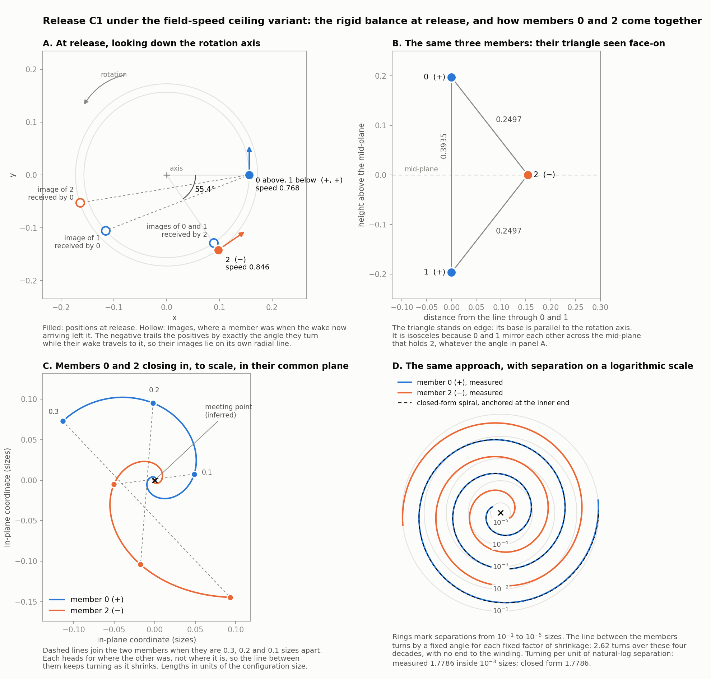

# Ceiling contact of the three-member release C1: does the approaching pair reach coincidence?

**The equation in this record is the field-speed ceiling variant, not the Master Equation.** It is an authorized research variation with the canonical equation retained as baseline. Nothing here adopts it, and nothing here selects a contact rule, event map, smoothing, softening, source truncation, new history or continuation past contact.

Work window: started 2026-10-06 18:08 EDT, deadline 20:08 EDT, last twenty minutes reserved for verification and capture. Numerical work ended at 19:19 and the closing verification of this record at 19:21.

## 1. Result

The [released-balance census](released-balances-under-field-speed-ceiling-2026-10-06.md) and its [blind reproduction](ceiling-releases-blind-reproduction-2026-10-06.md) stop the release C1 when its members 0 and 2 are a thousandth of the configuration size apart, closing at $0.98$ of wake speed. That is a stopping rule. This study asks whether the two members actually meet in finite time.

**Outcome: a precise obstruction (the third of the three outcomes sought), together with a conditional theorem whose every hypothesis but one is either proved to maintain itself or read from the stored history.** Coincidence is not proved. Turning is not found, and no loss of the ordinary root domain is found.

The findings, each graded where it is stated:

1. **The approach is a delayed mutual pursuit (derived).** While a member rides the ceiling, the response removes the forward part of its summed row and keeps the turning part. The pair's row grows as the inverse square of the delayed range, so the turning it supplies overwhelms every other influence and locks each member's velocity onto the direction of the partner's *image*, the place the partner occupied when the wake now arriving was emitted. Section 5 proves that this lock, once established at small delayed range, maintains itself: the pointing error stays below three times the delayed range.
2. **The third member is controlled completely by stored history (derived, with measured inputs).** Member 1 is $0.425$ away. Every wake it can deliver to the pair during the remaining approach was emitted before the frozen final node. Its row is bounded and cannot change the lock.
3. **Given the lock, coincidence in finite time follows from one further inequality (derived).** If the ratio of delayed range to present separation stays bounded, then the separation decreases strictly and the pair coincides in finite time. For C1 any bounding constant from $1.29$ to $1.95$ serves, and the coincidence then falls within $0.039$ time units of the frozen final node ($0.017$ for the constant $1.3$). Section 5 states this as Theorems A and B.
4. **That one inequality is the obstruction (derived).** The ratio's rate of change is the difference of two terms of equal order which cancel exactly on the limiting motion. The estimates available from the speed bound leave its sign undetermined. Trapping the ratio requires a contraction estimate for a map acting on a segment of the pair's joint history, which is not established. Section 6 states exactly what is missing, and Section 7 reduces it, in the planar symmetric case, to a two-sided bound on the solution of one scalar delay equation.
5. **The limiting motion is identified in closed form (derived as a formal limit; a comparison, not a solution of the variant).** Exact pursuit of the image has a self-similar inward spiral fixed by one transcendental equation. It predicts closing rate $0.980194$, delay ratio $1.290061$ and transmitter factor $0.883193$. Its formal linear spectrum has no mode other than its own symmetries that fails to decay.
6. **C1 follows that spiral as far as either frozen integrator can be taken (measured).** Continued with the unchanged blind-reference integrator from a thousandth to a hundred-thousandth of the size, the closing rate, delay ratio and transmitter factor approach the three predicted constants with a difference proportional to the separation over three decades. The unchanged subject integrator, whose smaller step at the ceiling resolves the lock, gives the same values to six digits down to a ten-thousandth of the size and shows the pointing error settling on its predicted multiple of the delayed range. The separation decreases at every stored node of every run.
7. **If the pair does coincide this way, the ending has a definite character (derived, conditional on the same inequality).** Present positions and delayed ranges vanish together, and the two velocities cannot both have limits: the velocity of at least one member cannot remain absolutely continuous on a time interval that includes the coincidence instant, whatever is decided about contact. In the measured approach the pair's transmitter factors tend to $0.8832$, so its causal roots stay ordinary all the way in (measured).

8. **How the balance comes apart before the approach, and how the pair's plane forms (measured).** Member 2 leaves the mid-plane first, climbs to member 0 and reaches the ceiling at $0.4598\,P$; member 0 follows at $0.7812\,P$; member 1 dissociates, and no row drives it away: the row that held it on its circle is withdrawn. Members 0 and 2 associate in the inward spiral. They start with velocities far from a common plane and come to move in one plane, tilted $9.47^\circ$ from the plane of the original rotation, with velocities tending to exactly opposite and the pair's centre coming to rest. Section 8 gives the timeline and the plane-formation ladder.

9. **The two arms are one spiral turned half a turn about the meeting point, and they never cross (measured).** They are not mirror images: both wind the same way. Whatever inequality the two members arrive with dies as the separation to the power $1.905$ in both integrators, against $1.9084$ for the slowest antisymmetric mode of the formal spectrum, a number fixed before any asymmetry was measured. From $0.3$ sizes inward neither member comes nearer to the other's path than $0.71$ of its own distance from the meeting point; the only point the two paths share is the one both reach together. Each turn shrinks the separation $34.2$-fold and takes $34.2$ times less time than the one before, so the turns are unbounded in number and their total duration is finite.

**What this does and does not establish.** The inference "C1 reaches coincidence at $t^\ast\approx0.87484$ periods" is graded *inferred*: it rests on a derived conditional theorem, a measured entry into its hypotheses, a measured continuation in which the one unproved hypothesis holds with margin, and a formal stability computation for the comparison motion. Smaller threshold crossings alone would not carry it. The step still missing for a proof is named in Section 6.

Values use $K=c_f=c_a=1$. Times are in units with $c_f=1$ unless marked as periods $P$; lengths are in the same units unless marked as sizes.

## 2. Case identity and frozen specification

**Case.** C1 is the first entry of `blind-ceiling.json` in `.local-data/master-equation-closure/geometry-session-20261006/ceiling/` (SHA-256 `065a836c…036f31`). It was located through the records and not rebuilt from printed digits. Its radii, angles, heights, polarities and angular rate equal, digit for digit, balance 0 of `results2/0063.json` in the same session directory (mirror group, three members, verified balance), by direct comparison of the parsed values. The balance is an exact rigid solution of the unchanged Master Equation: members 0 and 1 of positive polarity at radius $0.156728$ and heights $\pm0.196735$, member 2 of negative polarity at radius $0.172669$ and height zero, angular rate $4.900208$, period $P=1.282228$, size $0.196735$, speeds $(0.7680,0.7680,0.8461)$.

**Shape of the balance, and why the negative trails by $55.4^\circ$.** The two positives share one azimuth and sit at heights $\pm0.196735$, so they are mirror images across the mid-plane, and the negative lies in that plane. The triangle is isosceles for that reason alone, at any azimuth: its base is the vertical segment joining the positives, of length $0.393469$, and its two equal sides, of length $0.249723$, join the negative to each positive. The azimuth is not free. A rigid rotation keeps every speed constant, so the summed row on each member must have no component along its direction of motion. The negative receives two rows that are mirror images of each other; their components along its motion are equal and add, so each must vanish separately (derived). That happens exactly when each positive's image, the place it occupied when its arriving wake was emitted, lies on the negative's own radial line. The negative must therefore trail the positives by the angle they turn through during that delay. The delay is $\sqrt{(0.172669-0.156728)^2+0.196735^2}=0.197379$, and $4.900208\times0.197379=0.96720$ rad $=55.4165^\circ$, which is the stored azimuth offset (measured; rows evaluated directly at release, sum checked against the centripetal acceleration to $10^{-15}$). On each positive the balance is a cancellation between two rows instead: the like-polarity row from its mirror partner contributes $+1.07544$ along the motion and $+4.00478$ away from the mid-plane, and the row from the negative contributes $-1.07544$ and $-4.00478$. A four-panel drawing of this geometry and of the approach of members 0 and 2, made from the case file and the stored fine-setting trajectory by `ccth_figure.py`, is stored as [ceiling-contact-c1-release-and-spiral.png](../../../../../content/assets/images/claude-generated/ceiling-contact-c1-release-and-spiral.png) and shown below; in it the line joining the two members turns $1.7786$ radians per unit of natural-log separation inside $10^{-3}$ sizes, against the closed-form $1.7786$ (measured). The figure's receipt `ccth-figure-release-and-spiral.json` records two further values (measured, same script and trajectory): inside $0.3$ sizes, after $0.78\,P$, the unit joining direction departs from its best-fit plane by at most $0.0092$, and the joining line makes $2.62$ turns between $10^{-1}$ and $10^{-5}$ sizes, against $k\ln(10^{4})/(2\pi)=2.61$ for the closed-form spiral. By operator decision of 2026-10-07 the picture is kept in the image library's `claude-generated` folder and is registered in the image catalog as `needs-review`; its generating script and receipt remain in the study's local directory named in Section 10, and it is reproducible from the listed sources.



**Complete past and kick.** For emission times $S\le0$ every row reads the exact rigid rotation analytically. At $T=0$ the three velocities receive the kick stored in the case file, of total size $10^{-4}$. For $S>0$ rows read the computed motion.

**Receipts used.** The blind reference's stored trajectory `independent/C1-finest-traj.npz` (18,153 nodes, SHA-256 `8a4eff32…0af0f8`), its summary `C1-finest.json`, and `final_rows.json`. The frozen subject `release_cap.py` (SHA-256 `ad1514b5…c422b`) and blind-reference integrator `independent/ceiling_sim.py` (SHA-256 `b887c4eb…eedb3`) were not edited; the hashes were recomputed at closeout and are unchanged.

**Specification, unchanged.** The [existing definition](../../equation-variants/field-speed-ceiling/definition.md#12-the-ordinary-causal-root-ledger), Sections 1.2 to 1.4, as frozen for this case in the [variant index](../../equation-variants/README.md): ordinary partner rows at their original weight; zero self acceleration; the inclusive response at $c_a=c_f$ applied after the rows are summed. No assumption from any other study is carried in.

**History of the release, from the frozen records (measured).** Member 2 reaches the ceiling at $0.45982635\,P$ and member 0 at $0.78119419\,P$. Both ride it to the end. Member 1 never reaches it; its largest speed is $0.8627$. What each member does between release and the approach, including the fate of member 1 up to the last stored node, is tabulated in [Section 8](#8-measurements-on-c1) under "How the balance comes apart".

## 3. Exact equations of the approaching pair

Write $\mathbf X_i(T)$, $\mathbf V_i(T)$ for position and velocity of member $i$ at absolute time $T$. The approaching pair is $\{0,2\}$, of opposite polarity. For a receiver $i$ in the pair with partner $j$, let $S_i(T)$ be the instant at which the partner emitted the wake that arrives at $T$. Each member has its own emission clock; both are retained. Define

$$
\tau_i=T-S_i,\qquad \hat{\mathbf n}_i=\frac{\mathbf X_i(T)-\mathbf X_j(S_i)}{\tau_i},\qquad \mathbf e_i=-\hat{\mathbf n}_i,\qquad a_i=\mathbf e_i\cdot\mathbf V_i(T),\qquad b_i=\hat{\mathbf n}_i\cdot\mathbf V_j(S_i)
$$

Here $\tau_i$ is the **delayed range**, which equals the delay because $c_f=1$. The unit vector $\mathbf e_i$ points from the receiver to the partner's **image**, the point $\mathbf X_j(S_i)$. The number $a_i$ is the receiver's velocity component toward the image, and $b_i$ is the partner's velocity component, at emission, toward the place where the receiver will be at reception. In the definition's notation the receiver factor is $D_r=1+a_i$ and the transmitter factor is $D_t=1-b_i$.

**The two emission clocks.** Differentiating the causal equation $\lVert\mathbf X_i(T)-\mathbf X_j(S_i)\rVert=T-S_i$ gives, at an ordinary root,

$$
\frac{dS_i}{dT}=\frac{1+a_i}{1-b_i},\qquad \frac{d\tau_i}{dT}=-\frac{a_i+b_i}{1-b_i}
$$

The second relation is used throughout and is called the clock identity. It is exact and contains no approximation of either motion.

**The rows.** The pair's row on receiver $i$ is attractive and points at the image. The third member contributes one row to each. With $\sigma_{01}=+1$ and $\sigma_{21}=-1$,

$$
\mathbf A_i^{\mathrm{ord}}=\frac{\mathbf e_i}{\tau_i^2(1-b_i)}+\mathbf A_{i\leftarrow1},\qquad
\mathbf A_{i\leftarrow1}=\sigma_{i1}\frac{\hat{\mathbf n}_{i1}}{\tau_{i1}^2\,D_{t,i1}}
$$

where $\tau_{i1}$, $\hat{\mathbf n}_{i1}$ and $D_{t,i1}$ are the delayed range, direction and transmitter factor of the row from member 1, evaluated at member 1's own emission instant. Member 1 is not replaced by a prescribed source: its row is read from its actual history.

**The response.** At speed one the definition gives $\dot{\mathbf V}_i=\mathbf A_i^{\mathrm{ord}}-(\mathbf V_i\cdot\mathbf A_i^{\mathrm{ord}})_+\mathbf V_i$, applied to the sum. While the forward part $\mathbf V_i\cdot\mathbf A_i^{\mathrm{ord}}$ is positive the member rides the ceiling, its velocity is a unit vector $\mathbf u_i$, and

$$
\dot{\mathbf u}_i=\frac{\mathbf e_i-(\mathbf u_i\cdot\mathbf e_i)\,\mathbf u_i}{\tau_i^2(1-b_i)}+\bigl(\mathbf A_{i\leftarrow1}-(\mathbf u_i\cdot\mathbf A_{i\leftarrow1})\,\mathbf u_i\bigr)
$$

This is the direction equation. The first term turns the velocity toward the image at a rate proportional to $1/\tau_i^2$.

**The relative position.** Let $\mathbf R=\mathbf X_0-\mathbf X_2$, $r=\lVert\mathbf R\rVert$ and $\mathbf n=\mathbf R/r$. Then

$$
\dot r=-(p_0+p_2),\qquad p_0=-\mathbf n\cdot\mathbf V_0,\qquad p_2=\mathbf n\cdot\mathbf V_2,\qquad \dot{\mathbf n}=\frac{(\mathbf V_0-\mathbf V_2)-\bigl(\mathbf n\cdot(\mathbf V_0-\mathbf V_2)\bigr)\mathbf n}{r}
$$

Each $p_i$ is one member's velocity component toward the other's *present* position. Head-on motion is not assumed: the direction $\mathbf n$ is free to rotate.

**Two triangle identities.** They connect the quantities above to chords of the paths and are exact.

- *One leg.* The receiver at $T$, the image $\mathbf X_j(S_i)$ and the partner's present position form a triangle with sides $\tau_i$, $r$ and the chord $c_j=\lVert\mathbf X_j(T)-\mathbf X_j(S_i)\rVert\le\tau_i$. The angle $\theta_i$ at the receiver between image and present partner satisfies $\cos\theta_i=(\tau_i^2+r^2-c_j^2)/(2\tau_ir)$.
- *Two legs.* Let $\tau_j'=\tau_j(S_i)$ be the partner's own delayed range at its emission instant and $S_i'=S_i-\tau_j'$. The receiver's positions at $S_i'$ and at $T$ and the image point form a triangle with sides $\tau_j'$, $\tau_i$ and the receiver's own chord $C_i=\lVert\mathbf X_i(T)-\mathbf X_i(S_i')\rVert\le\tau_i+\tau_j'$. Its angle at the image point has cosine $\beta_i=(\tau_i^2+\tau_j'^2-C_i^2)/(2\tau_i\tau_j')$. If the partner was at speed one and aimed exactly at its own image of the receiver when it emitted, then $b_i=\beta_i$; for a partner at speed one the two angles differ by at most its pointing error at $S_i$.

The second identity shows where the difficulty lives. The number $b_i$, which drives the emission clock, is fixed by the shape of the receiver's own path over the two-leg span $[S_i',T]$, a look-back of length $\tau_i+\tau_j'$.

## 4. Four endings that must not be confused

| Notion | Definition | Relation to the others |
| --- | --- | --- |
| Present-position coincidence | $r(T)\to0$ | Implied by zero delayed range, since $r\le2\tau_i$ always. Does not by itself imply it. |
| Zero delayed range | $\tau_i(T)\to0$ | Implies coincidence. At a single instant $\tau_i=0$ and $r=0$ are the same statement. |
| Degenerate causal root | $D_t=1-b_i\to0$: the partner, at emission, moved at full speed straight at the reception point | Independent of the two above. The row is then not ordinary and the definition stops determining the motion, at any separation. |
| Loss of absolutely continuous velocity | $\mathbf V_i$ has no absolutely continuous extension to a closed interval | Independent in general. Proposition C shows that in the ending measured here it happens, for at least one member of the pair, exactly at coincidence. |

**Why $r\le2\tau_i$.** $\lVert\mathbf X_i(T)-\mathbf X_j(T)\rVert\le\lVert\mathbf X_i(T)-\mathbf X_j(S_i)\rVert+\lVert\mathbf X_j(S_i)-\mathbf X_j(T)\rVert\le\tau_i+(T-S_i)$.

**Why the converse fails at $c_a=c_f$.** Two members moving side by side at speed one in the same direction receive nothing from each other's straight segments: the wake of a source at wake speed never reaches a point abreast of it. Their roots lie in older history, so $r$ can be small while $\tau_i$ is not. This is the absence of gap control recorded in [Section 2.1 of the definition](../../equation-variants/field-speed-ceiling/definition.md#211-strict-gap-control-and-its-boundary), and it is the root of the obstruction in Section 6.

## 5. What controls the approach

Throughout, the pair's rows are assumed ordinary ($b_i<1$) on the interval considered; that is the condition for the specification to define the motion at all. $M$ denotes a bound on $\lVert\mathbf A_{i\leftarrow1}\rVert$. The pointing error $\psi_i\in[0,\pi]$ is the angle between $\mathbf u_i$ and $\mathbf e_i$, so $a_i=\cos\psi_i$ for a member at speed one.

**Lemma 1 (the third member is read from stored history; derived).** Let $d$ be the smaller of the distances from member 1 to members 0 and 2 at a time $t_1$. For $t_1\le T\le t_1+d/4$ the row $\mathbf A_{i\leftarrow1}(T)$ reads member 1 only at emission instants $S\le t_1$, and its delayed range is at least $d/4$. Hence $\lVert\mathbf A_{i\leftarrow1}\rVert\le16/\bigl(d^2(1-v_1)\bigr)$, where $v_1<1$ is the largest speed of member 1 on its history up to $t_1$.

*Proof.* Speeds are at most one, so the present distance at $T$ is at least $d-2(T-t_1)$. The delayed range of a row is at least half the present distance, by the inequality of Section 4. So $\tau_{i1}(T)\ge d/2-(T-t_1)\ge d/4$ and $S=T-\tau_{i1}\le t_1+2(T-t_1)-d/2\le t_1$. The transmitter factor is at least $1-v_1$. $\square$

The consequence is a causal separation. During the remaining approach, if it is shorter than $d/4$, nothing member 1 does after $t_1$ can reach the pair, and nothing the pair does can return to it through member 1. The third member's contribution is retained in full and is a bounded, already determined input.

**Lemma 2 (the pointing error is trapped; derived).** Let member $i$ ride the ceiling on an interval on which $\lVert\mathbf A_{i\leftarrow1}\rVert\le M$ and $\tau_i\le\bar\tau_M:=1/(24+4M)$. If $\sin\psi_i\le3\tau_i$ with $\psi_i<\pi/2$ at the start of the interval, the same holds throughout it.

*Proof.* From the direction equation, $\frac{d}{dT}(\mathbf u_i\cdot\mathbf e_i)=\dot{\mathbf u}_i\cdot\mathbf e_i+\mathbf u_i\cdot\dot{\mathbf e}_i$. The pair term contributes $\sin^2\psi_i/(\tau_i^2(1-b_i))$; the third-member term is at least $-M\sin\psi_i$; and since $\dot{\mathbf e}_i\perp\mathbf e_i$ the last term is at least $-\sin\psi_i\lVert\dot{\mathbf e}_i\rVert$. Dividing by $-\sin\psi_i$,

$$
\dot\psi_i\le-\frac{\sin\psi_i}{\tau_i^2(1-b_i)}+M+\lVert\dot{\mathbf e}_i\rVert
$$

The image direction turns because both ends of the line of sight move: $\dot{\mathbf e}_i$ is the part of $\bigl(\mathbf V_j(S_i)\,\dot S_i-\mathbf u_i\bigr)/\tau_i$ perpendicular to $\mathbf e_i$. The perpendicular part of $\mathbf V_j(S_i)$ is at most $\sqrt{1-b_i^2}$ because its speed is at most one, and that of $\mathbf u_i$ is $\sin\psi_i$. With $\dot S_i=(1+\cos\psi_i)/(1-b_i)$ this gives $\lVert\dot{\mathbf e}_i\rVert\le\bigl[(1+\cos\psi_i)\sqrt{1-b_i^2}/(1-b_i)+\sin\psi_i\bigr]/\tau_i$. Multiplying the inequality by the positive number $\tau_i^2(1-b_i)$ and using $(1+\cos\psi_i)\sqrt{1-b_i^2}\le2$ and $1-b_i\le2$,

$$
\tau_i^2(1-b_i)\,\dot\psi_i\le-(1-2\tau_i)\sin\psi_i+2\tau_i+2M\tau_i^2
$$

On the boundary $\sin\psi_i=3\tau_i$ the right side is $-\tau_i\bigl(1-(6+2M)\tau_i\bigr)$. The boundary itself moves at $3\dot\tau_i\ge-6/(1-b_i)$ by the clock identity. Therefore

$$
\frac{d}{dT}\bigl(\sin\psi_i-3\tau_i\bigr)\le\frac{-\cos\psi_i\bigl(1-(6+2M)\tau_i\bigr)+6\tau_i}{\tau_i(1-b_i)}
$$

For $\tau_i\le1/(24+4M)$ one has $(6+2M)\tau_i\le\tfrac12$, $6\tau_i\le\tfrac14$ and $\cos\psi_i\ge0.99$, so the numerator is below $-0.24$. The same sign holds for $\sin\psi_i$ slightly below $3\tau_i$, so the region cannot be left. $\square$

The transmitter factor cancels from the sign of every inequality in this proof. The lemma therefore needs the row to be ordinary but needs no lower bound on $1-b_i$.

**Lemma 3 (riding maintains itself; derived).** For a member at speed one with $\sin\psi_i\le3\tau_i$, $\psi_i<\pi/2$, $\tau_i\le\bar\tau_M$ and $\lVert\mathbf A_{i\leftarrow1}\rVert\le M$, the forward part of the summed row is at least $\cos\psi_i/(2\tau_i^2)-M>0$. Under the response the speed of a member at the ceiling can fall only while the forward part is negative, so the member stays at speed one and the response stays in the form used above. Lemmas 2 and 3 therefore continue each other: riding is not an extra hypothesis after the starting instant.

**Lemma 4 (closing bound; derived).** For a member at speed one with $\psi_i\le\pi/2$, $p_i\ge\cos(\theta_i+\psi_i)\ge r/(2\tau_i)-2\sin\psi_i$. The second step uses the one-leg identity with $c_j\le\tau_i$, which gives $\cos\theta_i\ge r/(2\tau_i)$. Consequently, when both members satisfy Lemma 2,

$$
\dot r\le-\frac r{2\tau_0}-\frac r{2\tau_2}+6(\tau_0+\tau_2)
$$

A member aimed at the image always has a positive velocity component toward the partner's present position, because the image lies within $\tau_i$ of that position while being exactly $\tau_i$ from the receiver.

**Lemma 5 (the lens bound; derived).** In the two-leg triangle of Section 3 let $\varepsilon_i=\pi-\arccos\beta_i$. The receiver's position at the intermediate instant $S_i$ lies within $\tau_j'$ of its position at $S_i'$ and within $\tau_i$ of its position at $T$, a lens-shaped region that has the image point on its rim. If $\varepsilon_i\le\pi/2$ every point of that lens is within $\sqrt5\,\min(\tau_i,\tau_j')\sin\varepsilon_i$ of the image point. Therefore

$$
\sin\varepsilon_i\ge\frac{r(S_i)}{\sqrt5\,\tau_j(S_i)}\qquad\text{or}\qquad\varepsilon_i>\frac\pi2
$$

*Proof.* Place the axis through the two centres. With base angles $\alpha$ and $\alpha'$ at the centres, $\alpha+\alpha'=\varepsilon_i$, the lens has half-height $h=\tau_j'\sin\alpha=\tau_i\sin\alpha'$ and axial width $h\bigl(\tan\tfrac\alpha2+\tan\tfrac{\alpha'}2\bigr)\le h$ when $\varepsilon_i\le\pi/2$. Every point of the lens is within $h$ of the axis and within the axial width of the foot of the image point, so its distance from the image point is at most $\sqrt{(2h)^2+h^2}$. Finally $h\le\min(\tau_i,\tau_j')\sin\varepsilon_i$. $\square$

In words: $b_i$ can approach $-1$, where the delayed range stops closing, only if the pair was very close at the emission instant *compared with the partner's delayed range then*.

**Theorem A (one-sided criterion; derived).** Let member 0 be at speed one at $t_1$ with $\sin\psi_0(t_1)\le3\tau_0(t_1)$, $\psi_0(t_1)<\pi/2$ and $\tau_0(t_1)\le\bar\tau_M$. Suppose that on an interval $[t_1,t)$ the solution exists, $\lVert\mathbf A_{0\leftarrow1}\rVert\le M$, the row from member 2 is ordinary and $b_0\ge-1+\delta$ with $9\tau_0(t_1)^2\le\delta/2$. Then on that interval $\dot\tau_0\le-\delta/4$. The interval is therefore shorter than $4\tau_0(t_1)/\delta$, and if the solution continues with these properties up to the instant at which $\tau_0$ reaches zero, that instant is a coincidence.

*Proof.* By Lemma 2, $a_0=\cos\psi_0\ge1-\sin^2\psi_0\ge1-9\tau_0^2$. The clock identity with $1-b_0\le2$ gives $\dot\tau_0\le-(\delta-9\tau_0^2)/2$, and $\tau_0$ is decreasing, so $9\tau_0^2\le\delta/2$ persists. Then $r\le2\tau_0\to0$. $\square$

**Theorem B (from the delay ratio to coincidence; derived).** Let $t_0$ be the earlier of the emission instants $S_0(t_1)$ and $S_2(t_1)$, and let $r_0$ be the largest separation on $[t_0,t_1]$. Suppose that on this stored look-back both members ride the ceiling with $\sin\psi_i\le3\tau_i$, $\psi_i<\pi/2$ and $\tau_i\le\Lambda r$. Suppose further that from $t_1$ on, for as long as the solution continues with ordinary pair rows, $\lVert\mathbf A_{i\leftarrow1}\rVert\le M$ and

$$
\tau_i(T)\le\Lambda\,r(T)\qquad(i=0,2)
$$

with $\Lambda r(t_1)\le\bar\tau_M$, $-1/\Lambda+12\Lambda r(t_1)<0$ and $3\sqrt5\,\Lambda^2r_0\le1$. Then (i) the lock $\sin\psi_i\le3\tau_i$ persists and $r$ is strictly decreasing, with $\dot r\le-1/\Lambda+12\Lambda r$; (ii) $b_i\ge-1+\delta_\Lambda$ with $\delta_\Lambda=1-\cos\bigl(\arcsin\tfrac1{\sqrt5\Lambda}-\arcsin(3\Lambda r_0)\bigr)$, which exceeds $1/(10\pi^2\Lambda^2)$ once $\Lambda^2r_0\le1/22$; (iii) if $9\tau_0(t_1)^2\le\delta_\Lambda/2$, the solution cannot continue with these properties beyond $t_1+4\tau_0(t_1)/\delta_\Lambda$, and if it continues with them until $\tau_0$ reaches zero it ends in coincidence.

*Proof.* (i) While the lock holds, Lemma 4 with $\tau_i\le\Lambda r$ gives the stated bound on $\dot r$, which is negative at $t_1$ and stays negative as $r$ falls; so $\tau_i\le\Lambda r\le\Lambda r(t_1)\le\bar\tau_M$ and Lemma 2 keeps the lock. For (ii), Lemma 5 with the ratio bound at the emission instant gives $\varepsilon_i\ge\arcsin\bigl(1/(\sqrt5\Lambda)\bigr)$. The partner's velocity at $S_i\ge t_0$ is a unit vector within $\psi_j(S_i)\le\arcsin(3\tau_j(S_i))\le\arcsin(3\Lambda r_0)$ of the direction to its own image, so the angle between it and $\hat{\mathbf n}_i$ is at most $\pi-(\varepsilon_i-\psi_j)$ and $1+b_i\ge1-\cos(\varepsilon_i-\psi_j)$. (iii) is Theorem A. $\square$

**Proposition C (character of the ending; derived, conditional).** If the hypotheses of Theorem B hold up to a coincidence at $t^\ast$, the velocities $\mathbf V_0(T)$ and $\mathbf V_2(T)$ do not both have limits as $T\to t^\ast$.

*Proof.* Suppose both converge, to unit vectors $\mathbf u_\infty$ and $\mathbf w_\infty$, and write $s=t^\ast-T$. Then $\mathbf X_0=\mathbf x^\ast-\mathbf u_\infty s+o(s)$ and $\mathbf X_2=\mathbf x^\ast-\mathbf w_\infty s+o(s)$. Because $\tau_0\le\Lambda r\le2\Lambda s$, the ratio $q=(s+\tau_0)/s$ stays in $[1,1+2\Lambda]$, and along a subsequence the causal equation becomes $q-1=\lVert\mathbf u_\infty-q\mathbf w_\infty\rVert$, which squares to $q(1-\mathbf u_\infty\cdot\mathbf w_\infty)=0$. So $\mathbf u_\infty=\mathbf w_\infty$, $r=o(s)$ and $\tau_i=o(s)$. Over the short span $[S_0,T]$ the partner then moves by $\tau_0\mathbf w_\infty+o(\tau_0)$, so $\mathbf e_0=-(r/\tau_0)\mathbf n-\mathbf w_\infty+o(1)$. Lemma 2 gives $\mathbf e_0-\mathbf V_0\to0$, hence $(r/\tau_0)\mathbf n\to-2\mathbf w_\infty$ and $\mathbf n\to-\mathbf w_\infty$. The same argument for member 2, whose line of sight is $-\mathbf n$, gives $\mathbf n\to+\mathbf w_\infty$. Contradiction. $\square$

A function that is absolutely continuous on a closed interval has a limit at its endpoint. So under these hypotheses the velocity of at least one member of the pair, as required by the [regular solution law](../../equation-variants/field-speed-ceiling/definition.md#13-the-velocity-constraint-and-response-order), exists on $[t_1,t^\ast)$ and has no admissible extension to $t^\ast$. On the spiral of Section 7 this holds for both. This is a statement about the specification as written; it selects no remedy.

**The other way a coincidence could happen.** The ratio bound enters the proof once, to keep the delayed range comparable with the time to coincidence. Without it the argument leaves open endings in which both velocities do converge while $\tau_i/s$ is unbounded. The simplest is a head-on arrival: the limits are antiparallel, each partner is aimed at the other's reception point at full speed, and $b_i\to1$, which is the degenerate root of Section 4. Exact head-on motion at the ceiling is therefore not an ordinary approach at all. It is excluded by the ratio bound and is not what is measured.

## 6. The obstruction: one missing inequality

**Statement.** Everything in Section 5 is either proved to maintain itself (the lock of Lemma 2, riding in Lemma 3), read from stored history (Lemma 1), or a consequence. The single hypothesis that is neither is the **delay-ratio bound** of Theorem B:

$$
\varrho_i(T):=\frac{\tau_i(T)}{r(T)}\le\Lambda\qquad\text{for all later }T
$$

By Lemma 5 it keeps $b_i$ away from $-1$, which is all that Theorem A uses; ordinariness in addition needs $b_i$ away from $+1$. For C1 at the frozen final node any $\Lambda$ from $1.29$ to $1.95$ suffices with the crude bound of Lemma 1, and the stored history has $\varrho_i\le1.2893$ on the whole look-back it requires.

**Why the available estimates do not supply it.** From the clock identity and the separation equation,

$$
\dot\varrho_i=\frac1r\left[\varrho_i\,(p_0+p_2)-\frac{a_i+b_i}{1-b_i}\right]
$$

Both terms in the bracket are of order one, so $\varrho_i$ can change by its own size over a time of order $r$. On the limiting spiral of Section 7 the bracket vanishes identically: $\varrho^\ast(p_0+p_2)=1.290061\times0.980194=1.264510=(1+b^\ast)/(1-b^\ast)$. The ratio is a marginal variable. A proof that it stays bounded must show that a displaced ratio is *restored*, and restoration acts through $b_i$ and $p_i$, which by the triangle identities are functionals of the paths over a look-back span of length $\tau_i+\tau_j'$. During that span the separation changes by a factor of about five and each velocity turns through about $166^\circ$ (twice the turn per delay of Section 7). The speed bound controls those chords from one side only. Used alone it gives $1+b_i\gtrsim1/\varrho^2$ and $p_0+p_2\le2$, which leaves the bracket with either sign.

**What the missing step is.** A contraction estimate, in logarithmic time $-\ln(t^\ast-T)$, for the map that advances the pair's joint history segment by one two-leg span, valid in a neighbourhood of the spiral that contains C1's stored segment, and robust to two perturbing terms of relative size proportional to $r$: the pointing error of Lemma 2 and the third member's row. Section 7 supplies the formal linear part of that estimate for the unperturbed pursuit limit, reduces the planar symmetric case to a scalar delay equation in which the missing inequality is a two-sided bound on one function, and Section 8 measures C1's distance from the spiral. Not supplied: a norm in which the linearized map contracts, the radius of the neighbourhood, and the persistence of the estimate under the two perturbing terms.

**What is not missing.** No part of the stored history is missing. The hypotheses at the entry node are evaluated on the complete rigid past, the kick and the stored motion. The gap is forward propagation of one inequality.

**A softer route, noted and not carried out (guessed).** The pursuit limit is scale invariant and both delayed ranges are non-increasing along it, strictly unless a coincidence occurred at the emission instant. A compactness argument on rescaled history segments would then give a fixed fractional decrease of $\tau_0$ per rescaled unit of time, hence coincidence in finite time, *provided* the rescaled segments are precompact. Precompactness is again the ratio bound. The route would avoid computing a spectrum but does not avoid the obstruction.

## 7. The pursuit-limit spiral: a closed-form comparison and its formal spectrum

**Status.** This section studies a *reduced* system: two points at speed one, each velocity aimed exactly at the other's image, with no third member. It is the formal limit of the direction equation as $\tau_i\to0$ under Lemma 2. It is a comparison for C1 and is not a solution of the variant, in which the pointing error is small and positive.

**The spiral (derived).** Seek a planar motion antipodal about a fixed centre, $z_0(s)=\cos\alpha\;s^{1+ik}$ and $z_2=-z_0$ in complex notation, where $s=t^\ast-T$ and $k=\tan\alpha$ so that the speed is one. Write $\lambda=(s+\tau)/s$ for the ratio of times-to-coincidence at emission and reception. The causal equation and the aiming condition combine into the single complex equation

$$
\lambda^{1+ik}+1=(\lambda-1)(1+ik)
$$

Its modulus and argument give $k=2/\sqrt{\lambda-1}$ and

$$
2\ln\lambda=\sqrt{\lambda-1}\,\arccos\!\left(1-\frac2\lambda\right)
$$

This equation has exactly one root on $\lambda>1$: the difference $2\ln\lambda/\sqrt{\lambda-1}-\arccos(1-2/\lambda)$ tends to $-\pi$ as $\lambda\to1$, changes sign once on a scan of 20,001 points from $1+10^{-6}$ to $10^6$ (uniqueness rests on that scan and is not proved analytically), and the branches of the arccosine shifted by multiples of $2\pi$ are unreachable because $2\ln\lambda/\sqrt{\lambda-1}\le1.61$. The constants that follow are

| Quantity | Expression | Value |
| --- | --- | --- |
| Ratio of times to coincidence | $\lambda$ | $2.264510406$ |
| Pitch | $k=2/\sqrt{\lambda-1}$ | $1.778561110$ |
| Angle between velocity and line of centres | $\alpha=\arctan k$ | $60.6530^\circ$ |
| Closing rate | $2\cos\alpha=2\sqrt{(\lambda-1)/(\lambda+3)}$ | $0.980194373$ |
| Delay ratio $\tau/r$ | $\tfrac12\sqrt{(\lambda-1)(\lambda+3)}$ | $1.290060870$ |
| Transmitter factor $1-b^\ast$ | $2/\lambda$ | $0.883193115$ |
| Turning rate times $r$ | $2\sin\alpha$ | $1.743335593$ |
| First-order pointing error, $\sin\psi/\tau$ | $2\sin\alpha\cdot(\tau/r)\cdot(1-b^\ast)$ | $1.986309293$ |
| Turn of the velocity per delay | $k\ln\lambda$ | $1.453722$ rad |

The spiral winds infinitely often: the line of centres turns by $k\ln(r_1/r)$ between separations $r_1$ and $r$. The path length is finite because the speed is one. The emission clocks advance at the finite rate $dS/dT=\lambda$.

**How the two arms reach the centre (derived for the limiting spiral; measured on C1 in Section 8).** The second arm is the first turned through half a turn, so along any ray from the centre the two arms alternate, each crossing $e^{\pi/k}=5.850$ times farther out than the one inside it, and one arm's successive coils are $e^{2\pi/k}=34.217$ times apart. Two interleaved coils of this kind have no common point except the centre: the nearest point of the other arm lies $0.8071$ of a member's own distance from the centre away, a fixed fraction at every scale (computed two ways, by sampling the two arms and from the polar form). The members therefore do not pass through each other's earlier positions on the way in. Each aims at where the other was, and has turned before it could arrive there. The separation closes at the constant rate $2\cos\alpha$, so the time remaining at separation $r$ is $r/(2\cos\alpha)$ and each member's remaining path is $2.0404$ times its straight-line distance to the centre. A full turn takes $34.217$ times less time than the one before it. The turns form a geometric series: there are infinitely many of them and their total duration is finite. The members reach the centre together, at one instant, with a velocity whose direction has gone round without limit. This describes the limiting spiral; that C1 follows it to the centre is the inferred statement of Section 1.

**The delayed range closes only as fast as the member turns (derived, pursuit limit).** In the pursuit limit the receiver's position, its delayed range and the image are tied by $\mathbf X_i(T)+\tau_i\,\mathbf e_i(T)=\mathbf X_j(S_i)$, and both velocities are the aiming directions. Differentiating,

$$
(1+\dot\tau_i)\,\mathbf e_i+\tau_i\,\dot{\mathbf e}_i=(1-\dot\tau_i)\,\mathbf e_j(S_i)
$$

The component along $\mathbf e_i$ is the clock identity with $b_i=-\mathbf e_i(T)\cdot\mathbf e_j(S_i)$. The component across it gives $\tau_i\lVert\dot{\mathbf e}_i\rVert=2\sqrt{(1+b_i)/(1-b_i)}$. Writing $\omega_i=\lVert\dot{\mathbf e}_i\rVert$ for the member's turning rate,

$$
-\dot\tau_i=\left(\frac{\omega_i\tau_i}{2}\right)^{2}
$$

A member that stops turning stops closing its delayed range. Coincidence by this route needs sustained turning, which is why the approach is a spiral and why straight head-on flight is the degenerate edge and not the typical case. On C1 at the frozen final node the two sides are $1.26248$ and $1.26246$ for member 0 and $1.26237$ and $1.26234$ for member 2 (measured, `ccth_diag.py`, with $\omega_i$ read as the size of the effective acceleration).

**A scalar form of the obstruction (derived, planar pursuit limit).** For planar motion write $\mathbf e_i=e^{i\varphi_i}$, $\Phi_i=\varphi_i(T)-\varphi_j(S_i)-\pi$ and $c_i=\cot(\Phi_i/2)$, so that $b_i=\cos\Phi_i$. The relations above become a closed delay system in which the separation does not appear:

$$
\dot\tau_i=-c_i^{2},\qquad \tau_i\,\dot\varphi_i=2c_i,\qquad \dot c_i=(1+c_i^{2})\left[(1+c_i^{2})\,\frac{c_j(S_i)}{\tau_j(S_i)}-\frac{c_i}{\tau_i}\right]
$$

At $c_i=0$ the last right side equals $c_j(S_i)/\tau_j(S_i)$. So if both $c_i$ are positive on an initial history segment they remain positive: in the planar pursuit limit the turning never reverses and both delayed ranges decrease strictly for as long as the solution exists. That is a qualitative statement. It gives no rate.

In the exchange-symmetric class, where $\varphi_2=\varphi_0+\pi$ and $\tau_0=\tau_2$, with the rescaled time $d\eta=dT/\tau$, the system collapses to one equation for one function:

$$
c(\eta)=\cot\!\left(\int_{\eta-N(\eta)}^{\eta}c\,d\eta'\right),\qquad\int_{\eta-N(\eta)}^{\eta}\exp\!\left(\int_{\eta'}^{\eta}c^{2}\right)d\eta'=1,\qquad\tau=\tau(\eta_1)\exp\!\left(-\int_{\eta_1}^{\eta}c^{2}\right)
$$

The spiral is the constant solution $c=\sqrt{\lambda-1}=1.124505$, with window $N=\ln\lambda/(\lambda-1)=0.646383$. Coincidence in finite time is the statement $\int\tau\,d\eta<\infty$, for which a positive lower bound on $c$ suffices; ordinariness is an upper bound on $c$. In this class the missing inequality of Section 6 is therefore a two-sided bound on the solution of a scalar equation with delayed negative feedback: a large $c$ over the window makes the integral large and the cotangent small. The crudest estimate, which bounds the window length and the integrand separately between constants $c_{\mathrm{lo}}\le c\le c_{\mathrm{hi}}$, maps an interval of half-width $d$ about the fixed point to one of half-width $2.39\,d$ and does not close. The true response to a perturbation that is constant over a window has slope $-0.536$. The gap between those two numbers is the averaging over the window, which a proof would have to capture. C1's measured value of $\sqrt{(1+b_0)/(1-b_0)}$ approaches $1.124505$ from below, with difference $-9.1\times10^{-4}$, $-9.5\times10^{-5}$ and $-9.4\times10^{-6}$ at $10^{-3}$, $10^{-4}$ and $10^{-5}$ sizes (fine run).

**Formal spectrum (derived characteristic function; roots counted numerically).** Perturb $z_j\mapsto z_j(1+\epsilon\,\xi_j(s))$. Linearizing the aiming law about the spiral, with $\kappa=\cot(\tfrac12k\ln\lambda)$ and $W_0=\bigl[\lambda^{1+ik}\xi_2(\lambda s)+\xi_0(s)\bigr]/(1+ik)$, gives

$$
\xi_0+\frac{s\,\xi_0'}{1+ik}=\frac{i}{\lambda-1}\bigl[\operatorname{Im}W_0+\kappa\operatorname{Re}W_0\bigr]
$$

and the same with the labels exchanged. The equation is autonomous in $\ln s$ and of delayed type toward the coincidence, so it has modes $\xi=A\,s^{\mu}+\bar B\,s^{\bar\mu}$ in the exchange-symmetric sector $\eta=+1$ ($\xi_2=\xi_0$) and the antisymmetric sector $\eta=-1$. A mode shrinks relative to the spiral as $s\to0$ exactly when $\operatorname{Re}\mu>0$. Eliminating $A$ and $B$ leaves the entire characteristic function

$$
D_\eta(\mu)=(1+ik+\mu)(1-ik+\mu)-\frac{i}{2(\lambda-1)}\Bigl[(\kappa-i)\bigl(\eta\lambda^{1+ik+\mu}+1\bigr)(1-ik+\mu)-(\kappa+i)\bigl(\eta\lambda^{1-ik+\mu}+1\bigr)(1+ik+\mu)\Bigr]
$$

A displacement $\zeta_j\sim s^{\nu}$ out of the plane obeys $\eta\lambda^{\nu}=1-\nu(\lambda-1)$ and shrinks relative to the spiral when $\operatorname{Re}\nu>1$.

The symmetries of the reduced system must appear as roots, and they do, to rounding: rotation ($\mu=0$) and a shift of the coincidence instant ($\mu=-1$) in the symmetric sector; translation of the centre ($\mu=-1\mp ik$) in the antisymmetric sector; translation ($\nu=0$) and tilt of the plane ($\nu=1\pm ik$) out of plane. These are relabelings of the same spiral and are not instabilities. Any root with $\operatorname{Re}\mu\le0.3$ satisfies $\lvert\mu+1\pm ik\rvert\le4.64$ for one of the signs, from the size of the bracket, and any out-of-plane root with $\operatorname{Re}\nu\le1.3$ satisfies $\lvert\nu-0.791\rvert\le2.29$. The argument principle on boxes containing those regions counts:

| Sector | Roots with $\operatorname{Re}\mu\le0.3$ (in plane) or $\operatorname{Re}\nu\le1.3$ (out of plane) | Next roots |
| --- | --- | --- |
| In plane, symmetric | 2: $\mu=-1$, $\mu=0$ (both symmetries) | $\mu=1.3600\pm4.8723i$ |
| In plane, antisymmetric | 2: $\mu=-1\mp ik$ (symmetry) | $\mu=1.9084$ |
| Out of plane, symmetric | 1: $\nu=0$ (symmetry) | $\nu=2.4049\pm5.4107i$ |
| Out of plane, antisymmetric | 2: $\nu=1\pm ik$ (symmetry) | $\nu=3.0528\pm9.3176i$ |

So, formally, every perturbation of the pursuit-limit spiral other than a relabeling decays at least like $s^{1.36}$ relative to the spiral. Claim boundary: this is a spectral statement about a formally linearized, state-dependent delay system. It is not a nonlinear stability theorem and it does not include the pointing error or the third member. A delegated reader of the same model family re-derived the linearized equation and $D_\eta$ by hand, reproduced the symmetry roots, next roots and counts, and found the nonlinear aiming-law residual of three non-symmetry modes falling a hundredfold per decade of amplitude; no reader outside that family has checked it.

## 8. Measurements on C1

**Instruments and controls, in the order used.**

1. `ccth_spiral.py` evaluates the constants above in 40-digit arithmetic and reads no trajectory. Its output was written at 18:16:59, before any target run of this study.
2. `ccth_diag.py` is a new diagnostic that shares no code with either frozen integrator. It reads a stored node trajectory through its cubic Hermite interpolant and solves each causal root by bracketed bisection with a Newton polish. **Control before target use:** the definition's exact ceiling circular pair, sampled analytically, for which $\tau=2RD$, $\psi=\pi/2-D$, $b=-\sin D$, $1-b=1+\sin D$, $a+b=0$, $\tau/r=D$, two-leg cosine $\cos2D$, forward part $4.509461$ and remaining part $1/R$, with $D=\cos D$. All twelve items passed, eleven to $10^{-9}$ or better and the forward part to the six digits of its reference. The first control attempt failed on one item because the author had written the wrong expected value for the two-leg cosine ($-\sin D$, which holds only for a source aimed at its image); the instrument's value was right, the reference was corrected by hand to $\cos2D$, and the failed receipt is retained. No target data had been read at that point.
3. `ccth_run.py` imports the frozen blind-reference integrator unchanged and sets only arguments of its `run` method: the contact threshold and the wall limit. **Control before target use, enforced in the driver:** the exact circular pair for one period, at each resolution used. Position deviation $4.9\times10^{-11}R$ at base, forward part $4.50946078$, remaining part times $R$ equal to one to $3\times10^{-16}$, transmitter factor $1.67361203$; passed at base and fine.
4. `ccth_fullscan.py` evaluates the pair's lock quantities at every stored node in one vectorized pass. **Controls before target use:** the exact circular pair ($\tau$, $\sin\psi$, $a$, $b$ to $7\times10^{-12}$), then agreement with `ccth_diag.py` at seven target nodes. The agreement check as first written compared the pointing error at a tolerance below the rounding floor of the root, about $4\times10^{-17}$ in $\tau$, and refused the base run at $3.7\times10^{-9}$ against $10^{-9}$. It was restated at the precision of the quantities reported ($\tau$ to $10^{-10}$ relative, $b$ to $10^{-9}$, $\sin\psi/\tau$ to $10^{-4}$) and passes with largest differences $4.9\times10^{-12}$, $2.8\times10^{-12}$ and $3.7\times10^{-6}$. The refused receipt is retained.
5. `ccth_subject.py` imports the frozen subject integrator `release_cap.py` unchanged and sets only constructor and run arguments: the census's two settings, a contact threshold of $10^{-4}$ blind-reference sizes, and a wall limit. Its step at the ceiling is at most a fraction $0.2$ (coarse) or $0.1$ (fine) of the reciprocal of the summed row, well inside the stability limit of an explicit scheme, so it resolves the lock where the blind reference only bounds it. **Control before target use, enforced in the driver:** the exact circular pair for one period. Position deviation $2.0\times10^{-9}R$ and $2.5\times10^{-10}R$, transmitter factor $1.6736120292$ against $1.6736120292$, removed forward part $4.50946079$ against $4.50946078$; passed at both settings. The stored kick equals the census kick of seed 1 to rounding.
6. `ccth_scan.py` and `ccth_entry.py` add no numerical method of their own: they call `ccth_diag.py`, refuse to run without its passing control receipt, and tabulate its output.
7. `ccth_spectrum.py` asserts the seven symmetry roots of Section 7, and three negative controls in the wrong sectors, before any root search. Its first form divided out a factor that vanishes at the translation root and failed that control; the entire form above passes. A multiprecision version was abandoned for wall time on a loaded machine before it produced output.
8. `ccth_breakup.py` reads stored trajectories and the case file only; it integrates nothing and shares no code with the instruments above. It was written on 2026-10-06 after the study closed, to put on record a breakup timeline and a plane-formation table that had been computed without a saved script during an operator consultation. **Control before target use, enforced in the script:** five known cases whose answers were already in this record from other instruments. The release rows on member 0 from the exact rigid past ($\pm1.07544$ along the motion and $\pm4.00478$ away from the mid-plane, Section 2) to $10^{-6}$, with every member's summed row equal to its centripetal acceleration to $2\times10^{-15}$; the two first arrivals at the ceiling ($0.45982635\,P$ and $0.78119419\,P$); member 1's largest speed $0.8627$; the $67.5^\circ$ between the direction to member 1 and the pair's plane (found $67.52^\circ$); and the turn of the joining line per unit of natural-log separation ($1.7786$ found against $1.7786$). All twelve checks passed and the receipt `ccth-breakup-control.json` was written before the target run.
9. `ccth_followup.py` was written on 2026-10-07 to put on record two further reductions first computed without a saved script during an operator consultation: the symmetry of the two arms and the non-crossing of the two paths. It reads stored trajectories and existing `ccth_diag.py` ladders only. **Controls before target use, asserted in the script:** a synthetic exact half-turn-symmetric logarithmic spiral of pitch $k$, for which it must return plane normal along the axis, turning $k$ per unit of natural-log separation (found to $10^{-15}$), midpoint speed zero, distance ratio one, and an arm-to-arm nearest ratio equal to the value obtained independently from the polar form ($0.807141$ sampled against $0.807140$); and two concentric circles of radii one and two, for which the nearest ratio is exactly one. All passed before any target array was read.

**Entry at the frozen final node (measured on the frozen stored trajectory; instrument `ccth_diag.py`, checks in `ccth_entry.py`).** Take $t_1=0.8746851083\,P$, the last stored node of the finest blind-reference run, where $r=1.9671\times10^{-4}$ ($0.99989\times10^{-3}$ sizes).

| Hypothesis | Value at $t_1$ or on the stored look-back | Required |
| --- | --- | --- |
| Both members at speed one | $1$ to rounding | $1$ |
| Forward part of each summed row | $1.7586\times10^{7}$, $1.7586\times10^{7}$ | $>0$ |
| Pair transmitter factors $1-b_i$ | $0.883995$, $0.884041$ | $>0$ |
| Delayed ranges $\tau_0$, $\tau_2$ | $2.53627\times10^{-4}$, $2.53619\times10^{-4}$ | $\Lambda r(t_1)=2.557\times10^{-4}\le\bar\tau_M=3.844\times10^{-4}$ |
| Third-member row | $7.163$ measured; $644.4$ by Lemma 1 with $d=0.42496$, $v_1=0.8625$ | bounded |
| Pointing error $\sin\psi_i/\tau_i$ at $t_1$ | $1.98707$, $1.98708$ | $\le3$ |
| Pointing error on the look-back from $0.03$ sizes, receiver and source at emission | at most $2.040$ and $2.094$ | $\le3$ |
| Delay ratio on the look-back from $0.03$ sizes | at most $1.2893$ | $\le\Lambda=1.3$ |
| Largest separation on the look-back, $r_0$ | $4.4514\times10^{-4}$; $3\sqrt5\Lambda^2r_0=0.0114$ at $\Lambda=1.95$ | $3\sqrt5\Lambda^2r_0\le1$ |
| Pointing errors acute | $a_i=\cos\psi_i>0.9998$ at $t_1$ and on the look-back | $\psi_i<\pi/2$ |
| Theorem B time bound against the causal window $d/4$ | $0.0168$ for $\Lambda=1.3$ ($\delta_\Lambda=0.0604$); $0.0389$ for $\Lambda=1.95$ | below $0.1062$ |
| Emission instants of member 1's rows | $0.5466$ to $0.5533\,P$ | before $t_1$ |

All sixteen checks of `ccth_entry.py` pass. From the instant both members ride the ceiling ($0.78119\,P$) to $t_1$, sampled at 405 nodes, $\dot r$ lies between $-0.9797$ and $-0.3912$: the separation has been decreasing since member 0 reached the ceiling, with $a_i+b_i\ge0.332$ and delay ratio at most $3.24$.

**Below the frozen threshold (measured; frozen blind-reference integrator with `contact=1e-5`, diagnostics by `ccth_diag.py`).** The threshold and the numerical settings were varied separately: one threshold ladder is read from each run, and the run was made at the base and the fine settings of the blind reference.

| $r$ (sizes) | $-\dot r$ base, fine | $\tau_0/r$ | $1-b_0$ | $(\tau_0/r)$ minus spiral value |
| --- | --- | --- | --- | --- |
| $10^{-1}$ | $0.928688$, $0.928597$ | $1.341962$ | $0.805570$ | $+5.2\times10^{-2}$ |
| $10^{-2}$ | $0.975337$, $0.975329$ | $1.284349$ | $0.888714$ | $-5.71\times10^{-3}$ |
| $10^{-3}$ | $0.979755$, $0.979747$ | $1.289322$ | $0.883994$ | $-7.39\times10^{-4}$ |
| $10^{-4}$ | $0.980153$, $0.980152$ | $1.289983$ | $0.883279$ | $-7.80\times10^{-5}$ |
| $10^{-5}$ | $0.980192$, $0.980196$ | $1.290053$ | $0.883198$ | $-7.84\times10^{-6}$ |
| Spiral | $0.980194$ | $1.290061$ | $0.883193$ | |

The middle columns are from the base run. The fine run's ladder nodes fall at slightly different separations; from $10^{-3}$ sizes inward its values agree with these to five digits. Between $10^{-2}$ and $10^{-5}$ sizes the difference from the spiral value falls by a factor of ten per decade, that is, in proportion to $r$. That is slower than the $s^{1.36}$ decay of free modes and is the size expected of the two perturbing terms named in Section 6, which are of relative order $\tau$.

Other maintained quantities over both runs (measured): $r$ decreases at every stored node after both members ride the ceiling (128,377 nodes at base, 129,128 at fine); the largest $\dot r$ in that range is $-0.3912$; both speeds stay at one to $2\times10^{-16}$; forward parts are positive at all 34 ladder nodes; the third member's row lies between $6.95$ and $7.164$; the two delayed ranges agree with each other to six digits below $10^{-4}$ sizes.

**The lock and the two clocks at every node (measured; `ccth_fullscan.py`).** From $0.03$ sizes to the last node:

| Trajectory | Nodes | $\sin\psi_i/\tau_i$, smallest to largest | Nodes above $3$ | Delay ratio | $b_i$ | Largest $\dot\tau_i$ |
| --- | --- | --- | --- | --- | --- | --- |
| Frozen finest, to $10^{-3}$ sizes | 2,946 | $1.984$ to $2.040$ | 0 | $1.2542$ to $1.2893$ | $0.0813$ to $0.1160$ | $-1.1768$ |
| Base, to $10^{-5}$ sizes | 127,423 | $0.0004$ to $2.324$ | 0 | $1.2541$ to $1.29005$ | $0.0812$ to $0.1168$ | $-1.1767$ |
| Fine, to $10^{-5}$ sizes | 127,773 | $0.0014$ to $2.040$ | 0 | $1.2541$ to $1.29005$ | $0.0812$ to $0.1168$ | $-1.1767$ |

Both delayed ranges decrease from each node to the next at every node of all three trajectories, and so does the separation. The hypothesis of Theorem A holds with $\delta=1.08$ throughout, far inside what it needs. At emission instants interpolated between nodes, sampled at one reception node in 61, the source's pointing error reaches $2.96\tau$ at base and $2.48\tau$ at fine.

**The same approach in the frozen subject integrator (measured; `release_cap.py` unchanged, diagnostics by `ccth_diag.py` and `ccth_fullscan.py`).** The coarse setting reached the threshold of $10^{-4}$ sizes in 177,573 steps. The fine setting was stopped by its 1,300-second wall limit at $1.81\times10^{-4}$ sizes after 196,766 steps; that is a limit of the run and not an ending of the motion.

| $r$ (sizes) | $-\dot r$ | $\tau_0/r$ | $1-b_0$ | $\sin\psi_0/\tau_0$ | turning rate times $r$ |
| --- | --- | --- | --- | --- | --- |
| $10^{-2}$ | $0.975325$ | $1.284344$ | $0.888725$ | $1.99292$ | $1.75015$ |
| $10^{-3}$ | $0.979746$ | $1.289321$ | $0.883995$ | $1.98806$ | $1.74380$ |
| $10^{-3.5}$ | $0.980056$ | $1.289818$ | $0.883455$ | $1.98655$ | $1.74348$ |
| $10^{-4}$ | $0.980151$ | $1.289983$ | $0.883276$ | $1.98641$ | $1.74338$ |
| Spiral | $0.980194$ | $1.290061$ | $0.883193$ | $1.98631$ | $1.74334$ |

The rows are from the coarse setting; the fine setting agrees to five digits or better at every level it reached, down to $10^{-3.5}$ sizes. The slow quantities agree with the blind reference's to five digits or better at $10^{-3}$ and $10^{-4}$ sizes. The pointing error is now a smooth function of the separation: over all 175,874 coarse nodes and 193,358 fine nodes from $0.03$ sizes inward $\sin\psi_i/\tau_i$ lies between $1.98641$ and $2.040$, and inside $10^{-3}$ sizes between $1.98641$ and $1.98807$, falling toward the predicted $1.98631$. No node exceeds $2.1$, against the bound $3$ of Lemma 2. Both delayed ranges and the separation decrease at every node, the delay ratio stays between $1.2541$ and $1.28998$, and the largest $\dot\tau_i$ is $-1.1767$.

**Remaining time (inferred from measured crossings).** Adding $r/0.980194$ to each crossing time gives estimates of the coincidence instant that settle geometrically: $0.874841624$, $0.874841656$, $0.874841659008$, $0.874841659329$, $0.874841659356\,P$ at $10^{-3}$, $10^{-3.5}$, $10^{-4}$, $10^{-4.5}$, $10^{-5}$ sizes (base; fine agrees to $6\times10^{-12}\,P$). In the blind-reference runs the inferred coincidence is at $t^\ast\approx0.874841659\,P$, about $1.57\times10^{-4}\,P$ after the frozen final node. The subject integrator's own estimates settle the same way, to $0.874835648\,P$ at the coarse setting and $0.874849281\,P$ at the fine. The three values span $1.4\times10^{-5}\,P$. That spread is inherited from the long sensitive stretch before the first arrival at the ceiling, which the instruments place at $0.4598264$, $0.4598203$ and $0.4598340\,P$; it is the same offset the frozen records already show at the threshold. Inside the approach each run is self-consistent to $10^{-9}\,P$ or better. The coincidence instant is therefore inferred as $0.87484\,P$ to about $10^{-5}\,P$. This is an extrapolation along the spiral and inherits its status.

**Source coverage and root margins (measured).** Every one of the six ordered rows had an ordinary root at every evaluation; the integrator reported zero unconverged delay solves in both runs. The smallest transmitter factor on any row over the whole run is $0.44560$, on the row from member 2 to member 0 at $0.7735\,P$, before member 0 reaches the ceiling. Inside $0.03$ sizes the pair's factors lie between $0.8832$ and $0.9187$; member 1's rows on the pair have factor $0.816$ to $0.823$ and delayed range $0.412$; the pair's rows on member 1 have factors $0.831$ and $1.408$. Diagnostic root residuals are at most $1.4\times10^{-16}$. Rows from member 1 in the inner approach read its stored motion at $0.5466$ to $0.5533\,P$; the pair's rows on member 1 read the pair at $0.450$ to $0.507\,P$. No row in the analysed window reads the rigid past directly; it enters through the stored motion that it shaped.

**A margin worth recording (measured, with a derived consequence).** The direction to member 1 stands $67.5^\circ$ out of the pair's plane of motion. A spiralling source sweeps every direction in its plane, so a receiver *in* that plane would meet a degenerate root on each turn. Member 1 is far from that plane, and the pair's future rows on it would keep a transmitter factor of at least $1-\cos67.5^\circ=0.617$. Those rows arrive after $t^\ast$ and are outside this study.

**How the balance comes apart, and how the pair's plane forms (measured; `ccth_breakup.py` on the stored fine blind-reference trajectory `ccth-C1-fine-c1e-05-traj.npz`, 132,261 nodes, with the same script run on the base blind-reference and the coarse subject trajectories for comparison).** Sections 3 to 7 treat the approach once both members ride the ceiling. This subsection records what precedes it: which member moves first, what happens to member 1, and how two members that begin in different planes come to move in one. Member 0 is the positive above the mid-plane, member 1 the positive below it, and member 2 the negative in it.

*Terminology (operator decision, 2026-10-06).* The operator's instruction was: "'associate' should be used for the spiral and dissociate for the architrino that moves far away." Accordingly members 0 and 2 are said to **associate** in the inward spiral, and member 1, which moves far from them, is said to **dissociate**. This follows the project's usage, in which `associate` names the formation of a sub-assembly, including a transient one, and `dissociate` names a breakup or exit. In this record `associate` names the spiral approach that is measured. It does not assert that a lasting pair forms: coincidence is inferred and not proved, and the specification does not determine what follows it.

*Member 2's place in the mid-plane is where the balance gives way (rows measured; the reading as the growing direction inferred).* At release member 2 receives axial row components $+25.584$ from member 0 and $-25.584$ from member 1, which cancel. After the kick its height grows by a factor $3.27$ per twentieth of a period (fit from $0.20$ to $0.40\,P$), while both positives stay within $0.0003$ sizes of their circles up to $0.40\,P$. A displacement of member 2 toward one positive shortens that delayed range and lengthens the other, so the nearer row grows and the farther one shrinks and the displacement is pushed further. That reading is an inference from the release rows and the measured growth; the growing direction was not extracted from a linearization about the balance.

| Time ($P$) | Member 2 height (sizes) | Member 2 orbit radius | Speeds of members 2, 0, 1 | Separation 2 to 0 (sizes) | Separation 2 to 1 (sizes) |
| --- | --- | --- | --- | --- | --- |
| $0$ | $0$ | $0.1727$ | $0.8461$, $0.7680$, $0.7680$ | $1.2693$ | $1.269$ |
| $0.30$ | $0.0029$ | $0.1727$ | $0.8463$, $0.7680$, $0.7680$ | $1.2671$ | $1.272$ |
| $0.40$ | $0.0313$ | $0.1727$ | $0.8556$, $0.7679$, $0.7680$ | $1.2447$ | $1.294$ |
| $0.46$ | $0.1314$ | $0.1725$ | $1.0000$, $0.7679$, $0.7679$ | $1.1659$ | $1.373$ |
| $0.60$ | $0.7495$ | $0.1495$ | $1.0000$, $0.7678$, $0.7679$ | $0.8291$ | $1.921$ |
| $0.75$ | $0.9620$ | $0.1425$ | $1.0000$, $0.7830$, $0.7740$ | $0.5181$ | $2.048$ |
| $0.78$ | $0.9722$ | $0.1428$ | $1.0000$, $0.9819$, $0.7830$ | $0.4423$ | $2.057$ |
| $0.87484$ (last node) | $0.9370$ | $0.1018$ | $1.0000$, $1.0000$, $0.8627$ | $10^{-5}$ | $2.174$ |

Each row is the stored node nearest the stated time. The sequence is:

- **Release to $0.40\,P$.** Member 2 rises out of the mid-plane; neither positive has moved measurably.
- **$0.4598\,P$.** Member 2 reaches the ceiling, because it has added axial motion to its rotation. It rides the ceiling for the rest of the run.
- **$0.46$ to $0.75\,P$.** Member 2 climbs to a height of $0.96$ sizes, close to member 0's original height of one size, while its orbit radius falls from $0.1727$ to $0.1425$. The fall in radius is measured and not explained here.
- **$0.75$ to $0.7812\,P$.** Member 0 responds. Its speed rises from $0.783$ to one, and it reaches the ceiling when the two are $0.439$ sizes apart.
- **$0.7812\,P$ to the end.** Both ride the ceiling and associate in the spiral analysed in Sections 5 to 7.

*Member 1 dissociates because the row that held it is withdrawn (measured).* At release the radial rows on member 1 are $-6.537$ from member 2, toward the axis, and $+2.773$ from member 0, away from it; their sum is the centripetal $-3.763$. No row drives member 1 outward later. Member 2's row simply weakens as member 2 moves away, and member 1's path straightens: the size of its acceleration falls from $3.763$ at release to $1.433$ at the last node. There its velocity is $0.458$ outward and $0.224$ away from the mid-plane, its speed is $0.8627$ (its largest of the run), its orbit radius has grown from $0.1567$ to $0.2057$ and its height is $-0.2200$. It is then $2.174$ sizes ($0.4276$) from the pair's midpoint. Member 1 learns of the change late: at release the delay of the row it receives from member 2 is $0.297\,P$ and from member 0 is $0.382\,P$, and it first leaves its circle by a thousandth of the size at $0.567\,P$.

Which positive member 2 approaches is fixed by the sign of the growing displacement and therefore by the kick. The balance and the specification are unchanged by reflection in the mid-plane, which exchanges members 0 and 1, so the reflected kick gives the reflected history with member 1 as the partner (derived from that symmetry; not run).

*The pair's plane (measured).* At each node let $\mathbf N$ be the unit vector along $(\mathbf X_0-\mathbf X_2)\times(\mathbf V_0-\mathbf V_2)$, the normal of the plane in which the joining line is turning. Inside a thousandth of the size $\mathbf N$ varies by less than $10^{-5}$ degrees; its mean there, $\mathbf N_f$, defines the final plane. $\mathbf N_f$ stands $9.469^\circ$ from the axis of the original rotation, so the final plane is close to horizontal. The pair's midpoint at the last node is at radius $0.10181$ and height $0.18434$ ($0.937$ sizes): inside member 0's original circle of radius $0.15673$ and a little below its original height $0.19673$.

| Separation (sizes) | Time ($P$) | Tilt of $\mathbf N$ from $\mathbf N_f$ | Velocity component along $\mathbf N_f$, member 0 and member 2 | Angle between $\mathbf V_0$ and $-\mathbf V_2$ | Speed of the pair's midpoint | Both at the ceiling |
| --- | --- | --- | --- | --- | --- | --- |
| $1.0$ | $0.5228$ | $56.24^\circ$ | $-0.0913$, $+0.7023$ | $114.97^\circ$ | $0.7480$ | No |
| $0.6$ | $0.7116$ | $4.19^\circ$ | $+0.0295$, $+0.0550$ | $127.26^\circ$ | $0.7937$ | No |
| $0.44$ | $0.7810$ | $4.93^\circ$ | $-0.0510$, $+0.0606$ | $94.96^\circ$ | $0.7361$ | No |
| $0.3$ | $0.8234$ | $0.53^\circ$ | $+0.0026$, $+0.0112$ | $44.87^\circ$ | $0.3816$ | Yes |
| $0.1$ | $0.8589$ | $0.088^\circ$ | $-0.0010$, $+0.0019$ | $5.18^\circ$ | $0.0452$ | Yes |
| $10^{-2}$ | $0.8733$ | $0.0009^\circ$ | $-1\times10^{-5}$, $+2\times10^{-5}$ | $0.063^\circ$ | $5.5\times10^{-4}$ | Yes |
| $10^{-3}$ | $0.8747$ | below $10^{-4}$ degrees | below $10^{-5}$ | $0.0008^\circ$ | $7\times10^{-6}$ | Yes |

Each row is the first stored node at or inside the stated separation. One size apart, the plane in which the joining line turns is $56^\circ$ from the final one and member 2 carries $0.70$ of its velocity out of that final plane, because it is still climbing. Once both members ride the ceiling the tilt, the out-of-plane velocity components, the departure of the two velocities from exactly opposite, and the speed of the midpoint all fall together, and the midpoint comes to rest: the pair sheds its shared orbital motion and the place they approach is fixed in space. Between $0.1$ and $10^{-2}$ sizes the midpoint's speed falls as the separation to the power $1.91$, and more slowly further in ($1.86$, then $1.65$ per decade).

The same script on the base blind-reference trajectory and on the coarse trajectory of the separately written subject integrator gives $9.469^\circ$, the same midpoint to five digits, and ladder entries that agree with the table within $0.25^\circ$ in the angles and $0.002$ in the midpoint speed.

*Why one plane forms (inferred).* A member at the ceiling has a unit velocity locked onto its partner's image (Lemma 2). On the limiting spiral of Section 7 the two members are antipodal about a fixed centre, so their velocities are exactly opposite, their midpoint is at rest and the joining line and both velocities lie in one plane; Section 7's formal spectrum has no out-of-plane mode that fails to shrink relative to the spiral. The measured ladder is what an approach to that spiral looks like. The orientation of the plane is not selected by the equation: a tilt of the plane is one of the spiral's symmetries (the roots $\nu=1\pm ik$), so the $9.47^\circ$ is set by the history up to the moment the lock forms and would differ for a different kick. The dependence on the kick was not measured.

*Not computed.* Member 1's motion after the inferred coincidence. At the last node it is still receiving wakes emitted before the spiral, and what it does when the spiral's wakes arrive depends on what the pair does at coincidence, which the specification does not determine and no study has selected. The margin on the transmitter factor of those rows, recorded earlier in this section, is the only statement made about them.

**Half-turn symmetry of the two arms, and how fast an inequality between them dies (measured; `ccth_followup.py` on the coarse subject trajectory and the fine blind-reference trajectory, using the `ccth_diag.py` ladders).** If the two arms were exactly one spiral turned half a turn about the meeting point, each member would be equally far from that point, the two delay ratios $\tau_0/r$ and $\tau_2/r$ would be equal, the two transmitter factors would be equal, and the velocities would be exactly opposite so that the midpoint would be at rest. The table measures the departures. The meeting point is taken as the pair's midpoint at the last stored node.

| $r$ (sizes) | Distance from the meeting point, member 0 over member 2 | $\tau_0/r-\tau_2/r$, subject | $\tau_0/r-\tau_2/r$, blind reference | Transmitter factor difference, subject | Midpoint speed, subject |
| --- | --- | --- | --- | --- | --- |
| $10^{-1}$ | $0.97328$ | $2.27\times10^{-1}$ | $2.27\times10^{-1}$ | $-2.64\times10^{-1}$ | $4.53\times10^{-2}$ |
| $10^{-2}$ | $0.99968$ | $3.28\times10^{-3}$ | $3.27\times10^{-3}$ | $-3.66\times10^{-3}$ | $5.49\times10^{-4}$ |
| $10^{-3}$ | $1.00000$ | $4.11\times10^{-5}$ | $4.11\times10^{-5}$ | $-4.58\times10^{-5}$ | $6.80\times10^{-6}$ |
| $10^{-4}$ | $1.00000$ | $5.08\times10^{-7}$ | $5.08\times10^{-7}$ | $-5.73\times10^{-7}$ | $9.69\times10^{-8}$ |

A tenth of a size apart the arms are plainly unequal: the two delay ratios are $1.342$ and $1.115$. Each tenfold shrinkage then reduces the inequality about eightyfold. Fitted between $10^{-2}$ and $10^{-4}$ sizes, the difference of the delay ratios falls as the separation to the power $1.905$ in the subject integrator and $1.905$ in the blind reference. The slowest mode of the antisymmetric sector of Section 7's formal spectrum has $\mu=1.9084$, and that value was written to `ccth-spectrum.json` on 2026-10-06 before any asymmetry in the data had been examined. The midpoint speed gives $1.88$ over the same range and $1.90$ to $1.91$ between $3\times10^{-2}$ and $10^{-3}$ sizes; inside $10^{-3}$ sizes it is below $10^{-5}$ and its local rate drifts down, as the breakup subsection also found. The symmetry is therefore not an assumption of the analysis. The pair is driven to it, and an inequality between the arms is a disturbance that dies.

What is not symmetric: the polarities, so the symmetry is a half turn together with an exchange of the two members; the histories, since member 2 has ridden the ceiling for $0.415\,P$ at the meeting and member 0 for $0.094\,P$; and the third member, which repels member 0 and attracts member 2. Its row is about $7.16$ against a pair row of $1/(\tau^2(1-b))$, a relative size near $4\times10^{-7}$ at $10^{-3}$ sizes, a hundred times smaller than the measured inequality there, and it would fall as the square of the separation and not as the power $1.9$ (estimated from the row sizes; not separated out by a run without member 1, which the specification of this case does not permit). The joining line turns in the same sense as the original rotation. The spiral's own mirror image exists as the reflected history of the breakup subsection, with member 1 as the partner.

**The two paths do not cross (measured; `ccth_followup.py` on the fine blind-reference trajectory).** At 5,509 points of member 0's stored path from $0.3$ sizes of separation inward, the nearest point of member 2's whole stored path is never closer than $0.714$ of member 0's own distance from the meeting point. Inside $0.02$ sizes of separation the fraction settles between $0.805$ and $0.807$, against $0.8071$ for the limiting spiral of Section 7. In $99.98\%$ of the sampled points that nearest point is one member 2 reaches later: it is the next coil inward of member 2's arm, not a place member 2 has been. Neither member passes through a position the other has occupied. The approach is a descent of both members into one common point and not a crossing of paths. Nothing in the runs or in the specification continues either member past that point.

**Numerical limitations.**

- **The inner step is set by stability, not by the tolerances.** The lock of Lemma 2 relaxes at the rate of the summed row, which grows as $1/r^2$, and the explicit integrator is held at that limit by its own step rejection. At a thousandth of the size the last step is $1.19\times10^{-7}\,P$ at base and $1.04\times10^{-7}\,P$ at finest. Base and fine took 129,990 and 132,260 steps with 75,176 and 75,548 rejections. The two settings are therefore not a true refinement of the inner region; they differ in the outer history and in which steps are rejected. Their agreement to about $4\times10^{-6}$ in the closing rate is agreement of two samplings of one scheme. The subject integrator is not at that limit and was refined by its own tolerances, but only to $10^{-4}$ sizes: its cost grows as $1/r$, about 176,000 steps per further factor of two at that depth.
- **The fast variable is poorly resolved inside the frozen threshold.** On the frozen finest trajectory the pointing error sits at $1.9871\tau$ at the threshold, against a predicted $1.9863\tau$ in the limit. In the two blind-reference runs its node values scatter: mean $1.41\tau$ at base and $1.67\tau$ at fine inside $10^{-3}$ sizes, with seven base nodes above $2.1\tau$ and none above $3\tau$ in either. This is the stability-limited scheme sampling a rapidly relaxing quantity. The lemma's bound is not violated at any node, but those runs do not test it sharply. The subject integrator does, down to $10^{-4}$ sizes; between there and $10^{-5}$ sizes the lock is bounded and not resolved. The slow quantities in the tables are unaffected at the $10^{-6}$ level.
- **Arithmetic floor.** The step shrinks as $r^2$. At $10^{-5}$ sizes it is $7.7\times10^{-12}$, about $3.5\times10^{4}$ units in the last place of the time variable. One further decade would leave a few hundred. The run was stopped there for that reason.
- **Two integrators, one model family.** The sub-threshold motion comes from the two frozen integrators, which were written separately and agree. Both were written by sessions of one model family from one reading of the specification. The closed-form constants are an independent reference in kind for the slow quantities and for the pointing error; they were derived by the author of this record.

## 9. Claim grades and falsifiers

| Claim | Grade | Falsifier, and where to look |
| --- | --- | --- |
| Clock identity, triangle identities, Lemmas 1 to 5, Theorems A and B, Proposition C | Derived; self-reviewed, then checked once by a delegated reader of the same model family | An error in the proofs of Section 5; or a stored node at which a lemma's hypotheses hold and its conclusion fails, for instance $\sin\psi_i>3\tau_i$ after entry, in the scan files |
| The speed-bound estimates of Section 5 leave the sign of $\dot\varrho_i$ undetermined, and its bracket vanishes identically on the spiral | Derived | A sign-definite bound for the bracket of Section 6 obtained from the triangle identities and the speed bound alone |
| Turning identity $-\dot\tau_i=(\omega_i\tau_i/2)^2$, the planar system for $(\tau_i,\varphi_i,c_i)$, positivity of $c_i$, and the scalar equation | Derived for the pursuit limit; self-reviewed, then checked once by a delegated reader of the same model family | An algebra error in Section 7; a planar pursuit-limit history with $c_i>0$ on a segment and $c_i\le0$ later |
| Spiral constants | Derived as a formal limit | A second root of the transcendental equation; an algebra error in Section 7 |
| No non-symmetry mode of the pursuit-limit spiral with $\operatorname{Re}\mu\le0.3$ | Derived characteristic function; roots counted numerically in double precision | A root of $D_\eta$ in the stated region, or an error in the linearization |
| C1 satisfies every entry hypothesis at the frozen final node | Measured; `ccth_diag.py` on the frozen finest trajectory | A different integrator of the same specification giving a pointing error above $3\tau$ or a delay ratio above $1.95$ on the look-back |
| C1 follows the spiral to $10^{-5}$ sizes with strictly decreasing separation | Measured; frozen blind-reference integrator at two settings to $10^{-5}$ sizes (stability-limited), frozen subject integrator at two settings to $10^{-4}$ sizes (lock resolved) | An integrator of the same specification, written outside this model family or treating the lock implicitly, that gives a non-monotone separation or constants that drift from the tables |
| C1 reaches coincidence near $0.87484\,P$, with ordinary roots to the end and at least one velocity without a limit | Inferred | A proof or a resolved computation in which the delay ratio leaves $[0.5,1.95]$ before the separation vanishes |
| Breakup timeline, member 1's state at the last node, the final plane's $9.469^\circ$ tilt and the plane-formation ladder | Measured; `ccth_breakup.py` on three stored trajectories from two separately written integrators of one model family, one kick | The same script on an integrator written outside this model family, or on a re-run with tighter outer tolerances, giving a different order of events, a tilt outside $9.4^\circ$ to $9.5^\circ$, or a midpoint that does not come to rest; files `ccth-breakup*.json` |
| Member 2's mid-plane position is the direction in which the balance gives way; the plane forms because the approach converges to the planar antipodal spiral | Inferred | A linearization about the verified balance whose growing mode is not dominated by member 2's axial displacement; an out-of-plane mode of the spiral that grows |
| The reflected kick gives the reflected history with member 1 as partner | Derived from the mirror symmetry of the balance and the specification; not run | A run with the reflected kick in which member 2 still approaches member 0 |
| The two arms are half-turn symmetric in the limit; the inequality of the delay ratios falls as $r^{1.905}$ (subject) and $r^{1.905}$ (blind reference) between $10^{-2}$ and $10^{-4}$ sizes | Measured; `ccth_followup.py` on `ccth_diag.py` ladders of two separately written integrators of one model family. Its agreement with the formal exponent $1.9084$ is a comparison with a formal spectrum, not a proof of stability | An integrator outside this model family giving an exponent outside $1.85$ to $1.95$, or an inequality that stops falling; `ccth-followup.json` |
| The two paths share no point but the meeting point; nearest approach $0.71$ of the distance from it, settling at $0.805$ to $0.807$ | Measured on the stored fine blind-reference path from $0.3$ sizes inward; the limiting value $0.8071$ is derived | A stored node of member 0 within a tenth of its distance from the meeting point of any stored node of member 2; `ccth-followup.json` |
| A compactness route would also need the ratio bound | Guessed | A precompactness argument that does not use it |

## 10. Validation, files, remaining obligations and review status

**Commands.** All Python ran under the shared venv at `../.venv/bin/python` relative to the repository root; the `AAA_VENV` variable was unset and system Python was not used. From `.local-data/master-equation-closure/ceiling-contact-two-hour-20261006/`:

```
python ccth_spiral.py
python ccth_diag.py control
python ccth_diag.py stored <frozen>/independent/C1-finest-traj.npz stored-finest 0.1,0.03,0.01,0.003,0.001
python ccth_run.py base 1e-5 1500
python ccth_run.py fine 1e-5 1500
python ccth_subject.py coarse 1200 0.01 0.2 0.25 0.2 1e-4 1300
python ccth_subject.py fine 2400 0.005 0.1 0.125 0.1 1e-4 1300
python ccth_spectrum.py
python ccth_scan.py <npz> <tag> <stride>
python ccth_fullscan.py <npz> <tag>
python ccth_entry.py
python ccth_breakup.py control
python ccth_breakup.py target
python ccth_breakup.py target ccth-C1-base-c1e-05-traj.npz base
python ccth_breakup.py target ccth-C1-subject-coarse-traj.npz subject-coarse
python ccth_followup.py
python ccth_figure.py
```

Every integrator run was bounded twice: by the integrator's own wall limit and by an outer alarm. The two blind-reference runs took about 160 seconds each and ended by the contact threshold. The two subject runs took about 21 minutes each on a heavily loaded machine; the coarse ended by its threshold and the fine by its wall limit. No process of this study was left running at closeout.

**Files changed.** This record is the only file written under `reference/`. Scripts, receipts and trajectories are in the new directory `.local-data/master-equation-closure/ceiling-contact-two-hour-20261006/`, all with the prefix `ccth`. The scratch directory `.tmp/ceiling-contact/` holds only disposable review scratch. Nothing was written to the frozen directory, to any priorities file, queue, ledger, manuscript or corpus document, and nothing was regenerated, staged or committed. On the operator's later instruction of 2026-10-06 a second agent indexed this record from the Braid Program's [priorities](../priorities.md) and [work log](../work-log.md), the ceiling definition's [evidence boundary](../../equation-variants/field-speed-ceiling/definition.md#current-scope-and-evidence-boundary), the variant's [README](../../equation-variants/field-speed-ceiling/README.md) and the [released-balance record](released-balances-under-field-speed-ceiling-2026-10-06.md), changing nothing else in this record. Later the same day a third agent added `ccth_breakup.py` and its receipts `ccth-breakup-control.json`, `ccth-breakup.json`, `ccth-breakup-base.json` and `ccth-breakup-subject-coarse.json` to the study directory, and added to this record finding 8 of Section 1, the pointer in Section 2, instrument 8 and the breakup subsection of Section 8, three rows of Section 9, and obligations 6 and 7 below. Those four files are newer than `ccth-manifest.sha256` and are not listed in it; no earlier file of the study was edited. On 2026-10-07, on the operator's instruction, the original session added `ccth_followup.py` and its receipt `ccth-followup.json` to the study directory (also not in that manifest), copied the figure of Section 2 to `content/assets/images/claude-generated/` and registered it in the image catalog, and added to this record finding 9 of Section 1, the figure link and image in Section 2, the paragraph on how the arms reach the centre in Section 7, instrument 9 and the two subsections on symmetry and non-crossing in Section 8, two rows of Section 9, and obligations 8 to 10 below. The review scratch in `.tmp/ceiling-contact/` and the indexing snapshots in `.tmp/ceiling-contact-index/` were deleted the same day as disposable.

**Remaining obligations.**

1. Prove or refute the delay-ratio bound for histories near the spiral: the contraction estimate of Section 6.
2. A derivation of the characteristic function and a root count by a reader outside this model family, and an analytic proof that the spiral equation has one root.
3. An integrator that treats the lock implicitly, so that the region inside $10^{-4}$ sizes is refined by tolerance at a cost that does not grow as $1/r$.
4. The same analysis for C3 and for a contact in which only one member rides the ceiling, twelve of the sixty contacts in the census; Lemma 2 does not apply to a member below the ceiling.
5. Whether the dispersing member of a contact at the spiral's plane could meet a degenerate root: the margin of Section 8 is particular to C1.
6. Why member 2's orbit radius falls from $0.1727$ to $0.1425$ while it climbs toward member 0. The fall is measured in Section 8 and has no derivation.
7. How the orientation of the final plane depends on the kick, and the reflected-kick run that would test the symmetry statement of Section 8.
8. What, if anything, the specification determines at and after the coincidence instant, and whether the association of members 0 and 2 is more than transient. The specification as frozen gives no rule there; any continuation is a new rule that needs the operator's explicit selection.
9. The growing direction of the balance from a linearization about it, to replace the inference of Section 8 that member 2's axial displacement is where the balance gives way.
10. Member 1's motion after the inferred coincidence. It depends on obligation 8.

On 2026-10-07 the operator directed a separate thread to work obligations 1 to 6, 8 and 9. Its [launch brief](ceiling-contact-open-research-launch-brief.md) carries the scope and the approval boundary; obligations 7 and 10 were not selected.

**Review status.** Self-review, followed by one delegated adversarial check of the mathematics of Sections 3, 5, 6 and 7 by a reader of the same model family, instructed to re-derive and to find errors and given no access to edit. It is not an independent review in the strong sense. It reported no error that breaks a lemma, a theorem, the spiral constants, the planar system or the characteristic function, and it reproduced the constants, the lens bound on 1,374 random configurations, the root counts and the time bounds. It did report, and this record now corrects: an overstatement (Proposition C shows that the two velocities do not both converge, not that neither does); a wrong endpoint value quoted for the uniqueness scan; a wrong phrase (at $b_i=-1$ the delayed range stops closing while the emission clock keeps running); an unproved converse in Section 6; an over-graded impossibility claim, now stated as what the estimates leave undetermined; and hypotheses that were used silently (an acute pointing error in Lemma 4 and Theorems A and B, speed one for the two-leg remark, the continuation step in Lemma 3, the condition $3\sqrt5\Lambda^2r_0\le1$ in Theorem B). Its scratch is in `.tmp/ceiling-contact/review/`. It did not review the measurement tables or receipts. No human has reviewed any of it. Three of the author's own control references or tolerances were wrong on first writing and were caught by the controls; all are recorded in Section 8. Both integrators and this session belong to one model family. The additions of 2026-10-07 named under "Files changed" are self-reviewed only.
