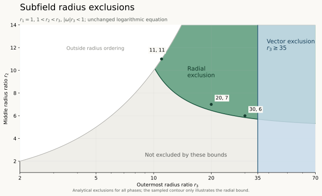

# Overnight C: logarithmic three-binary geometry

## Current scientific account

The strongest independently checked result is a finite outer-radius bound: an exact strictly subfield configuration in the selected unequal-radius circular class must have $r_3/r_1<35$. A distant outer pair would first force the inner pairs near coincidence, but then a single nearby contribution would be too large for all the other contributions to cancel. No exact reference has been admitted. Additional checked exclusions constrain separated radius ratios, slow rotation in the initial radius box, and a declared ordinary superfield sector. These results do not exclude the full three-binary class.

| Domain, with $r_1=1$ and $\phi_1=0$ | Current conclusion | Evidence boundary |
| --- | --- | --- |
| $1<r_2<r_3$, $r_3\ge35$, $|\omega|r_3<1$, arbitrary relative phases | No exact circular balance | [Finite outer-radius bound](overnight-c-outer-radius-thirty-five-bound.md) and [independent reconstruction](overnight-c-outer-radius-thirty-five-independent-review.md); full-vector contradiction retaining all thirty partner roots |
| $r_2\in[1.2,1.4]$, $r_3\in[1.6,1.8]$, $|\omega|\le0.03$, arbitrary relative phases | No exact circular balance | [Analytical exclusion](overnight-c-curvature-refined-exclusion.md) and [independent reconstruction](overnight-c-curvature-independent-review.md); thirty partner roots, no self roots |
| $r_2\in[1.04,1.06]$, $r_3\in[1.09,1.11]$, $\omega\in[1.02,1.04]$, $\phi_2,\phi_3\in[-0.001,0.001]$ | No exact circular balance | [All-past superfield chart](overnight-c-superfield-aligned-exclusion.md) and [independent reconstruction](overnight-c-superfield-independent-review.md); thirty partner and six self roots |
| $11\le r_2<r_3$, $|\omega|r_3<1$, arbitrary relative phases | No exact circular balance | [Inner radial obstruction](overnight-c-large-radius-ratio-exclusion.md) and [independent reconstruction](overnight-c-large-radius-independent-review.md); thirty partner roots, no self roots |
| First radius box, $\omega\in[0.1,0.5]$, all phases | Finite search found no candidate; continuous cover incomplete | Numerical proposals and retained interval leaves; unresolved boxes are not excluded |
| Wider separated subfield proposal chart below | Finite search found no candidate | Floating search only; no continuous negative |

Every row uses the unchanged logarithmic inverse-distance response, $K_{\log}=c_f=1$, complete ordinary roots and fixed pair identity. The proved exclusions identify failures within their declared domains; they do not establish stability, nonlinear fate, physical assembly status, or theory closure.

## Execution record

Research began at 2026-10-06 23:29:31 UTC (October 6, 19:29:31 EDT), measured with the session clock at startup. The twelve-hour deadline is 2026-10-07 11:29:31 UTC (October 7, 07:29:31 EDT). New exploration stops at 2026-10-07 09:59:31 UTC (05:59:31 EDT); the remaining ninety minutes are reserved for checking and closeout. These times remain fixed across continuation wakes.

Status: bounded investigation complete; whole-box exclusion remains blocked by the declared retained-leaf limit. The finite outer-radius bound and its prerequisite separated-radius and inner-separation inequalities have been independently reconstructed. The slow-rotation and complete-chart superfield exclusions are also independently checked. The initial higher-speed subfield interval cover stopped incomplete at the declared retained-leaf limit; exact endpoint refresh and independent final evidence adjudication are complete. Three finite numerical search charts have supplied no exact candidate. No exact reference or stability result is admitted. The [coordinator plan](overnight-braid-research-plan-2026-10-06.md) owns the assignment. Only this report and companions beginning `overnight-c-` are writable; shared scientific owners remain read-only.

## Selected assumptions and first chart

The selected equation is the authorized logarithmic inverse-distance acceleration with $K_{\log}=c_f=1$, unchanged transmitter weighting, and every ordinary positive-delay self and partner root. There is no ceiling, receiver factor, coupling tuning, smoothing, or event continuation. The candidate geometry comprises three persistent neutral antipodal pairs in one plane, with coincident centers and one common angular rate. Pair identity is fixed independently of radius order. The complete histories are circular for every real time.

The initial gauges are $r_1=1$ and $\phi_1=0$. The explicit compact strictly subfield chart below was frozen before target calculations. Radius normalization is a scale gauge, not a selected physical radius. Known controls are static logarithmic vector sums, source-velocity differentiation, and the previously adjudicated regular-hexagon residual; they must pass before unequal-radius target use. The equal-radius exclusion is a control only, not this investigation's objective.

## Work status

Legend: ✓ Done; ◐ In progress; ○ Not done.

1. ✓ Done: complete radial/tangential reduction, scale covariance and subfield root certificate derived from the live equation.
2. ✓ Done: search and interval instruments passed their recorded known controls before target use; numerical results remain at their bounded grades.
3. ✓ Done for the selected bounded investigation: three finite numerical charts produced no candidate; the slow-speed, separated-radius, finite outer-radius and superfield exclusions are independently checked. The initial higher-speed whole-box exclusion is ◐ Partial, Blocked at the retained-leaf limit, with 35,693 unresolved boxes.
4. ✓ Done: separate reviews completed for all analytical theorems and both interval methods; final saved-cover adjudication confirms valid partial evidence, and owned computational processes are closed.

## Evidence and scope

All findings will be graded where stated and accompanied by their assumptions and falsifiers. No equilibrium, stability, physical assembly, or all-future fate is asserted at startup.

## Complete circular reduction

Represent the plane by complex coordinates. Pair $a\in\{1,2,3\}$ has radius $r_a>0$ and positive-endpoint phase $\phi_a$. Its two persistent endpoints are indexed by $s\in\{+1,-1\}$, have polarity $s$, and follow

$$
X_{a,s}(t)=s r_a\exp(i(\omega t+\phi_a)),\qquad -\infty<t<\infty.
$$

These are prescribed complete histories until their received acceleration is proved equal to their circular second derivative. A simultaneous half-turn exchanges every positive endpoint with its negative partner and preserves every polarity product. Consequently the negative endpoint equation is the rotated positive endpoint equation; three radial and three tangential equations suffice. Reflection reverses the sign of $\omega$, so it is enough to study $\omega>0$ and all phases. Simultaneous rotation fixes $\phi_1=0$.

For a positive receiver in pair $a$ and a transmitter $(b,s)$, define the relative present phase $\delta=\phi_b-\phi_a$ for $s=+1$ and $\delta=\phi_b-\phi_a+\pi$ for $s=-1$. At positive delay $\tau$, let $\theta=\delta-\omega\tau$. With $c_f=1$, the causal equation and transmitter factor are

$$
\tau^2=r_a^2+r_b^2-2r_ar_b\cos\theta,
\qquad
D=1+\frac{\omega r_ar_b\sin\theta}{\tau}.
$$

Here $D=1-\mathbf n\cdot\mathbf V_b$ uses the source velocity at emission, and $\mathbf n$ points from source emission to receiver reception. Substitution into the authorized inverse-distance equation gives the receiver-frame acceleration row

$$
(A_r,A_t)_{a\leftarrow(b,s)}
=\frac{s}{\tau^2|D|}(r_a-r_b\cos\theta,-r_b\sin\theta).
$$

The same-member channel has positive polarity and is included whenever it has an ordinary positive root. Sum every such root and every partner channel. Exact balance requires

$$
F_{a,r}=A_{a,r}+\omega^2r_a=0,
\qquad F_{a,t}=A_{a,t}=0,
\qquad a=1,2,3.
$$

These formulas are derived directly from the selected equation, not from a standard-physics acceleration law. A wrong source-velocity sign, missing self root, or failure of the negative-endpoint rotation identity falsifies this reduction.

### Scale covariance

The coupling has dimensions $[K_{\log}]=L^2/T^2$ and $k=K_{\log}/c_f^2=1$ is dimensionless. Under $r_a\mapsto\lambda r_a$, $t\mapsto\lambda t$, $\omega\mapsto\omega/\lambda$, every delay scales by $\lambda$, while speeds, phases, polarity and transmitter factors stay fixed. Received and prescribed accelerations both scale by $1/\lambda$. Thus $r_1=1$ fixes a length/time gauge. It cannot repair a dimensionless residual or select a physical radius. The five remaining parameters are $(r_2,r_3,\omega,\phi_2,\phi_3)$.

### First compact chart, declared before target use

The first search chart is

$$
r_2\in[6/5,7/5],\quad r_3\in[8/5,9/5],\quad
\omega\in[1/10,1/2],\quad
\phi_2,\phi_3\in[-\pi,\pi].
$$

Pair labels remain fixed. The ordering here defines this chart only. It does not identify pair labels elsewhere. Every speed is at most $9/10$, leaving speed margin $1/10$. Every present interpair separation is at least $1/5$ by the reverse triangle inequality; intrapair separation is at least $2$. These bounds hold throughout the complete past.

**Derived complete-root certificate:** write $h(\tau)=|X_i(0)-X_j(-\tau)|-\tau$. At nonzero range, $h'(\tau)=\mathbf n\cdot\mathbf V_j(-\tau)-1\le-1/10$. The same inequality holds in the Lipschitz sense at a geometric zero. Each partner starts with $h(0)>0$ and has $h(\tau)<0$ for $\tau>r_a+r_b$. It therefore has exactly one positive root. The self channel starts at zero and is strictly decreasing, so has none. There are exactly thirty directed ordinary partner roots and no positive-delay self root. Every root has $D\ge1/10$. Moreover $\tau\ge d_{ij}(0)/(1+9/10)\ge2/19$, bounding delayed range away from zero. Rotation covariance makes this census valid at every reception time and over the entire past, not merely at sampled phases.

The initial numerical stopping rule is a bounded pilot of four starts, at most 120 function-evaluation steps per start, followed by a measured decision about a larger search. A finite unsuccessful search is only proposal evidence. A candidate with maximum component residual below $10^{-9}$ would be frozen for independent enclosure. Otherwise the next objective is a continuous residual inequality over this chart or an explicitly narrower subchart. No stability calculation is admissible without an exact balance.

### Known-first receipt

Before any unequal-radius target evaluation, the command `"${AAA_VENV:-../.venv}/bin/python" reference/priorities/master-equation-closure/braid-program/evidence/overnight-c-subfield-search.py --stage known` passed all five declared controls: the static opposite pair, static alternating hexagon with thirty directed hits, known hexagon tangential derivative $(2-\sqrt3)/2$, exact subfield chord source-velocity derivative $h'=-5/4$, and static Cartesian inverse-distance Jacobian $\operatorname{diag}(-1/4,1/4)$. The negative-endpoint rotation identity also passed within the moving-hexagon control. Instrument: [bounded subfield search](../evidence/overnight-c-subfield-search.py); local source-bound receipt: `.local-data/master-equation-closure/overnight-c/known.json`. Grade: measured control agreement against analytic values; this does not certify target balances. The target command refuses a missing or different-source known receipt.

### Pilot outcome and continuation selection

The four-start pilot completed in 0.7053 instrument seconds with maximum resident size 74,416,128 bytes by Python `resource.getrusage` on this macOS host. Its smallest Euclidean six-residual norm was 1.4169880599190112; no candidate met the declared tolerance. These are measured optimizer outcomes, not continuous exclusion. The reproducible starts and terminal residuals are in the local `pilot.json` receipt. Supervisor run `5dade8e2-7e6e-4524-a7a5-e3ab456f41ea` records exit 0 and `processGroupClosed: true`. The initial sandbox launch failed before target spawn because loopback socket creation was blocked; the authorized supervised retry succeeded after tool approval.

Continue with the same unchanged instrument and box, 128 deterministic starts, at most 300 evaluation steps each and a 120-second instrument limit inside a 150-second supervisor limit. This bounded extension tests whether multiple numerical basins contain useful proposals; it cannot establish absence. In parallel with no second computational job, derive a continuous inequality suitable for a bounded exclusion.

### Interval proof method and controls

The interval instrument is [overnight-c-subfield-interval.py](../evidence/overnight-c-subfield-interval.py). It uses outward-rounded `mpmath.iv` arithmetic at thirty decimal digits and rational parameter endpoints. To avoid any phase-endpoint rounding gap, the cover uses $[-22/7,22/7]$ for each phase, a superset of $[-\pi,\pi]$. The remaining bounds are unchanged. For each directed row it first encloses the unique delay with the proven range and speed bounds, then contracts the enclosure using the mean-value identity for $h(\tau)=d(\tau)-\tau$. Away from a root its derivative is $h'=-1-\omega r_ar_b\sin\theta/d(\tau)$, with actual geometric distance in the denominator; replacing that distance by $\tau$ is valid only on the root and is not used in the contraction.

Each leaf is excluded only if one complete radial or tangential residual has a strict outward sign. Otherwise an exact rational midpoint splits a coordinate using fixed geometric width weights $(1,1,4,2,2)$ for the two radii, angular rate and two phases. These weights prioritize angular uncertainty and affect efficiency only. The two children cover the entire parent including their shared endpoint. Every unfinished or depth-limited leaf remains explicitly unresolved. A complete cover would be a computer-assisted exclusion under this instrument's arithmetic and reduction, subject to independent checking. A partial cover cannot support a whole-box exclusion.

Before its first target, `"${AAA_VENV:-../.venv}/bin/python" reference/priorities/master-equation-closure/braid-program/evidence/overnight-c-subfield-interval.py --stage known` passed static opposite-pair, exact moving-chord, static hexagon and exact rational partition controls. The moving chord checks the exact rows $(2/5,-2/5)$ and transmitter factor $5/4$. This is a measured known-first receipt bound to the current instrument in local `interval-known.json`; it is not independent adjudication. The first pilot permits at most 1,000 processed boxes, sixty seconds, depth forty and 400 MB measured resident memory; all unfinished leaves are retained.

The first target attempt stopped on an assertion before returning scientific output: interval subtraction of a pair's absolute phase from itself had unnecessarily widened its exactly antipodal relative phase. The correction uses the exact $\pi$ difference and adds a wide-absolute-phase control. Known controls passed again before the successful pilot. That pilot processed 1,000 boxes in 12.7204 instrument seconds with peak resident size 27,115,520 bytes; it excluded none, leaving 1,001 unresolved boxes. These broad boxes still had excessive phase uncertainty. The next bounded pilot changes only the subdivision weights described above, with a new known receipt, a 10,000-box maximum and 180-second instrument limit. The older receipt remains preserved and supplies no exclusion claim.

## Analytical result frozen for independent review

The [slow-rotation exclusion](overnight-c-slow-rotation-exclusion.md) proves a continuous negative over the same unequal-radius intervals and arbitrary phases for $0\le |\omega|\le9/1000$. Its mechanism is the exact neutral static virial $V_0=-3$, together with a uniform bound on the complete causal correction. At the selected endpoint the correction plus required circular contribution is at most $14682/4919+2511/2500000<3$. Thus the circular acceleration cannot be attained. This is a separate slow-speed subset, not a claim about the initial $[1/10,1/2]$ angular-rate box. Grade: derived and independently checked by the [separate analytical review](overnight-c-slow-rotation-independent-review.md), which reconstructs the root census, inequality and constants from the equation owner and supplies exact-rational controls and target receipts. The frozen theorem retains its historical pending-review text; this report and the separate review record its current disposition.

## Wider subfield proposal chart

After the current interval pilot closes, a separate bounded numerical pilot may explore $r_2\in[21/20,2]$, gap $g=r_3-r_2\in[1/20,2]$, outer speed $\beta=\omega r_3\in[1/10,49/50]$, and both relative phases over $[-\pi,\pi]$. Here $r_1=1$, $r_3=r_2+g$, so $r_3\le4$, all present separations are at least $1/20$, every speed is at most $49/50$, and every ordinary transmitter factor is at least $1/50$. The complete subfield monotonicity argument still gives thirty partner hits and no positive-delay self hit; delayed ranges are at least $5/198$. This expands only the geometry, not the equation, within the assigned unequal-radius class.

The [wider-chart proposer](../evidence/overnight-c-expanded-search.py) imports the frozen floating Cartesian evaluator and checks its digest; it is explicitly dependent evidence. Its `--stage known` command passed the five analytical controls and exact chart-mapping control before target use. The selected pilot permits 128 deterministic starts, at most 200 evaluations each, 120 instrument seconds, and 150 supervisor seconds. It multiplies each pair's two residual equations by that pair's positive radius, which preserves their zeros. Candidate threshold remains maximum scaled residual below $10^{-9}$ and requires independent certification before any exactness claim.

### Measured progress and interval continuation

The initial 128-start search completed in 26.6330 seconds with best unscaled residual norm 0.3563866184384066. The wider-chart pilot completed all 128 starts in 11.8358 seconds; its best scaled residual norm was 0.20961719080660135, at radii approximately $(1,2,2.75265)$. Neither produced a candidate. These are measured finite-search outcomes from their source-bound JSON receipts, summarized by a minimum selector checked on a known two-row example before this report's final extraction.

The weighted interval pilot processed 9,607 boxes in 180.0017 instrument seconds, excluded 1,080 leaves and retained 7,448 unresolved leaves. Its peak resident size was 28,393,472 bytes by `resource.getrusage`. The scientific conclusion remains partial exclusion only. Supervisor run `d6ff3914-1bd1-47e2-913d-57220049a3b7` closed with exit 0 and a closed process group.

The [continuation driver](../evidence/overnight-c-interval-continue.py) resumes those unresolved leaves without repeating the completed partition. It imports the frozen interval evaluator by digest and checks the partition as a full binary tree: each internal vertex must have exactly the two matching children for one coordinate, with no missing, duplicated or overlapping leaves. Its known controls passed before continuation, including deliberate malformed-tree rejection and exact rational path reconstruction. A thirty-minute continuation is selected, at most 100,000 additional processed boxes, 150,000 retained leaves and 400 MB measured resident memory. It writes a checkpoint every sixty seconds and scientific progress every fifteen seconds. Remaining leaves stay unresolved. The [separate analytical method review](overnight-c-interval-method-independent-review.md) subsequently checked the frozen evaluator; its scope does not include independent reconstruction of a completed cover.

## Further analytical refinement and interval conditioning

The [curvature-refined exclusion](overnight-c-curvature-refined-exclusion.md) derives an extension to $|\omega|\le3/100$ by comparing the actual emission velocity with the exactly averaged source velocity over each causal delay. Its explicit remainder uses the circular source acceleration, so no response term is changed or omitted. It also bounds the two antipodal distances jointly. The strict rational contradiction margin is $4679079917/72711925000$. The [independent curvature review](overnight-c-curvature-independent-review.md) reconstructed every inequality and exact constant and found the extension valid. The frozen theorem's pending-review text is historical; this report and its separate review record the checked disposition.

The [centered interval instrument](../evidence/overnight-c-centered-interval.py) is a proposed conditioning improvement for the same higher-speed cover. It differentiates the complete root constraint implicitly, encloses the resulting residual Jacobian, and applies a mean-value bound from a rational box center. A rational linear combination of the six residuals may supply a strict sign even when each separately fails. Floating singular vectors only propose those weights; every chosen weighted expression is subsequently enclosed with outward intervals, so no floating linear-algebra accuracy is used as a proof premise. Known controls passed before target use: exact static-pair radius and angular derivatives, the known hexagon angular derivative, and all frozen root controls. A short eight-leaf pilot is selected from the current checkpoint to measure whether this method resolves boxes the natural interval sum cannot. It is a short conditioning check, not a second sustained computational search.

The eight-leaf centered pilot completed in 1.1835 seconds and resolved none of its selected unresolved boxes; each centered evaluation took approximately 0.11–0.14 seconds. Receipt: local `centered-pilot.json`, bound to its exact checkpoint bytes and source identities. This measured pilot does not justify replacing the cheaper natural interval evaluator at the present subdivision widths. The derivative instrument is retained as a checked research companion, without a continuous-exclusion claim or another sustained launch.

### Sharper bounds from circular geometry

A second conditioning refinement uses exact geometry rather than a larger derivative calculation. For radii $a,b$, angular difference $\theta$ and chord length $d$, the identities $d^2-b^2\sin^2\theta=(a-b\cos\theta)^2$ and its exchanged version prove $ab|\sin\theta|/d\le\min(a,b)$. Consequently the distance derivative, including away from a causal root, is bounded by $\omega\min(a,b)$. This improves the ordinary factor enclosure to $1-\omega\min(a,b)\le D\le1+\omega\min(a,b)$.

Within each neutral pair, the opposite-endpoint delay obeys $\tau=2a\cos(\omega\tau/2)$ throughout the subfield chart. Its gap derivative has $D=1+\omega a\sin(\omega\tau/2)\ge1$, and its exact rows simplify to $A_r=-1/(2aD)$ and $A_t=\tan(\omega\tau/2)/(2aD)$. These formulas remove interval dependencies that obscure the same known acceleration. The [tight interval evaluator](../evidence/overnight-c-tight-interval.py) retains the earlier files byte-for-byte and applies these identities only on the declared disjoint radius intervals, where the equal-interval antipodal fast path represents the same pair radius. It must not be reused for two independently varying radii merely because their interval bounds coincide.

Before target use this evaluator passed all earlier interval controls, the exact distance-derivative equality at $a=1,b=2,\theta=\pi/3$, and an exact moving antipodal root with $\omega=(\pi/6)/\cos(\pi/6)$, $\tau=\sqrt3$. A sixteen-leaf pilot is selected to measure the improvement on retained unresolved boxes. The identities are derived; their effect on coverage is not asserted until measured.

The measured sixteen-leaf pilot resolved nine previously unresolved boxes in 0.3084 seconds. This justified a method change: supervisor run `0cbe6314-3d17-4ed2-9211-af239a50b9ac` was stopped through its authenticated owner at 2026-10-06 23:52:53 UTC, with `processGroupClosed: true`, after 730.297 supervisor seconds. The retained complete checkpoint remains the scientific input; work after its last sixty-second checkpoint may be repeated only to recover the interrupted state. No other chat's process was signalled.

The [tight cover driver](../evidence/overnight-c-tight-cover.py) checks complete partition structure before every atomic save and serializes new interval endpoints as exact binary tuples with string-valued integers. It records the complete source-receipt ancestry; inherited leaf strings remain historical evidence requiring final adjudication. Known controls passed before its target, including exact endpoint serialization and the prior tree and analytical controls. The next bounded continuation permits 100,000 further boxes, thirty minutes, 400 MB measured resident memory, 150,000 retained leaves and 75 MB serialized output. Scientific progress remains every fifteen seconds, checkpoints every sixty seconds. The [independent tighter-method audit](overnight-c-tight-method-independent-review.md) found the refinement sound on this declared domain and preserved the distinction between reviewed mathematics and an unfinished cover.

The [witness refresh instrument](../evidence/overnight-c-witness-refresh.py) will recover exact endpoints for the older inherited exclusions after the active cover closes. It reuses the frozen original evaluator, so its agreement is reproduction rather than independent mathematical evidence. The purpose is to replace decimal display strings with an inspectable exact witness for every leaf while preserving the partition and its ancestry. Before target use, its shared-venv `--stage known` command passed the original analytical row controls, complete-tree and path controls, and exact endpoint serialization; source-bound receipt: local `witness-refresh-known.json`. The complete saved tree and exact signs still require separate adjudication.

The first tight continuation reached its 100,000 additional-box limit in 1,107.1175 instrument seconds, retaining 56,413 excluded and 34,418 unresolved leaves. Its receipt measured peak resident size 248,102,912 bytes and 15,117,837 serialized bytes. Supervisor `918d57f6-6799-4f4b-a4bf-e8ee0b14910d` closed with exit 0 and `processGroupClosed: true`. The frozen local `tight-cover.json` has SHA-256 `c0d78a01e9f7d49295c7f2943a54f6bea4601fe39eb4b099d4279894ed26e2b7`. The unfinished cover remains scientifically partial. The subsequent selection was to resume the same reviewed evaluator after the short intermediate-radius proposer, into a distinct `tight-cover-2.json`, allowing at most 100,000 further boxes and thirty minutes while preserving the same 400 MB resident, 150,000-leaf and 75 MB output limits. That continuation advanced the retained unresolved partition; its terminal receipt is recorded below and the original receipt remains immutable.

## A separate large-radius obstruction

The [large-radius-ratio theorem](overnight-c-large-radius-ratio-exclusion.md) derives a subfield obstruction for $11\le r_2<r_3$ with $r_1=1$ and arbitrary phases. The outer speed limit forces a small common angular rate. The inner partner's inward radial contribution then exceeds the largest possible outward contribution from the four distant sources plus the required circular term. The residual upper bound is exactly $-35161/738100$. The [independent reconstruction](overnight-c-large-radius-independent-review.md) confirms the all-past census, source-factor bound and exact arithmetic. The subject remains frozen with its historical pending-review statement; this report and the separate review record its current checked disposition. The theorem does not exclude middle radii below eleven or superfield histories.

## Remaining numerical proposal region

A final bounded proposal chart is selected in the still-open range between the wider pilot and the radius-eleven theorem: $r_2\in[2,11]$, $g=r_3-r_2\in[1/20,11]$, $\beta=\omega r_3\in[1/10,49/50]$, and phases in $[-\pi,\pi]$. Thus $r_3\le22$, present intermember separation is at least $1/20$, source speed is at most $49/50$, and delayed ranges are at least $5/198$. The strictly subfield monotonicity proof again supplies the complete thirty-root partner census and excludes self roots. This chart changes only radii and phases within the selected geometry. No target run will overlap the sustained interval worker. A four-start, 120-evaluation, thirty-second pilot will precede any larger selection; candidate admission still requires independent full-vector and root certification.

The [intermediate-radius proposer](../evidence/overnight-c-intermediate-radii-search.py) passed the frozen analytical controls and its own chart-map control before this pilot. The four starts completed in 0.2594 instrument seconds, with peak resident size 73,760,768 bytes by `resource.getrusage`, and best scaled residual norm 0.12388778983467935. No candidate met the $10^{-9}$ maximum-component threshold. Supervisor run `c01abf18-d163-44e0-8885-82dea85b626b` closed with exit 0 and a closed process group. This measured pilot supports a bounded extension of 128 starts, 300 evaluations per start and 120 instrument seconds within 150 supervisor seconds, on exactly the same chart and evaluator. It remains proposal evidence only.

The 128-start extension completed in 7.1724 instrument seconds with peak resident size 73,629,696 bytes. Its best scaled residual norm was 0.1238877898345428, maximum component 0.08802041596647435, at approximate radii $(1,2.41805604,3.62321864)$ and angular rate $0.24922377$. No candidate met the declared threshold. Supervisor `629eca90-252a-4341-a424-8eed5ee22b7f` closed with exit 0 and a closed process group. The complete local `intermediate-search-128.json` preserves all starts and terminal residuals; a known-first minimum selector supplied this summary. No continuous negative follows from these endpoints.

The first tighter-centered conditioning pilot retained exact leaf paths and source identities in local `tight-centered-pilot-1.json`, preserved byte-for-byte before a later pilot reused the default output name. After its known analytical controls passed, it evaluated sixteen leaves from a checkpoint in 1.1122 instrument seconds. Six already admitted a strict component with the tight natural evaluator; the centered evaluator added one exclusion among the other ten. This measured improvement does not justify a sustained method replacement. Its source checkpoint was an atomic intermediate snapshot; the recorded leaf paths and the frozen rational domain reproduce the selected boxes even after the live checkpoint advances. A second sixteen-leaf pilot is selected from the smaller boxes in `tight-cover-2.json` to check whether the changed conditioning now justifies that method.

The second tighter-centered pilot completed in 1.1351 instrument seconds. Twelve of its sixteen selected leaves already admitted a strict component with the tight evaluator; all four remaining leaves also remained unresolved under the centered method. Receipt: local `tight-centered-pilot.json`, bound to its checkpoint digest and exact leaf paths. This changed-state measurement supplies no reason to replace the running method.

A proposed universal sign for the total tangential contraction was rejected as a research lead: a known-first weighted-sum postprocessor found both signs among the 128 retained optimizer endpoints, with twelve negative values. Receipt: local `torque-endpoints.json`, bound to `search-128.json`. This floating observation is not a theorem or interval counterexample, but it supplies no support for using that universal sign as an exclusion premise.

The [split-conditioning pilot](../evidence/overnight-c-split-pilot.py) tested a floating derivative heuristic only for choosing the subdivision coordinate. Every proposed exclusion still used the unchanged outward interval evaluator. Known analytical and linear-selection controls passed first. Among sixteen checkpoint leaves, six still needed subdivision; both the existing width rule and the proposed rule excluded four children across those six parents. The measured pilot took 0.4602 seconds and supplied no improvement, so the running subdivision policy was retained. A separate known-first projection check found that the then-unresolved leaves still projected over the entire two radius intervals and angular-rate interval; no fully excluded one-coordinate slab was inferred from the partial cover.

## Distant-radius necessary conditions

The [separated-radius condition](overnight-c-separated-radius-necessary-condition.md) keeps both outer radii explicit in the inner radial obstruction. It derives an exact necessary inequality $B(r_2,r_3)\ge0$; negative values exclude all phases. Its displayed examples extend the exclusion to $r_2\ge7, r_3\ge20$ and $r_2\ge6, r_3\ge30$. For a hypothetical exact strictly subfield sequence with $r_3\to\infty$, the same inequality requires $\limsup r_2\le5$. The [independent reconstruction](overnight-c-separated-radius-independent-review.md) verifies these statements and observes that the strict subfield inequality also excludes $B=0$. Thus $B>0$ is the stronger checked necessary condition; the frozen subject states the conservative weaker form.

The [figure source](../evidence/overnight-c-radius-exclusion-map.py) passed its floating checks against exact-rational corner references before plotting, and its local PNG was visually inspected. The green region illustrates $B<0$, and the blue region marks the separately proved all-phase exclusion $r_3\ge35$; numerical contour samples provide no additional proof. The labelled coordinates are upper-bound corners in $(r_3,r_2)$ order, including the limiting ordered-radius corner $(11,11)$.

The [inner-separation theorem](overnight-c-distant-outer-pair-compactness.md) compares the four inner equations with their exact static scalar contraction $-2$, while bounding every actual internal causal correction and all eight contributions received from the outer pair. It derives a finite necessary upper bound on the minimum inner separation. Combined with the preceding radius condition, it forces any hypothetical exact sequence with $r_3\to\infty$ to satisfy $r_2\to1$, $\phi_2$ modulo $\pi\to0$, and $\limsup r_3d\le6$. The [independent reconstruction](overnight-c-distant-outer-independent-review.md) verifies every finite estimate and the order of limits. This is a statement about a sequence of exact circular configurations, not actual-time contact or an existence result.

The [outer-radius bound](overnight-c-outer-radius-bound.md) closes the apparent near-coincidence escape route by retaining the full vector equation at one inner receiver. For $r_3\ge400$, the checked preceding inequalities force $r_2<6$ and an inner cross-pair distance below $425520000/727290719$. The magnitude of that one nearby acceleration then exceeds the combined norms of all four other contributions and the required circular acceleration by a strict rational margin. The [independent reconstruction](overnight-c-outer-radius-independent-review.md) confirms the complete root census, geometric pairing, all five contributions, monotonic bounds and exact positive margin $95265590168624957827777/224627312610912022560000$. This excludes every ordered strictly subfield configuration with $r_3\ge400$, not merely a fixed phase sector. It does not establish existence below that value, compactness of the remaining ordinary domain, or a superfield or stability result. The frozen theorem retains its historical pending-review text; this report and its separate review record the checked disposition.

The [exact-count refinement](overnight-c-outer-radius-hundred-bound.md) retains the actual ordered radius products and receiver sums for the four inner members. This improves the exclusion to every $r_3\ge100$. Its [independent review](overnight-c-outer-radius-hundred-independent-review.md) verifies the radius sums, causal estimate and strict vector contradiction greater than $1/20$. This is a mathematical tightening of the same proof, with no coefficient or source adjustment.

The [finite-band refinement](overnight-c-outer-radius-thirty-five-bound.md) further uses the two complementary antipodal distances rather than replacing every inner distance by its minimum. Four explicit middle-radius bands fail the scalar contraction, while the remaining near-radius band fails the vector cancellation bound. It derives $r_3<35$ as a necessary condition for any exact strictly subfield configuration, with all phases allowed. The [independent reconstruction](overnight-c-outer-radius-thirty-five-independent-review.md) verifies all band inequalities, the complementary-distance multiplicities, the complete root census and the vector contradiction. This is the strongest checked summary result.

## Complete ordinary superfield charts: analytical fallback construction

The finite circular history geometry makes the all-past superfield root question bounded in delay even when the root count grows. For any directed channel with radii $a,b$ and present relative phase $\delta$, define

$$
G(\tau)=\tau^2-a^2-b^2+2ab\cos(\delta-\omega\tau),
\qquad 0<\tau\le a+b.
$$

Every causal root lies in this interval, because the maximum chord length is $a+b$. For positive $\tau$, squaring the causal equation adds no roots. The derivatives are

$$
G'(\tau)=2\tau+2\omega ab\sin(\delta-\omega\tau),
\qquad
G''(\tau)=2-2\omega^2ab\cos(\delta-\omega\tau).
$$

These identities suggest a complete finite chart rather than a uniform time scan. When $\omega^2ab\le1$, $G'$ is nondecreasing. When $\omega^2ab>1$, every zero of $G''$ is an explicit phase crossing of $\cos(\delta-\omega\tau)=1/(\omega^2ab)$ in the bounded interval. Those finitely many crossings partition the interval into pieces where $G'$ is monotone. Enclose every crossing, then isolate or exclude each zero of $G'$ on its monotone pieces. The resulting critical points partition the complete delay interval into monotone pieces of $G$, on which endpoint signs isolate or exclude every causal root. Repeated or endpoint critical points must be retained explicitly; a simultaneous zero of $G$ and $G'$ is a singular or multiple root, not an empty box. Calling it a fold additionally requires the appropriate nondegeneracy conditions, including $G''\ne0$.

At a causal root, $D=G'(\tau)/(2\tau)$. Therefore a positive lower bound for $|G'|$ and $\tau$ supplies an ordinary-root chart. For each same-member channel, $(a,b,\delta)=(a,a,0)$ and the same-time root $\tau=0$ must be removed explicitly; all other positive roots remain. The endpoint expansion $G(\tau)=(1-\omega^2a^2)\tau^2+O(\tau^4)$ identifies the local self-root side but is not by itself a certificate of the remaining interval. Equality $|\omega|a=1$ requires its own endpoint treatment.

Claim grade: derived construction for complete finite enumeration, pending executable interval realization. On a compact parameter box, certified separation of the relevant critical values from zero would preserve the complete branch count and give an all-past ordinary chart; rotation covariance then preserves it at every reception time. A skipped curvature crossing, an unresolved critical-value sign, a missing self sheet or a positive root beyond the asserted complement would falsify completeness. No superfield search has been launched from this construction, and no pointwise floating root scan is being substituted for chart admission.

### A superfield box settled analytically

The [aligned-sector superfield theorem](overnight-c-superfield-aligned-exclusion.md) realizes the all-past chart directly, without launching a superfield search. It uses $r_2\in[1.04,1.06]$, $r_3\in[1.09,1.11]$, $\omega\in[1.02,1.04]$, and independently variable $\phi_2,\phi_3\in[-0.001,0.001]$, retaining $r_1=1$ and $\phi_1=0$. All member speeds exceed wake speed, yet all positive causal roots are ordinary. The proof excludes the entire initial delay strip $(0,1/4]$, then uses the gap derivatives to show exactly one later root in every source channel. Thus there are thirty partner and six self hits, with no omitted older complement. At every hit the delayed angular geometry and polarity give strictly forward tangential acceleration, contradicting circular motion. Grade: derived and independently checked by the [separate superfield review](overnight-c-superfield-independent-review.md), including the thirty-six root census and exact inequality controls. This region has unequal radii and variable phases and does not repeat the regular alternating-hexagon exclusion.

### Instrument annotation erratum

The frozen floating proposer's unused introductory comment above its moving-chord control mentions an incorrect opposite-endpoint example at $\omega=\pi/3$ with delay one. That example is not evaluated or used as evidence. The actual executable control immediately below it uses $a=b=1$, $\delta=\pi/2+1/2$, $\omega=1/(2\sqrt2)$ and $\tau=\sqrt2$, yielding $D=5/4$; these are the values checked and reported here. The frozen dependency bytes are preserved. The incorrect comment supplies no mathematical premise.

### Final bounded continuation

The second tighter continuation, supervisor run `f26f368d-4785-4635-8e70-136d1d9a3fa4`, ended with exit 0 and a closed process group. Its terminal `tight-cover-2.json` records 247,243 cumulatively processed boxes and 33,984 unresolved leaves after 871.3186 instrument seconds in this continuation. The next selected calculation consumes only those unresolved leaves with the same frozen evaluator and unchanged 400 MB, 150,000-leaf, 75 MB and depth-forty limits, at most 100,000 further processed boxes or 1,800 seconds. Its distinct output is `tight-cover-3.json`. This is continuation toward completion or the declared resource obstruction; no limit is increased.

## Remaining mathematical domain and disposition

The strongest checked necessary conditions leave $1<r_2<r_3<35$, $|\omega|r_3<1$ and $B(r_2,r_3)\ge0$, subject to the additional slow-rotation exclusion on its stated radius box. This remaining set is not a compact ordinary chart: $r_2-1$, $r_3-r_2$, some present cross-pair separations, and the speed margin $1-|\omega|r_3$ can approach zero. The finite outer-radius bound supplies none of those missing positive margins. A future all-class exclusion must control these boundaries analytically or cover explicitly separated compact subdomains; finite optimizer samples and the present incomplete interval tree cannot fill the gap.

The precise unresolved computational question is whether the six complete residual equations can vanish somewhere in the initial compact box $r_2\in[6/5,7/5]$, $r_3\in[8/5,9/5]$, $\omega\in[1/10,1/2]$, with arbitrary phases. Every retained unresolved leaf is a location where the selected interval enclosure has not separated a residual from zero; it is not an approximate solution or evidence that a solution exists. A full independent residual calculation on that domain, or a stronger analytic contraction valid there, could overturn or complete this computational disposition. The separately checked analytical theorems do not depend on the interval cover reaching completion.

No exact reference was admitted, so the assignment's conditional perturbation item is not mathematically available. The ordinary superfield fallback was completed as a continuous exclusion of the explicit aligned sector, with its own full self-root census. Wider superfield geometry and behavior at singular folds are unresolved and are not covered by that result. No boundary response or continuation rule has been introduced.

The recommended next mathematical step after this bounded investigation is an analytic estimate combining the radial equations with the signed tangential equations on the remaining compact subfield box. A universal positive tangential-contraction argument is unavailable: the finite proposal study contains negative values and was retained as a counterexample to that proposed shortcut, at floating-evidence grade. Any new sign argument must state its extra geometric restrictions and pass an independent derivation before driving exclusions. Increasing the same subdivision budget alone has not been selected as the next step.

The [reproduction companion](overnight-c-reproduction.md) collects the proof/review pairs, frozen instruments, exact commands and local-evidence boundaries. Its links provide the retained route to the evidence without making ignored runtime outputs dependencies of a fresh checkout.

### Retained-leaf limit reached

Measured by the terminal `tight-cover-3.json` receipt, the final cover contains 114,308 excluded leaves and 35,693 unresolved leaves after 264,308 cumulatively processed boxes. The third continuation took 144.3060 instrument seconds, with peak resident size 301,367,296 bytes and 31,773,357 serialized bytes. Its stopping condition is 150,001 retained leaves: the frozen driver checks `>150000` after processing a leaf, so the crossing step is retained rather than discarded. No memory, time or output limit was raised. Supervisor run `b1bf8ea0-1db1-4a0f-bbeb-cfbf95139c4b` exited 0 with its process group closed at 2026-10-07 00:32:45 UTC. The frozen receipt SHA-256 is `e82c326fe269c6a2084f9591cfb1542c82effe8e979c4c21025684822b979ac2`.

This is a concrete obstruction to completing the selected interval protocol within its retained-leaf budget, not a mathematical obstruction to circular solutions. The cover is not resumed beyond that budget. The already-controlled witness refresh is selected with source `tight-cover-3.json`, output `exact-witness-cover.json`, at most 600 instrument seconds, 630 supervisor seconds and 20,000 replayed old witnesses under its unchanged 400 MB and 75 MB limits. It changes evidence representation only and preserves all unresolved leaves.

### Exact-witness serialization recovery

The original refresh stopped after 3,000 of 9,057 display-only rows because its measured peak resident size crossed the 400 MB threshold: `exact-witness-cover.json` records 468,451,328 bytes and 6,057 unrefreshed rows after 17.2301 seconds. Supervisor `fa105ebd-89e5-43f7-bbc5-ca613751a3dc` closed normally. The threshold is inspected after a save and is not an operating-system hard cap; source inspection identifies whole-document serialization as the inferred cause of the allocation peak. The partial receipt is preserved and is not the final evidence target.

The distinct [streamed refresh](../evidence/overnight-c-witness-refresh-stream.py) preserves the frozen residual evaluator, source/dependency identities, exact tuples, partition and replay semantics. It writes JSON incrementally to a temporary file before checking output size and atomically replacing the destination, removing the full serialized-string allocation. Known controls passed before target use, including exact output bytes for a literal signed-dyadic and Boolean fixture. A ten-row resource pilot precedes the complete retry. The final retry consumes the unchanged `tight-cover-3.json`, not the partial refresh; repeated old-row evaluation is solely evidence recovery and adds no independent scientific corroboration. The separate independent audit must check this new producer identity explicitly. The source is frozen at SHA-256 `6df95c3f85445dcf48deb45dd88ec1130c687bd33ff85f9f17e19fe1fa49c573`.

The ten-row streamed pilot completed with exit 0 and a closed process group under supervisor `3a84ad22-9bcb-407f-9549-e6e572347772`. Its pre-final-save receipt measured 272,449,536 bytes peak resident size and 0.4711 seconds of refresh work; the supervisor measured 1.654 seconds including startup and final serialization. This supports retrying all old rows under the same limits, but does not itself certify the complete retry or final memory peak.

The streamed retry finished all 9,057 inherited rows in 65.1958 refresh seconds, leaving zero display-only witnesses. Its receipt records 281,411,584 bytes of peak resident size at the pre-final-save measurement and 33,344,927 final serialized bytes; excluded and unresolved counts remain 114,308 and 35,693. Supervisor `b2e8a654-96b1-4303-807d-d0f86e6f7f1e` closed with exit 0 and a closed process group at 00:36:03 UTC. The [frozen cover manifest](../evidence/overnight-c-cover-manifest.json) binds the exact final bytes, all five terminal ancestors, the five applicable known-first receipts and the runtime identity. It explicitly requests a partial-cover audit with `require_complete: false`. The old partial refresh and resource pilot are retained outside that ancestry.

The original audit program also holds every ancestor in memory, which is unsuitable for the retained evidence sizes. The independent reviewer identified this from source inspection and known-first synthetic allocation measurements before target use. A separately versioned audit was prepared to preserve its exact-sign, complete-tree, ancestry, source-control and runtime obligations with bounded in-memory state. Neither the original checker nor any subject is changed to obtain agreement. The successful final audit is recorded below; all analytical proof/review results remain independent of it.

### Final saved-evidence audit

The separately authored [streaming auditor](../evidence/overnight-c-review-cover-streaming-audit.py) passed its known-first synthetic controls and then the frozen target. Its [target receipt](../evidence/overnight-c-review-cover-streaming-target.json) records 114,308 exact sign witnesses and 35,693 unresolved leaves in a complete 150,001-leaf partition of normalized rational volume one, maximum depth twenty-five. It verifies every transition through six retained receipts, the five applicable subject-control receipts, pinned source identities and all 87 inventoried mpmath Python files. Supervisor `be6a17dd-0e10-46c3-8e36-6fdfb7bb60df` closed with exit 0 and a closed process group after 10.878 seconds; the checker measured 36,667,392 bytes peak resident size.

Grade: measured independent saved-evidence verification, combined with the separate analytical method derivations. This does not independently replay residuals or formally verify the library. The runtime inventory was captured during the calculation and is not a launch-time attestation. The exact saved signs and complete partition justify the recorded partial disposition under those boundaries; the unresolved leaves prohibit a whole-box exclusion. The target receipt's `complete_exclusion` value is explicitly false.

The [process closeout record](../evidence/overnight-c-process-closeout.json) records `status: clear` from the owned supervisor at 00:37:48 UTC. A known-first owner selector found seventeen leases for this exact chat, each with `processGroupClosed: true`; these include completed runs, the intentionally stopped earlier evaluator and failed startup or target attempts. No unrelated process was changed. Operational closure does not establish scientific acceptance.

## Final closeout and validation

Research closeout was recorded at 2026-10-07T00:40:11.638Z by the host clock, 4241 elapsed wall seconds after the recorded launch. This is actual elapsed work within the twelve-hour allocation, not twelve hours of delivered computation. Early closeout follows the execution contract: the selected finite proposal charts and analytical negative results are complete and independently reviewed; the selected continuous interval protocol reached its declared resource obstruction; the ordinary superfield fallback has a checked bounded exclusion; and perturbation work is unavailable without an exact reference. No scientific deadline or resource budget was extended.

The [final independent cover disposition](overnight-c-cover-independent-review.md#final-disposition-valid-partial-cover) admits partial saved exclusion evidence only. The independently derived outer-radius restriction $r_3/r_1<35$ is the principal result. It neither proves an exact configuration below the bound nor establishes that the bound is optimal. The remaining mathematical domain and recommended next estimate are stated above. Shared owners and theory acceptance remain with the coordinator.

Scoped validation: the known-first Markdown link/whitespace checker passed on the owned analysis and evidence files; it tests local file existence, not fragment anchors or mathematics. Shared-venv `ast.parse` passed on all twenty-five owned Python sources after a known valid fixture, and `node --check` passed on the independent JavaScript exact checker. A known-first control-character scan found no forbidden controls in owned text. SHA-256 checks against the nine frozen analytical subject identities all matched. The revised scientific figure was regenerated from its owned source, passed its floating checks against exact-rational corner references, and was visually inspected as a PNG. These checks do not replace the independent mathematical and saved-evidence reviews.

The [artifact inventory](../evidence/overnight-c-artifact-manifest.json) enumerates the owned report, proofs, reviews, instruments and retained local JSON evidence by exact bytes. It excludes itself to avoid a hash cycle. Local evidence is explicitly checkout-bound; the [reproduction companion](overnight-c-reproduction.md) supplies durable source and command links. No corpus, queue, production solver, pre-existing frozen scientific subject or another chat's work was changed.
