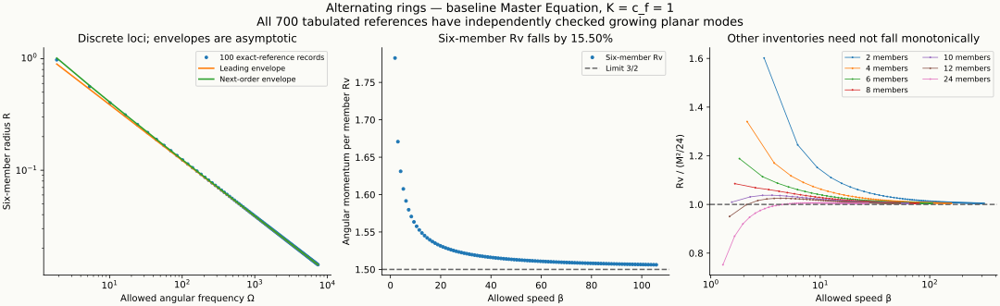

# Alternating-ring exploration: account and closing report

Status: completed bounded research session, begun 2026-10-03 at 20:04:01 UTC and closed 2026-10-04 at 00:04:13 UTC (16:04:01–20:04:13 Eastern on October 3). Elapsed wall time is four hours and twelve seconds, measured by the session's UTC clock observations. The final half hour was reserved for integration and validation. Every accepted session result below has its separate adjudication, including the slow-planar asymptotic, far-coaxial asymptotic and all-even low-speed theorem. This report records bounded answers and remaining questions; the standing deferred tasks retain their dispositions.

## Answers to the six leading questions

**No stable ring was found.** All 700 tabulated baseline circles—100 each at 2,4,6,8,10,12,24 members—have at least two independently checked simple positive real common planar characteristic roots. Their exact complete periodic histories exist, while some arbitrarily small first variations grow. Nonlinear orbital instability is separately established in the T02 common planar class. Neither finite certificates nor the high-rung theorem supply a full complex spectrum or nonlinear fate for every inventory and rung. Owners: [six-member Cartesian adjudication](ring-symmetric-independent-adjudication-2026-10-03.md), [other 1200 growing witnesses](ring-inventory-spectrum-independent-adjudication-2026-10-03.md), [T02 nonlinear adjudication](t02-nonlinear-history-independent-adjudication-2026-10-03.md). **Grade: computer-assisted derived spectral growth and separately adjudicated conditional nonlinear instability.**

**Radius and speed follow a discrete frequency envelope.** For the six-member high rungs, at fixed coupling and wake speed,

$$
R(\Omega)=\sqrt{\frac{3K}{2c_f\Omega}}
+\frac{c_f\ln2}{\pi\Omega}+o(c_f/\Omega),
$$

$$
v(\Omega)=\sqrt{\frac{3K\Omega}{2c_f}}
+\frac{c_f\ln2}{\pi}+o(c_f).
$$

These are evaluated only at allowed frequencies. The leading formula is 8.2673% low at T02; the next-order correction is 3.81288% high. The discussion's “about 4%” applies to the corrected formula. Those errors are measured projections of inherited records, rather than a uniform numerical remainder theorem. Owner: [frequency derivation, units, errors and all hundred rows](ring-frequency-account-2026-10-03.md), accepted by [separate adjudication](ring-frequency-and-fast-limit-independent-adjudication-2026-10-03.md). **Grade: derived asymptotics, measured finite arithmetic.**

**The six-member angular diagnostic is nearly constant at high rung, but it is not identical between rungs.** In $K=c_f=1$ units, $Rv$ decreases from 1.7825535758 at T02 to 1.5061919357 at T200, a 15.5037% decline, approaching $3/2$. Over the same endpoints $\Omega$ rises from 1.8713883913 to 7426.44280057. Root topology, frequency, radius and characteristic rates distinguish the rungs. No particle-only angular conservation theorem has been assumed. Finite $Rv$ can initially increase at 10,12,24 members. Owners: [six-member projection](ring-frequency-account-2026-10-03.md), [other six inventory tables](ring-inventory-ladders-all600-table-2026-10-03.md), [fixed-inventory tail adjudication](ring-inventory-tail-independent-adjudication-2026-10-03.md). **Grade: measured endpoint arithmetic and derived fixed-inventory limits.**

**The specified tangential additions excite growth.** The circular-past common tangential impulse and the selected smooth finite-duration raised-cosine acceleration pulse have nonzero transfer to certified growing planar poles. They are not pure ring-downs or shifts to a continuously adjustable circular family. A designed input with another history or numerator needs its own cancellation test. No finite nonlinear pulse has been shown to carry a ring to its neighbor. Owners: [impulse/source adjudication](ring-source-angular-independent-adjudication-2026-10-03.md), [smooth-input adjudication](ring-slow-drive-independent-adjudication-2026-10-03.md), [bounded ordinary cross-root obstruction](ring-rung-topology-independent-adjudication-2026-10-03.md). **Grade: derived formal linear response, independently checked noncancellation; finite fate open.**

**Steady axial translation fails, and a velocity nudge depends on rung.** Every selected mapped T02–T200 planar-balanced screw continuation is excluded at nonzero subwake axial speed. The effective stationary rung is fixed while radius and frequency rescale; this is a whole-past rigid-translation statement. At axial speed exactly one the surviving phase-alignment roots have persistent zero transmitter factor; above one there are no positive-delay screw roots to supply circular acceleration. In the common axial first variation, T02–T08 damp modulo a fixed displacement; every recorded T10–T200 reference grows after the specified flat-past common velocity preparation. The full scalar growing counts are 0/2/4/6 on T02–T08/T10–T64/T66–T178/T180–T200. Owners: [all-hundred screw adjudication](ring-screw-all100-independent-adjudication-2026-10-03.md), [differential axial adjudication](ring-axial-independent-adjudication-2026-10-03.md), [lower-rung damping adjudication](ring-common-axial-independent-adjudication-2026-10-03.md), [full hundred-rung count adjudication](ring-higher-common-axial-independent-adjudication-2026-10-03.md). **Grade: derived bounded exclusions and computer-assisted derived scalar spectra; nonlinear nudge fate open.**

**No exact three-dimensional ring structure was found.** Rigid alternating-height puckers fail an axial sign obstruction. All twenty neutral polarity words in the declared orthogonal-plane geometry fail at the two inherited T02/T04 speed boxes. The 24 nearby and twelve additional far coaxial pair preparations fail full mutual residuals. Fixed plane tilt is a symmetry, while differentiable rigid precession/drift companions in the tested correction class are excluded at T02/T04. Nonrigid, breathing, unequal-rate or singular connections remain open. Owners: [pucker](ring-axial-independent-adjudication-2026-10-03.md), [orthogonal orders](ring-orthogonal-polarity-independent-adjudication-2026-10-03.md), [nearby coaxial residuals](../../photon-research/analysis/coaxial-ring-independent-adjudication-2026-10-03.md), [far residuals and mean](../../photon-research/analysis/coaxial-ring-far-mean-independent-adjudication-2026-10-03.md), [neutral modes](ring-neutral-mode-independent-adjudication-2026-10-03.md). **Grade: derived or computer-assisted derived bounded exclusions; no general three-dimensional nonexistence theorem.**



The figure is a measured display projection of the two admitted table owners. Its parser passed exact circular kinematic controls before plotting; the saved PNG was visually inspected. Curves connecting inventory records help display the values and do not supply intervening exact circles. The normalized plot uses $K=c_f=1$ and contains no new balance, sign or spectrum proof.

## Units, spacing and rung distinctions

The dimensional restorations are $R=(K/c_f^2)r$, $v=c_f\beta$, $\Omega=(c_f^3/K)w$, period $P=(K/c_f^3)p$, and $Rv=(K/c_f)r\beta$. Thus $[K]=L^3/T^2$, and $K/c_f$ has the dimensions of angular momentum without a mass factor. This is the selected kinematic diagnostic; it is not a demonstrated conserved complete delayed-field account.

Along the local sufficiently high odd-fold balance branch at fixed even member count $M$, set $a=M^2/24$ and $b=M\ln2/(2\pi)$. The independently adjudicated tail gives

$$
r=\frac a\beta+\frac b{\beta^2}+o_M(\beta^{-2}),\qquad
Rv=\frac K{c_f}\left(a+\frac b\beta+o_M(\beta^{-1})\right),
$$

$$
R(\Omega)=\sqrt{\frac{aK}{c_f\Omega}}
+\frac{6c_f\ln2}{\pi M\Omega}+o_M(c_f/\Omega),
$$

$$
v(\Omega)=\sqrt{\frac{aK\Omega}{c_f}}
+\frac{6c_f\ln2}{\pi M}+o_M(c_f).
$$

The dimensionless speed spacing has $\Delta\beta\to2\pi/M$, so physical $\Delta v\to2\pi c_f/M$, and adjacent dimensionless frequency gaps obey $\Delta w/\beta\to96\pi/M^3$. Their absolute gap diverges while relative gap vanishes. These limits are at fixed $M$ and coupling; a simultaneous growing-inventory limit has other premises. The two-member first reference is $\beta\approx3.07035662539$, $R\approx0.0869416734742$, $\Omega\approx35.3151314289$, $P\approx0.177917653225$, $Rv\approx0.266941943174$, with the full hundred rows in the [600-reference table](ring-inventory-ladders-all600-table-2026-10-03.md). The fixed-$M$ limit is $Rv\to M^2K/(24c_f)$, not an inventory-independent action magnitude.

A different accepted limit increases the inventory on the selected first-birth branch. For $M=2N\to\infty$, set $a_{\rm inv}=(3\pi/2)^{1/3}$. Then

$$
\frac{R}{K/c_f^2}\sim\frac{a_{\rm inv}}6N^{5/3},\qquad v\to c_f\ \text{from above},\qquad
\Omega\sim\frac{6c_f^3}{a_{\rm inv}K}N^{-5/3},\qquad
Rv\sim\frac{a_{\rm inv}K}{6c_f}N^{5/3}.
$$

The [frequency adjudication](ring-frequency-and-fast-limit-independent-adjudication-2026-10-03.md#3-complete-and-self-root-ownership-inventory-is-a-different-limit) consumes the accepted growing-inventory theorem. This branch-specific asymptotic has no finite-inventory onset or whole-cell uniqueness claim. It differs from taking the rung to infinity at fixed $M$.

For six members, the first adjacent jump T02 to T04 is approximately $\Delta\beta=1.14787621146$, $\Delta R=-0.414244731730$, $\Delta\Omega=3.42350092283$. The last recorded jump T198 to T200 is approximately $1.04724483099,-0.000143011119459,146.639502829$ respectively. These are measured kinematic differences from the frequency projector, not disturbance thresholds or a transition protocol. Every intervening jump is tabulated by the [frequency owner](ring-frequency-account-2026-10-03.md#discrete-frequency-gaps).

At T$_{2n}$ the complete directed six-member count is $24(n+1)$; the total positive-delay self count is $6[1+2\lfloor(2n-1)/6\rfloor]$. T02 has 48 directed/6 self hits, T200 has 2424/402. Adjacent cross counts differ by 12 when $3$ divides $n$ and by 24 otherwise. A continuous bounded ordinary noncoincident cross-root family cannot change this count; any connection between these rungs must violate a stated hypothesis. The theorem does not locate or prescribe the required boundary event. The quadratic motion proxy is $\beta^2/2$ per member and has zero gain on the exact ring. Its cycle integral is $\pi Rv$ in normalized units, a diagnostic rather than a derived complete action or energy law.

One hertz means one cycle per physical second, so $\Omega=2\pi\,\mathrm{s}^{-1}$. At a selected dimensionless rung it requires $K/c_f^3=w/(2\pi)\,\mathrm{s}$: about 0.297840712920 seconds at T02 and 1181.95508130031 seconds at T200. A physical wake speed would then determine the required numerical physical $K$. Neither that calibration nor a physical value of $K$ is derived here. There is no continuously selectable one-hertz ring at fixed previously chosen coupling.

```text
Operator assumption only: an identification of K/c_f with hbar is not derived,
used as a premise, or inferred from the near-constant angular diagnostic.
```

## Coverage of the twenty-four questions

Each row states its current domain and grade, with the primary owner or separate adjudication. Its numerical certificate can be falsified by a missing root, failed outward inequality or incorrect reference; each owner provides the exact additional mathematical and preparation falsifiers. “Open” records an unanswered question, not an exclusion.

| Question | Answer and boundary | Grade | Owner |
| --- | --- | --- | --- |
| A1 | All hundred six-member $\beta,R,\Omega,P,Rv$ rows and dimensional restoration; next-order frequency envelope, with the T02 four-percent interpretation corrected | Derived relations; measured table arithmetic | [Frequency account](ring-frequency-account-2026-10-03.md) |
| A2 | All 99 frequency/speed/radius jumps, diverging absolute frequency gap, vanishing relative gap; physical one-hertz conversion needs an underived coupling calibration | Derived limit; measured jumps | [Frequency adjudication](ring-frequency-and-fast-limit-independent-adjudication-2026-10-03.md) |
| A3 | T04 unique in the rigid antipodal-binary common-rate chart within a uniform five-coordinate halfwidth $10^{-5}$ box; larger $10^{-4}$ proposal failed admission. Bounded ordinary cross-root paths cannot join rungs. Breathing, ellipses, unequal rates and singular paths remain open | Computer-assisted derived isolation; derived topology obstruction | [Isolation](ring-t04-isolation-independent-adjudication-2026-10-03.md), [topology](ring-rung-topology-independent-adjudication-2026-10-03.md) |
| A4 | All hundred references at each of the six other inventories, including the uncapped binary; fixed-inventory tail and inventory-dependent $Rv$ limit | Computer-assisted derived local balances; derived tail | [600 balances](ring-inventory-ladder-independent-adjudication-2026-10-03.md), [tail](ring-inventory-tail-independent-adjudication-2026-10-03.md) |
| B5 | Two positive common planar roots at every recorded six-member rung; sufficiently high largest positive real root has $\lambda/\beta^4\to\sqrt2$. At fixed even inventory a simple positive branch has $\lambda/\beta\to24\tau_*/M^2$, $\tau_*=0.71616422657180624\ldots$, without finite onset or smallest-root ordering | Computer-assisted derived finite witnesses; derived asymptotic limits, independently checked | [Family](ring-symmetric-independent-adjudication-2026-10-03.md), [slow adjudication](ring-slow-planar-limit-independent-adjudication-2026-10-03.md) |
| B6 | Every planar spatial sector at T02/T04 has growth; lower growing-root counts 23/25 across blocks. Differential axial sectors have at least four real growing directions at T02/T04/T06. Common scalar axial counts are complete through T200 | Computer-assisted derived witnesses and common scalar counts | [Planar sectors](ring-planar-sector-independent-adjudication-2026-10-03.md), [axial counts](ring-higher-common-axial-independent-adjudication-2026-10-03.md) |
| B7 | Every one of 600 other-inventory references has two simple positive common planar roots; no tabulated ring is free of growing modes. Full other-inventory sectors remain open | Computer-assisted derived growth | [1200 witnesses](ring-inventory-spectrum-independent-adjudication-2026-10-03.md) |
| B8 | Every finite even regular alternating circle is excluded throughout $0\le\beta\le1$ analytically. Equality has $M(M-1)$ ordinary partner hits and no positive-delay self hit; above-wake self birth remains a separate singular one-sided chart | Derived analytical theorem and endpoint laws, independently checked | [All-even adjudication](ring-arbitrary-inventory-low-speed-independent-adjudication-2026-10-03.md), [self birth](ring-low-speed-census-2026-10-03.md) |
| C9 | Specified common tangential impulse/pulse excites growing poles. The pulse area is an input parameter, not the actual angular diagnostic change after feedback. No nonlinear rung transfer retained | Derived linear transfer and independently checked numerator | [Smooth drive](ring-slow-drive-independent-adjudication-2026-10-03.md) |
| C10 | Complete root/self census, frequency, radius, rates and quadratic proxy distinguish rungs; $K/c_f$ remains a dimensional scale without hbar identification | Derived census/proxy identities; measured projections | [Frequency owner](ring-frequency-account-2026-10-03.md#angular-momentum-root-census-and-proxy-quantities) |
| C11 | Every neighboring kinematic jump is tabulated; an ordinary bounded cross-root connection is obstructed. No disturbance history achieving the transfer is found | Measured differences; derived bounded obstruction | [Jumps](ring-frequency-account-2026-10-03.md#discrete-frequency-gaps), [topology](ring-rung-topology-independent-adjudication-2026-10-03.md) |
| D12 | T02/T04/T06 damping depths $0.4,1,0.5$ in the common axial sector; T08 existential gap. Common velocity input grows at higher recorded references; selected rates located | Computer-assisted derived complete scalar counts; derived linear response | [Damping](ring-common-axial-independent-adjudication-2026-10-03.md), [higher counts](ring-higher-common-axial-independent-adjudication-2026-10-03.md) |
| D13 | Screw exclusion extends to every nonzero subwake axial speed on the selected mapped planar-balanced T02–T200 branches; effective stationary rung fixed, radius/frequency rescale. Equality singular and above-speed rootless, no event rule | Derived exact root/scaling consequence of independently accepted signs | [All-hundred screw adjudication](ring-screw-all100-independent-adjudication-2026-10-03.md) |
| D14 | Every nonzero rigid two-height alternating pucker excluded on ordinary roots. A growing out-of-plane mode does not point to a demonstrated exact pucker | Derived sign obstruction | [Pucker owner](ring-axial-sectors-2026-10-03.md#alternating-height-pucker-full-axial-residual-first) |
| D15 | Fixed tilts/translations are exact symmetries; no rigid drift/precession companion in the declared correction class at T02/T04. General deforming motion remains open | Computer-assisted derived neutral simplicity | [Neutral adjudication](ring-neutral-mode-independent-adjudication-2026-10-03.md) |
| D16 | All 24 nearby and twelve additional far paired preparations fail full mutual residuals; contra full-cycle mean only assigned on ordinary charts. No pair spectrum taken about failed balances | Computer-assisted derived bounded rejection; derived phase boundary | [Nearby adjudication](../../photon-research/analysis/coaxial-ring-independent-adjudication-2026-10-03.md), [far adjudication](../../photon-research/analysis/coaxial-ring-far-mean-independent-adjudication-2026-10-03.md) |
| D17 | All 20 neutral polarity words in the declared perpendicular-plane geometry rejected at both inherited speed boxes; other speeds/phases/frames open | Computer-assisted derived bounded rejection | [Orthogonal adjudication](ring-orthogonal-polarity-independent-adjudication-2026-10-03.md) |
| E18 | Specified fast ancient branch certified only for $\lvert q\rvert\le10^{-13}$; exact degree-eight remainders enclosed at half that amplitude. Printed coefficient rounding and later event remain open | Derived quantitative conditional local existence, independently checked | [Quantitative adjudication](ring-unstable-domain-independent-adjudication-2026-10-03.md) |
| E19 | Fresh T04 three-refinement EOM attempt fails the sharp antipodal acceleration enclosure at 53 bits; checkpoint refuses a cycle. Prior accepted prefix retained | Measured controlled failed attempt | [Attempt/blocker](../evidence/ring-t04-release-attempt-2026-10-03.md) |
| F20 | Signed common-time position moments through degree two vanish and the first permitted cubic moment rotates at $3\Omega$ (inherited self-reviewed algebra). Exact alternating-source mean at fixed probes is zero; permitted six-member temporal harmonics are odd multiples of $3\Omega$, with individual coefficients allowed to vanish; each fixed-harmonic far coefficient has an inverse-square expansion, with limiting caustic directions $\sin\theta=1/\beta$ | Derived prescribed-source theorem independently checked; inherited moment algebra self-reviewed; measured sample coefficients | [Source adjudication](ring-source-angular-independent-adjudication-2026-10-03.md), [moment owner](../../neutrino-research/analysis/alternating-ring-mismatch-moments.md#angular-selection-rule) |
| F21 | Nearby co-rotating axial mean sign depends on phase/rung/gap; complete ordinary contra-cycle axial mean is zero. Fixed-rung far co-rotating mean is $h^{-5}$ with delayed phases, explicit remainder and both zero-phase gap signs arbitrarily far away; no released binding | Derived phase symmetry and asymptotic/remainder, independently checked; outward residual measurements | [Pair owner](../../photon-research/analysis/coaxial-ring-independent-adjudication-2026-10-03.md), [far adjudication](../../photon-research/analysis/coaxial-ring-far-mean-independent-adjudication-2026-10-03.md) |
| F22 | Six-member axis acceleration is exactly zero even for an arbitrary moving axial receiver; fixed in-plane mean zero with oscillating harmonics. The binary's axial transverse field rotates. No coupled slow-probe trajectory integrated; caustic averages are measure integrals, not pointwise continuation | Derived prescribed-probe identities | [Probe adjudication](ring-probe-defect-independent-adjudication-2026-10-03.md) |
| F23 | Removing/flipping one member imbalances the full T02/T04 circle; single-member radial displacement has nonzero residual derivative, with no evaluated finite neighborhood radius. Full finite displaced census and dynamics remain open | Derived identities and outward residuals, independently checked | [Defect adjudication](ring-probe-defect-independent-adjudication-2026-10-03.md) |
| G24 | Authorized Log variation has no regular six-member circle from rest through twenty ordinary speed cells, below $\beta\approx12.00108478$, with singular fold endpoints outside the ordinary-root scope; fixed coupling cannot support an unbounded ladder. No first exact Log ring for a spectrum | Computer-assisted derived continuous signs; derived asymptotic obstruction | [First four](ring-logarithmic-census-independent-adjudication-2026-10-03.md), [extended](ring-logarithmic-extended-census-independent-adjudication-2026-10-03.md) |

The inherited [common-time moment calculation](../../neutrino-research/analysis/alternating-ring-mismatch-moments.md#angular-selection-rule) is derived algebra at self-reviewed grade. For a regular six-member alternating ring, signed position moments through degree two vanish. With first-member polarity $q_0$, first-member angle $\psi=\Omega T+\psi_0$ and in-plane unit direction $\hat n$ of angle $\phi$, its first permitted cubic projection is

$$
\sum_jq_j(\hat n\cdot\mathbf X_j)^3=\frac32q_0R^3\cos[3(\psi-\phi)].
$$

This geometric moment requires no speed restriction. It does not determine the leading delayed exterior acceleration: the accepted source coefficient retains the finite phase $\beta\sin\theta$ even at large receiver distance and can be inverse square. The inherited numerical moment-verification route remains unactivated; its self-reviewed grade is not promoted by this summary.

The accepted slow growth scale is

$$
\lambda_{\rm slow}\sim\frac{c_f^3}{K}\frac{24\tau_*}{M^2}\beta,\qquad \tau_*^2+\tau_*-2\tanh\tau_*=0.
$$

It is derived for a locally simple positive real branch at each fixed even inventory on sufficiently high admitted exact loci. It supplies no computable first rung, smallest-root ordering, dominance over complex roots, or uniform limit when $M$ grows with the rung. The separately constructed [adjudication](ring-slow-planar-limit-independent-adjudication-2026-10-03.md) retains the full older ledger and finite newborn Schur correction.

Representative six-member common planar growth-rate centers are measured by the [family instrument](ring-family-symmetric-stability-2026-10-03.md), with the simple positive root boxes accepted by [independent Cartesian adjudication](ring-symmetric-independent-adjudication-2026-10-03.md). All numbers use $K=c_f=1$; physical rates multiply these values by $c_f^3/K$. The displayed decimals are centers, not outward interval endpoints or a full complex spectrum. A failed authoritative root box would overturn its corresponding witness.

| Rung | Complete directed hits | Slow positive witness | Fast positive witness |
| --- | ---: | ---: | ---: |
| T02 | 48 | 0.859629068213381 | 10.6584241740494 |
| T04 | 72 | 1.42545538342261 | 89.6449210439662 |
| T200 | 2424 | 50.5541850632798 | 175882992.725135 |

For two equal-radius prescribed coaxial co-rotating six-member rings with aligned polarity labels at fixed rung, let $d=h/R$ and $C=27K\beta^3/(4R^2d^5)$. The lower and upper mean axial accelerations are $-C\sin[3(\phi-\beta d)]$ and $-C\sin[3(\phi+\beta d)]$, with fixed-$\beta$ absolute remainder $O_\beta(K/(R^2d^6))$. The complete far chart has six cross roots per receiver for every $d>\beta$. At phase zero the gap acceleration is $-2C\sin(3\beta d)$, so both signs recur arbitrarily far away; the leading spatial period is $2\pi c_f/(3\Omega)$. At phase $\pi/6$ the gap acceleration is exactly zero, but the common acceleration need not vanish. The [independent far adjudication](../../photon-research/analysis/coaxial-ring-far-mean-independent-adjudication-2026-10-03.md) accepts the explicit conservative bound for $d\ge64(1+\beta)$ and twelve full nonzero residual comparisons. Conjugating one ring reverses both mutual axial signs. This is a prescribed two-scale asymptotic, not a released binding or simultaneous large-rung law.

## Proved, measured, failed and remaining

The independently accepted derivations cover the next-order frequency envelope and fixed-inventory tail, fast largest-positive-real and slow locally simple growth scales, all-even-inventory whole-subwake exclusion, fixed-rung far coaxial mean with an explicit remainder, bounded topology obstruction, specified pulse noncancellation, ordinary screw boundary, rigid pucker obstruction, neutral drift/precession restriction, prescribed-source/probe identities, and a quantitative ancient-series domain. The computer-assisted derivations accept 700 complete local balances and their growing witnesses, the historical seven-inventory interval low-speed exclusions, T04 coupled isolation, declared orthogonal/coaxial residual negatives, complete common axial counts, and twenty-cell Log exclusion. Their predicates and scope remain in their individual owner/adjudication pairs; no instrument's repetition is counted as a separate proof.

Measured displays include all frequency/period/angular tables and jumps, finite rate centers with authoritative outward root boxes, source Fourier quadratures, prescribed residual comparisons and run costs. The source quadrature's refinement agreement is an implementation diagnostic, not an independently certified caustic sign or retained motion. Exact baseline-ring proxy gain is derived to vanish; numerical proxies do not establish a complete energy or action account.

The fresh EOM solver build and analytical preparation controls passed before the T04 attempt. All three evolving requests fail on sharp antipodal acceleration enclosure between `b13-0` and `b13-3` at precision 53 bits, with no acceleration-precision escalation in the unchanged handoff. Parser inspection passes, but the final checkpoint has `accepted:false` and no one-cycle metrics. Failed response endpoints approximately 0.0029296875, 0.0035400390625 and 0.00341796875 are not three accepted retained prefixes. The existing accepted prefix stays 0.0029296875. The [durable blocker record](../evidence/ring-t04-release-attempt-2026-10-03.md) gives the exact requests, checks and stop condition. The standing deferred one-cycle and return-map tasks retain their status.

The $10^{-4}$ T04 extension failed uniform interval admission; that is not a new branch or a nonexistence proof outside the accepted $10^{-5}$ box. Series extrapolations at $q=0.001,0.01$ are ten or eleven orders of magnitude outside the certified domain, and a negative polynomial delay at still larger $q$ is a failed extrapolation rather than an observed fold. Instrument-bound failures and final known-first repairs are recorded by their owners. No incomplete target is read as a physical negative.

Remaining research includes event-level nonlinear fate, a useful larger ancient-series domain with coefficient rounding enclosures, a nonrigid three-dimensional exact balance, full complex spectra outside the complete common axial counts, quantitative high-rung thresholds, higher-cell/all-cell Log classification, finite displaced histories, and coupled moving-probe dynamics. A fixed prescribed source cannot establish backreaction or retention. No stable ring, exact three-dimensional ring branch, demonstrated rung transfer, photon identity or complete return is booked.

## Closing validation and coordination record

Measured closing checks: the known-control-first scoped document checker passed 81 session analyses and owner files, including KaTeX spans, local links and heading destinations, ledger table placement/identifier uniqueness, fixed BRD/BIN/PHO vocabulary and selected final scientific freezes. The shared-venv Python parser accepted all 50 session scientific scripts without rerunning numerical targets. `git --no-optional-locks diff --check` emitted no whitespace diagnostics. `node scripts/validate-content.mjs --check` exited zero with 2184 repository Markdown files audited, zero errors and zero warnings; its thirty notes are informational. `node scripts/validate-priority-ranking.mjs` passed its 32 active-owner and fourteen ranked-row consistency checks. Both cross-geometry indexes, circular registry, Braid priorities, planar foundation, manuscript and work log received accepted changes in the same integration passes. Binary and Photon owners receive their own inventory/pair results. Completed bounded routes keep their identifiers; ratings are separate guessed judgments, never multiplied into a score or fed into the global ranking. This session does not publish, change the equation, change ranks/scores/qualification, or activate deferred/dormant work.


The scoped validation receipt and exact checked-file identities are retained in `.local-data/ring-exploration/closing/scoped-validation.json`. The initial source-index-only heading check misclassified repository em-dash anchors; those flags were rejected without changing their links. The final checker passed an explicit known repository heading control before rechecking targets. Five genuine historical routing defects were repaired to existing archive/work-log owners; their scientific and task dispositions were unchanged. Two manuscript display delimiters and one algebraic cubic-power grouping were repaired as notation only, with frozen mathematical subjects and instruments preserved. The historical pre-grouping adjudication digest and current rendered-equivalent digest are separately recorded.

Measured receipt-identity check: the known-fixture-first metadata checker matched current instrument hashes in 44 of 45 immediate known-control receipts and checked declared target/known and input-file bindings where present, with no mismatches. The remaining receipt is the separately recorded EOM analytical control, outside this Python-script hash schema. Its record is `.local-data/ring-exploration/closing/receipt-bindings.json`. This is an identity and normalization audit, not a new adjudication of control mathematics or run chronology.

Measured process closure: `node scripts/dev/owned-compute-supervisor.mjs closeout --owner-task "$CODEX_SESSION_ID"` returned `status: clear` at 23:30 UTC for this session owner. Every scientific batch's own terminal receipt separately retains its group-closure state. This owner-scoped observation makes no claim about other sessions or old test leases.

## Recommended next actions

1. **Repair the exact T04 sharp acceleration-enclosure blocker before another cycle attempt.** Recommended first for the existing numerical route: identify the reusable enclosure/precision capability under the retained handoff and its static analytical controls, then repeat only the existing bounded ladder once it is valid. This is a recommendation; the standing deferred task is not reopened by this report.
2. **Enclose ancient coefficients and enlarge the complete-root continuation to a first decisive event.** Recommended as the analytical route to actual fate. Optimize a quantitative domain or construct successive validated charts, then stop at and classify the first fold, wake-speed event, collision, return or explicit continuation obstruction. A larger polynomial evaluation alone is insufficient.
3. **Declare one genuinely nonrigid three-dimensional complete history class.** Recommended ahead of another broad rigid-ring scan. Consume the pucker, orthogonal, drift/precession and pair obstructions, then specify coupled deformation and all source histories before seeking full residual zero. Linear growth away from a flat ring supplies no exact three-dimensional destination.
4. **Make the asymptotic growth thresholds quantitative only if a new finite-rung decision needs them.** Recommended after fate/geometry work. Every tabulated circle already has growth, so another finite spectrum by itself cannot supply retention. Full sector counts are useful when they change an admissible-history or departure question.
5. **Classify higher ordinary logarithmic speed cells with a uniform sign argument.** Recommended as a separate bounded mathematical follow-up after the first twenty cells; the baseline all-even low-speed question is completed. Keep the authorized Log variation labelled and require an exact reference before any stability calculation; more sampled negatives do not close a continuous or infinite domain.
