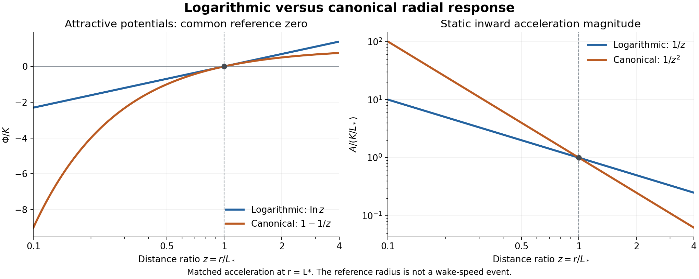

# Logarithmic collinear encounters and speed-boundary comparisons

The [shared logarithmic definition](../../equation-variants/logarithmic-potential/manuscript.md) specifies the candidate equation, reference levels and general spherical accounting. This treatment owns its collinear applications and their explicitly selected ceiling comparisons.

## Two moving opposites: exact instantaneous approach

The first collinear comparison treats both constituents as moving and uses an instantaneous logarithmic response. It is a separate control for the causal equation above: equal-time separation replaces delayed separation, the transmitter weight is set to one, and no self reception is included. The following result is derived for this declared comparison, without a speed cap, softening, or contact prescription.

Take unit polarity signs $\sigma_+=+1$, $\sigma_-=-1$ and the receiver scalar $\Psi_i=-K\sigma_i\sigma_j\ln(|X_i-X_j|/r_0)$, with $K>0$ of dimension squared speed. Differentiate with respect to the receiver coordinate before imposing symmetry. The opposite pair obeys

$$
\ddot X_+=-\frac{K}{X_+-X_-},
\qquad
\ddot X_-=\frac{K}{X_+-X_-}.
$$

Set $c_f=1$ and prescribe $X_\pm(0)=\pm x_0$, $\dot X_\pm(0)=\mp u_0$, with $x_0>0$ and $0\le u_0<1$. The midpoint remains at rest, so write $X_\pm=\pm x$, separation $d=2x$, and individual inward speed $u=-\dot x$. The positive half-separation is $x=|X_+-X_-|/2>0$: each constituent is that distance from the midpoint, and “positive” describes distance, not polarity. Then

$$
\boxed{\dot x=-u,\qquad \dot u=\frac{K}{2x}},
\qquad
\ddot d=-\frac{2K}{d}.
$$

Each constituent responds across the full separation $2x$, which supplies the factor $1/2$ in its acceleration. The fixed-center result cannot be substituted using half-separation as the source distance. Smoothness for $x>0$ gives local uniqueness; $\dot u>0$ makes inward speed increase strictly, including immediately after a rest release.

Differentiating $u^2+K\ln(x/x_0)$ along this equation gives zero, hence

$$
\boxed{u^2=u_0^2+K\ln(x_0/x)}.
$$

This is a first integral of the acceleration equation, not an assumed kinetic-energy or wake-energy law. It is valid when $u_0=0$, and the arbitrary reference $r_0$ has disappeared.

The pair therefore reaches individual speed one at positive separation:

$$
\boxed{x_v=x_0e^{-(1-u_0^2)/K},\qquad d_v=2x_v}.
$$

This is the first future event among individual wake-speed equality, contact, a turn, and loss of the ordinary positive-separation domain. The acceleration there is finite, $K/(2x_v)$, so this instantaneous equation continues smoothly through the diagnostic speed threshold. Relative closing speed is $2u$; using relative speed one would locate a different event at individual speed $1/2$.

The exact time follows by using the strictly increasing speed as a parameter:

$$
x(u)=x_0e^{(u_0^2-u^2)/K},
\qquad
T(u)=\frac{2x_0}{K}e^{u_0^2/K}
\int_{u_0}^{u}e^{-v^2/K}\,dv.
$$

The first-speed time is $T_v=T(1)$. Continuing the same instantaneous equation gives the finite endpoint time

$$
T_c=\frac{2x_0}{K}e^{u_0^2/K}
\int_{u_0}^{\infty}e^{-v^2/K}\,dv,
\qquad
0<T_v<T_c<\infty.
$$

As $T$ approaches $T_c$, separation tends to zero and individual speed grows without bound. There is no inward-to-outward turn and no finite-velocity classical continuation through contact. This conclusion concerns the incoming solution and does not specify a generalized passage or reflection rule. If $u_0=1$, wake-speed equality occurs at release; if $u_0>1$, the pair starts above that level and never returns to it. The same finite contact-time formula applies for every finite $u_0\ge0$.

For the exact normalized rest example $x_0=K=1$,

$$
x_v=e^{-1},\qquad d_v=2e^{-1},\qquad
T_v=2\int_0^1e^{-v^2}\,dv,\qquad
T_c=\sqrt{\pi}.
$$

The speed threshold thus occurs when the separation is $e^{-1}$ times its initial value. It is selected by preparation and amplitude, independently of where the potential crosses zero.

The [supporting derivation](logarithmic-instantaneous-collinear-first-event.md) establishes the maximal positive-separation interval and its endpoint; the [independent calculation](logarithmic-instantaneous-collinear-independent-check.md) reconstructs the reduction and event clock through full separation. The result shows that logarithmic attraction alone does not cap speed or regularize contact in this instantaneous approach. It supplies no event ordering for the delayed logarithmic equation, where source history, transmitter weighting, and possible self arrivals must be included explicitly.

## Causal logarithmic approach from a complete prepared history

The delayed candidate can now be posed as a definite initial-history problem. Its incoming motion has the same first-event order as the instantaneous comparison: individual speed reaches $c_f=1$ while the pair is still separated. Delay allows a closer approach and a later arrival at that speed. Self reception contributes nothing before or at that event, because no positive-delay self root exists yet. These are derived results for the candidate and preparations below, rather than adoption of a new primitive law.

### Emission, reception, and preparation

Retain the emitted-sphere measure and propagation of the current model, and postulate that each regular receiver response is multiplied by $r/L_*$ relative to the inverse-square response at a fixed matching length $L_*$. Equivalently, use the inverse-distance causal-root equation displayed above, including its absolute transmitter weighting and every admitted positive-delay self root. This is a complete response specification for studying motion. The factor is a new physical hypothesis; spherical dilution and the local logarithmic scalar do not derive it or provide a conserved energy account. The [formulation](logarithmic-causal-logarithmic-formulation.md) gives the emission-time representation, ordinary-root domain, and static and moving-source checks.

Choose equal-magnitude opposite polarities and write $K=\kappa_{\log}|q_+q_-|>0$. Set $c_f=1$ and supply the entire past

$$
X_\pm(T)=\pm(a-u_0T),\qquad T\le0,
\qquad a>0,\quad0\le u_0<1.
$$

The pair is held at rest when $u_0=0$; for positive $u_0$ it has a prescribed uniformly inward past. This is preparation data, not a claim that the interacting pair had already solved the proposed equation for all negative times. Future motion is released at zero with continuous position and velocity. The theorem covers the whole stated family, including the controlled variation $u_0=1/4$ at unchanged $a$ and $K$.

Before contact, put $X_\pm=\pm x(T)$ and $u=-\dot x$. The past partner emission is determined by

$$
R=T-S=x(T)+x(S),\qquad
D_t=1-u(S),\qquad D_r=1+u(T).
$$

The increasing function $P(T)=T+x(T)$ identifies the source uniquely through $P(S)=T-x(T)$ while all earlier speeds remain below one. A self root would require $\int_S^T u(v)\,dv=T-S$, which is impossible when the average speed on every such interval is less than one. Therefore the complete incoming equation is

$$
\boxed{\dot x=-u,\qquad
\dot u=\frac{K}{R[1-u(S)]},\qquad
\dot S=\frac{1+u(T)}{1-u(S)}.}
$$

The last expression describes root playback; it is not an extra acceleration multiplier. Initial values are $x(0)=a$, $u(0)=u_0$, $S(0)=-2a/(1-u_0)$, and $R(0)=2a/(1-u_0)$. In particular, $\dot u(0)=K/(2a)$. Positive delay and a nonzero source factor allow local unique evolution by using already determined history segments. No finite history truncation or self-root removal is needed.

While $S\le0$, the prepared past gives the explicit ordinary differential equation $\dot u=K/(x+a-u_0T)$. Its exact solution and the criterion for the source to enter the released history are given in the [incoming derivation](logarithmic-causal-collinear-first-event.md#prepared-history-reception-and-its-join). Crossing $S=0$ is a regular history join: source position and velocity are continuous, and $D_t=1-u_0>0$ there.

### Why speed one precedes contact

Attraction makes $u$ increase, while the delay satisfies $\dot R=-(u(T)+u(S))/(1-u(S))\le0$. Thus the acceleration is at least its initial value, $K/(2a)$, and the incoming below-speed-one interval cannot last indefinitely. Contact with speed at most one is also impossible. To see the obstruction, use emission time $S$ as the independent variable. The exact acceleration and playback relations give

$$
\frac{d}{dS}\left(u+\frac12u^2\right)=\frac{K}{T(S)-S}.
$$

Hypothetical contact at finite time $T_c$ would require $S\to T_c$. Since $T(S)<T_c$, integrating the right side gives at least a logarithmically divergent integral of $K/(T_c-S)$. The left side stays bounded for $u\le1$. This contradiction forces the first limiting event to be

$$
\boxed{0<T_v\le\frac{2a(1-u_0)}{K},\qquad
u(T_v)=1,\qquad x(T_v)>0.}
$$

There is exactly one partner root and zero positive-delay self roots at $T_v$. Its source time is still earlier than $T_v$, so $D_t=1-u(S_v)>0$ even though the receiver itself has reached speed one. The partner acceleration is finite, and $D_r=2$. Emitting at speed one and receiving an emission with a zero transmitter factor are different events; the latter has not occurred here.

The [independent calculation](logarithmic-causal-collinear-independent-check.md) obtains the event by bounding the delay directly. It also gives the finite range

$$
R_0e^{-(1-u_0^2)/K}\le R_v
\le R_0e^{-(1-u_0^2)/(2K)},\qquad
R_0=\frac{2a}{1-u_0}.
$$

These are bounds on the source-to-receiver distance at the event, not on the equal-time separation $2x_v$.

### Just below wake speed and at the endpoint

The established incoming motion has finite accumulated acceleration all the way to wake speed. With $c_f=1$, integrating $\dot u=A_p$ gives

$$
\int_0^{T_v}A_p(T)\,dT=1-u_0.
$$

Here $A_p$ is the inward acceleration from the single partner root. Its integral is the change in individual inward speed. The divergent self integral discussed below belongs to a proposed outgoing continuation, after this incoming interval.

Near the endpoint the partner wake still travels a positive distance from an earlier emission. The partner's speed at that emission is below one. Thus both denominator factors $R_v$ and $1-u(S_v)$ remain positive, and the limiting acceleration $A_v=K/[R_v(1-u(S_v))]$ is finite and positive. For a small time interval $\delta=T_v-T>0$ before arrival, continuity of this acceleration gives

$$
u(T_v-\delta)=1-A_v\delta+o(\delta),\qquad
x(T_v-\delta)=x_v+\delta-\frac12A_v\delta^2+o(\delta^2).
$$

The remainder notation means terms smaller than the indicated power of $\delta$ as $\delta\to0$. Speed approaches one with a finite slope while the positive half-separation approaches $x_v$. There is no incoming speed spike, contact, or self reception at the endpoint. The same local description applies to the canonical inverse-square control with its own event time, separation, and finite acceleration; those values need not agree between the models.

Neither radial potential curve acquires a singularity merely because the receiver reaches wake speed. The curves depend on the emission-to-reception distance, and that partner distance is still positive. The impending difficulty concerns a different distance: the range of a newly admitted self arrival in a proposed motion above wake speed.

### How the result differs from instantaneous attraction

Compare the two models when they have the same present separation. The instantaneous model uses the partner's present position. The delayed model receives a wake emitted when the partner was farther away, so its source-to-receiver distance $R$ exceeds the present gap $2x$. The transmitter factor $1/[1-u(S)]$ amplifies the delayed contribution, but during this accelerating approach that amplification does not fully offset the greater distance.

The exact reason is that the partner has moved faster on average during the wake's flight than it was moving when it emitted that wake. Define its average inward speed during that interval by $\bar u=R^{-1}\int_S^T u(v)\,dv$, using $R=T-S$ in $c_f=1$ units. Causal geometry gives $2x=R(1-\bar u)$, and strictly increasing speed after release gives $u(S)<\bar u<1$. Thus

$$
\frac{\dot u_{\mathrm{causal}}}{K/(2x)}
=\frac{2x}{R[1-u(S)]}
=\frac{1-\bar u}{1-u(S)}<1.
$$

This ratio compares acceleration at the same current gap; it does not compare two different gaps at the same clock time. Both preparations start with the same inward speed. Since the delayed trajectory gains speed more slowly at every common gap, it is still below speed one when it reaches the gap at which the instantaneous model reaches one. It must approach closer before reaching that threshold. It also takes longer to reach every shared gap after release, and then has an additional interval of approach before its own threshold. Integrating the acceleration inequality gives

$$
\boxed{0<x_v^{\mathrm{causal}}<a e^{-(1-u_0^2)/K}
=x_v^{\mathrm{instantaneous}},\qquad
T_v^{\mathrm{causal}}>T_v^{\mathrm{instantaneous}}.}
$$

Thus delay changes where and when the threshold occurs without making contact the first event. For the exact example $a=1$, $K=2$, $u_0=0$, $c_f=1$, the source remains in the stationary prepared past through the event and

$$
x_v=2e^{-1/4}-1,\qquad
T_v=\int_0^1e^{-v^2/4}\,dv<1,\qquad
R_v=2e^{-1/4}>1.
$$

This exact example requires no numerical integration. For the other normalized rest preparation $a=K=1$, the hypothetical stationary-source value at speed one instead satisfies $T/R=e^{1/2}\int_0^1e^{-v^2/2}\,dv>1$. The source therefore joins the released history before speed one, and continuing the stationary-source formula would be incorrect. The general proof covers that genuinely evolving source history as well.

The current inverse-square Master Equation is a separate control. With the fixed matching length $L_*=2a$, its coefficient is $G=2aK$ and its incoming acceleration is $G/[R^2(1-u(S))]$ on its own evolved history. The same emission-coordinate proof, with $G/(T(S)-S)^2$ on the right, proves that this control also reaches speed one at positive separation. Initial accelerations match at rest; with inward prepared speed $u_0>0$, the control begins at $K(1-u_0)/(2a)$ while the logarithmic candidate begins at $K/(2a)$. Matching those again would retune the comparison and is not assumed. No ordering of the two delayed event positions is claimed.

### What has and has not happened at the endpoint

The pair has not passed through each other on the established causal trajectory: its separation is still positive at the first wake-speed event. Neither a turn nor a contact has occurred. At that exact instant the partner contribution is finite and no positive-delay self root exists. The separate continuation analysis below proves that the complete equation cannot continue this approach with finite continuous velocity along the line.

The full [incoming proof](logarithmic-causal-collinear-first-event.md) states the event ledger and its falsifiers. Its result is conditional on the declared response, complete affine preparations, equal couplings, and incoming mirror geometry. The continuation proof uses that established history; it does not transfer an endpoint from the inverse-square law or extrapolate the instantaneous trajectory.

### Why a finite-velocity collinear continuation fails

The obstacle is the first reception of each constituent's own wake. To see why it cannot be avoided by slowing down, suppose there were a continuation with finite continuous velocity through $T_v$. Require velocity changes to equal the integral of the full acceleration on every interval strictly after $T_v$. This includes classical motion and locally absolutely continuous velocity; it does not assume that the acceleration can already be integrated across the endpoint. Allow the two constituents to move differently after $T_v$, while remaining on the line.

Continuity keeps both constituents on their original sides and moving inward for a short time. Every partner contribution is attractive and points inward. Every possible self contribution is repulsive away from its own past emission point, which lies behind its current inward motion, so it also points inward. The existing partner root persists with positive delayed distance and a nonzero transmitter factor. Its acceleration is therefore bounded below by a positive number $m_i$ for receiver $i$. The complete equation requires

$$
\dot u_i\ge m_i>0,\qquad
u_i(T)\ge1+m_i(T-T_v)>1\quad(T>T_v).
$$

The speed crossing is thus forced by the equation. Remaining at speed one, braking, or beginning a reversal would violate it. This step is what turns the [earlier conditional self-birth argument](logarithmic-inverse-distance-collinear-obstructions.md) into an obstruction at the actual incoming endpoint.

Each such crossing creates exactly one positive-delay self root emitted before $T_v$, while its old partner root remains the only partner contribution. For one receiver, call the self emission time $\tau<T_v$, its delay $\rho=T-\tau$, and the two speed gaps $w_-=1-u(\tau)>0$ and $w_+=u(T)-1>0$. Its self contribution has positive inward sign and magnitude

$$
A_s=\frac{K}{\rho w_-},\qquad
\frac{d\rho}{dT}=\frac{w_-+w_+}{w_-},\qquad
A_s\,dT=\frac{K}{\rho(w_-+w_+)}\,d\rho.
$$

As reception approaches the birth event, the self emission approaches that same event from below, so $\rho\to0$. Finite continuous velocity keeps the speed-gap sum bounded above by a finite $B>0$. Therefore every proposed right-neighborhood of the event has

$$
\int_{T_v}^{T}A_s(t)\,dt
\ge\frac{K}{B}\int_0^{\rho(T)}\frac{d\rho}{\rho}
=+\infty.
$$

This is stronger than saying acceleration becomes large: its accumulated contribution is infinite. No other contribution can cancel it because they all accelerate that same receiver inward. Opposite coordinate signs for the two constituents do not help; each must satisfy its own velocity equation. Excluding the exact zero-delay emission does not exclude the nearby positive-delay self roots that cause this divergence.

**Derived result:** the specified causal logarithmic law has no finite-velocity continuation in this collinear solution class. The result also excludes outgoing collinear motions that break the initial mirror symmetry. It does not describe a realized jump to infinite speed, a physical halt, or annihilation; it says that the proposed acceleration equation supplies no admissible outgoing evolution in the stated class. A speed cap, impulse, deletion of self reception, or changed short-distance response would be an additional law.

The [complete continuation proof](logarithmic-causal-continuation-obstruction.md) gives the root census, integral regularity, falsifiers, and a further obstruction to nonnegative acceleration measures that remain finite up to the birth endpoint and retain the same ordinary contributions. An [independently constructed proof](logarithmic-causal-continuation-independent-check.md) checks the collinear result. Arbitrary weak formulations with undeclared singular velocity changes and transverse departures from the line are outside this theorem. Delay weakens the incoming acceleration relative to the instantaneous logarithmic comparison at the same present gap, but the delayed logarithmic candidate still has this collinear self-reception obstruction.

### Comparing the logarithmic and canonical radial curves

The canonical $1/r$ dependence describes a potential whose radial acceleration magnitude varies as $1/r^2$. The proposed logarithm instead gives a $1/r$ radial acceleration magnitude. To compare their shapes, fix a matching length $L_*>0$, set $G=KL_*$, and use the dimensionless distance $z=r/L_*$. Choose the attractive partner sign and a common potential zero at $r=L_*$. The static receiver scalars and their inward acceleration magnitudes are

$$
\Phi_{\log}=K\ln z,\qquad
\Phi_{\mathrm{can}}=K\left(1-\frac1z\right),\qquad
A_{\log}=\frac K r,\qquad
A_{\mathrm{can}}=\frac{KL_*}{r^2}.
$$

The canonical expression is the attractive scalar $-G/r$ with a constant added. Differentiating either scalar with respect to distance gives the positive magnitude of its inward radial acceleration. These are local acceleration-potentials, not an established conserved energy for evolving delayed motion. Reversing to the repulsive same-polarity sign reverses the scalar and acceleration direction, up to an arbitrary constant.

The curves have equal acceleration at $r=L_*$. At half that distance the logarithmic acceleration is twice its matching value, while the canonical acceleration is four times its matching value. The logarithmic attraction is weaker at smaller radii and stronger at larger radii under this fixed normalization. Both attractive scalars diverge negatively as $r\to0$, but the logarithm does so more slowly. Their common zero is freely chosen and does not identify a speed threshold.

For moving sources, both declared ordinary-root laws retain the multiplier $1/|D_t|$ in $c_f=1$ units. Comparing the same root on the same supplied history therefore gives $A_{\log}/A_{\mathrm{can}}=r/L_*$. Evolving the two laws changes their histories and roots, so this ratio does not order their event times or event separations. The proved later-and-closer threshold compares delayed and instantaneous logarithmic motion, not the logarithmic candidate and the canonical delayed law.

### Why the weaker radial response still has infinite accumulated self acceleration

The small range at self birth is the distance from a constituent's own earlier position to its current position. The two opposite constituents are still separated. A proposed crossing above wake speed makes the receiver overtake a wake emitted just before its crossing. The emission point is behind its inward motion, so same-polarity repulsion away from that point adds inward acceleration.

Two quantities vanish together near birth: the self range $\rho=T-\tau$ and the source's speed gap $w_-=1-u(\tau)$. The logarithmic self response divides by both. The canonical self response divides by the squared range and the same speed gap:

$$
A_{s,\log}=\frac K{\rho w_-},\qquad
A_{s,\mathrm{can}}=\frac G{\rho^2w_-}.
$$

The integral calculation above proves that the logarithmic response has infinite area under its acceleration-versus-time curve in every proposed interval beginning at birth. Each range interval from $\rho/2$ to $\rho$ contributes at least $(K/B)\ln2$ to the speed change. Successively halving the range produces infinitely many disjoint intervals with this same positive lower bound, so their sum cannot be finite. The bound $\int_0^\rho d\rho'/\rho'$ is logarithmically divergent; this is a lower bound, not a claim about the exact divergence rate. For the canonical response the same change of variable gives

$$
A_{s,\mathrm{can}}\,dT
=\frac G{\rho^2(w_-+w_+)}\,d\rho,
\qquad
\int_{T_v}^{T}A_{s,\mathrm{can}}(t)\,dt
\ge\frac GB\int_0^{\rho(T)}\frac{d\rho'}{(\rho')^2}
=+\infty.
$$

Here the geometry and speed gaps are evaluated on the relevant hypothetical continuation for each law, and $B$ is a finite upper bound for their sum. Removing one inverse power of range therefore weakens the self singularity without making its accumulated acceleration finite. This divergence comes from one self root per receiver as time approaches birth, not from an infinite number of simultaneous roots.

A prescribed local path illustrates the mechanism without purporting to solve either equation. Put $h=T-T_v$ and choose a right-hand position $y(h)=x_v-h-\alpha h^2/2$, with $\alpha>0$ and $c_f=1$. Its inward speed is $u(h)=1+\alpha h$. For small $h>0$ the self emission occurs exactly at time offset $-h$: the traveled distance $y(-h)-y(h)=2h$ equals the wake's travel time. Consequently

$$
\rho=2h,\qquad w_-=\alpha h,\qquad
A_{s,\log}=\frac K{2\alpha h^2},\qquad
A_{s,\mathrm{can}}=\frac G{4\alpha h^3}.
$$

For any fixed small $H>0$, the corresponding integrals from a positive cutoff $\varepsilon$ to $H$ grow without bound as $\varepsilon\to0$: respectively $K(1/\varepsilon-1/H)/(2\alpha)$ and $G(1/\varepsilon^2-1/H^2)/(8\alpha)$. The prescribed path has finite acceleration $\alpha$, so the evaluated self response shows why it cannot be an outgoing solution. The general obstruction does not assume this quadratic path or these exact time powers.

These comparisons are derived from the declared radial laws and causal geometry. A finite-velocity collinear outgoing solution retaining those same positive self contributions would falsify the obstruction; changing the self rule, transmitter factor, or solution class would change its premises. The radial plot represents the static formulas alone and supplies no trajectory evidence.

### Relation to the earlier collinear continuation results

The [collinear comparison](../manuscript.md#1-collinear-encounter-comparison) distinguishes an obstruction under the unchanged Master Equation from a successful short continuation under a modified self response. For its stationary opposite-polarity pair, the unchanged law reaches wake speed at positive separation and admits no finite-continuous-velocity collinear extension in the declared integral class. The [stationary analysis](stationary-binary-first-interval.md#local-continuation-alternatives-for-the-original-collinear-history) derives that conclusion without assuming outgoing mirror symmetry. It supplies no physical stopping state, passage or rebound.

The [quintic candidate](../manuscript.md#collinear-note-3) instead multiplies the newborn self contribution by a dimensionless fifth-power factor that vanishes at birth, while leaving the ordinary partner interaction unchanged. Its [independently reviewed theorem](../../analysis/quintic-mirror-boundary-independent-adjudication.md#verdict-and-scope) establishes a unique short mirror-symmetric continuation above wake speed. On that solution, the modified self acceleration vanishes quadratically with elapsed time after birth and has a finite integral. The partner's positive endpoint acceleration carries speed through one. The theorem stops before the weakening rule's release condition and before coincidence; it establishes neither passage nor long-time behavior. This is a derived result conditional on an unadopted response modification.

The logarithmic replacement makes a different change: it removes one inverse power of distance from every radial response while preserving the original self weighting. Its divergent self integral therefore does not contradict the quintic result. Neither result establishes a universal prohibition on speeds above wake speed.

A separate [reflected-source construction](../../analysis/speed-crossing-opposing-interaction-geometry.md#a-reflected-pair-with-a-finite-outgoing-acceleration-sum) preserves the canonical per-root law and cancels every divergent term in a selected local self-plus-partner sum. Its source paths are prescribed and noncollinear, with source speeds already above wake speed in their earlier histories. The finite selected acceleration has not been shown to equal the prescribed receiver acceleration, all other history contributions are not closed, and the source equations and event limit remain unresolved. This is a derived cancellation mechanism, not a coupled crossing solution or a continuation of the stationary pair. A complete coupled solution satisfying those missing conditions would advance that distinct construction; importing its prescribed paths into the present isolated pair would change the problem.

## Strict and inclusive speed ceilings for logarithmic attraction

The inequalities $v<c_f$ and $v\le c_f$ define different allowed speed domains, but neither specifies an acceleration law. With the same logarithmic equation and complete incoming history, the speed-one event has positive separation and finite positive inward acceleration. The strict inequality excludes that event; the inclusive inequality admits its state. Neither inequality by itself supplies continuing motion through it.

The inequality-only comparison keeps the logarithmic causal acceleration unchanged, with $a,K>0$, $0\le u_0<1$ and $c_f=1$. It contains no receiver-speed multiplier or boundary projection. Zero self acceleration is part of the stated ceiling scenarios; through the first speed-one event, it also follows from the absence of self roots. A subsequent comparison explicitly adds a boundary projection and examines its entry event. Its capped trajectory is a consequence of that additional response, not of allowing equality alone.

| Feature | Strict requirement: $v<1$ with unchanged logarithmic acceleration | Inclusive requirement: $v\le1$ with unchanged logarithmic acceleration |
| --- | --- | --- |
| Acceleration below wake speed | The logarithmic causal partner input | The same logarithmic causal partner input |
| First speed-one state | Excluded, although its incoming limit is finite | Admitted at the same time and positive separation |
| Partner acceleration there | Finite positive incoming limit | The same finite positive value; equality does not remove it |
| Self roots at the first equality | None in the completed incoming boundary data | None in the admitted endpoint state |
| Continuous motion after that boundary | Incompatible with the unchanged acceleration and strict domain | Incompatible with the unchanged acceleration and inclusive domain, with zero self acceleration |
| Contact and departure | Not reached | Not reached merely by admitting equality |

The [incoming proof](logarithmic-causal-collinear-first-event.md) and its [independent derivation](logarithmic-causal-collinear-independent-check.md) establish the shared incoming event. The strict and inclusive domain arguments below distinguish whether its state is allowed and whether it can continue. The [conditional projection reference](logarithmic-inclusive-ceiling-independent-check.md) concerns a separately modified equation. The withdrawn quadratic-response comparison supplies no assumption or evidence for either unchanged-response scenario.

### Strict domain with unchanged logarithmic acceleration

The strict scenario retains the logarithmic causal acceleration and requires individual speed below one. Write $u=-x'$ for the common inward speed, with positions $X_\pm=\pm x$, and $S<T$ for the partner emission time. The selected equation is

$$
x'=-u,\qquad
u'=\frac K{R[1-u(S)]},\qquad
R=T-S=x(T)+x(S),\qquad 0\le u<1.
$$

The source-velocity weight and causal geometry are unchanged. There is no receiver-speed multiplier, softened distance law or added boundary prescription. The logarithmic radial change and the strict domain are the only modifications under discussion. During the admitted incoming motion every earlier same-label displacement is shorter than the corresponding wake radius, so self acceleration is zero.

The already established incoming theorem applies directly: this equation approaches $u=1$ in finite time at positive separation, with finite positive partner acceleration and no self root. The strict domain excludes that endpoint. Merely requiring $u<1$ supplies no dynamical response that prevents it. This conclusion concerns the first domain boundary; it gives no capped segment, contact trajectory, passage or reflection within the strict scenario. In particular, a contact-speed conclusion obtained from a separate receiver-response experiment does not describe this equation.

#### First interval after release from rest

For the baseline preparation, prescribe $X_\pm=\pm a$ and zero velocity for $T\le0$, then begin interacting evolution at $T=0$. The stationary past is supplied history, not an equilibrium under attraction. Set $c_f=1$, with $a,K>0$. At later times the separation is $2x(T)$ and the inward speed is $u=-x'$.

The first interval receives partner emissions from the stationary past. For the right constituent the relevant source emission point is $-a$, even though the partner has since moved. Thus

$$
R=a+x(T),\qquad S=T-a-x(T)\le0.
$$

The source speed at emission is zero, so its weighting factor is one. Existing past wakes produce immediate inward acceleration at release:

$$
x'=-u,\qquad u'=\frac K{a+x},\qquad
x(0)=a,\quad u(0)=0,\quad u'(0^+)=\frac K{2a}.
$$

The two constituents move toward the midpoint, their speeds increase, and the acceleration magnitude increases as $x$ decreases. All acceleration comes from the partner. With continuous speeds below one, a constituent travels less than $T-S$ between emission and reception, while its emitted sphere expands to radius $T-S$. It therefore remains inside its own sphere and does not receive it again.

The first-interval identity is

$$
u^2=2K\ln\frac{2a}{a+x}.
$$

Differentiating its left side gives $2uK/(a+x)$; differentiating the right side using $x'=-u$ gives the same expression, and both vanish at release. Equivalently, the exact speed parametrization is

$$
a+x(u)=2a e^{-u^2/(2K)},\qquad
T(u)=\frac{2a}{K}\int_0^u e^{-w^2/(2K)}\,dw.
$$

These formulas agree with the independently checked [prepared-history reduction of the logarithmic equation](logarithmic-causal-collinear-first-event.md). They apply only until the earlier of two events: reception of the release-time wake, $S=0$, or the limiting speed-one boundary, $u=1$. Their ordering depends on $K$; the history join is not guaranteed to come first. Evaluate $S(u)=T(u)-a-x(u)$ formally at $u=1$ using the displayed stationary-source parametrization: $S(1)<0$ means speed one comes first, $S(1)=0$ means simultaneous events, and $S(1)>0$ means the history join comes first. This formal comparison locates the first event; it does not continue the actual stationary-source equation after its range of validity.

Neither contact nor a turn intervenes. A turn is excluded by $u'>0$. If contact occurred at or before either stopping event, traversing distance $a$ with speed below one before that endpoint would require $T>a$, but then $S=T-a>0$, contradicting reception from the stationary past. Consequently the first stopping event has positive separation. The partner root is unique because $S+x(S)$ is strictly increasing throughout the subunit history, and no self root appears even at the limiting speed-one instant: every finite earlier chord still has average speed below one.

If the history join occurs first, its condition is $T_j=a+x(T_j)$, and position, velocity and acceleration remain continuous. Further evolution must then use the partner's moving source history. If speed one occurs first, the strict-domain motion ends before that join; the inequality supplies no continuation. If the events coincide, the strict domain ends at their common boundary. The interval is not extended by importing a receiver factor from another experiment.

#### Which event ends the stationary first interval

For release from rest, a unique coupling threshold determines whether the release-time wake arrives before the strict speed boundary. This is a derived property of the displayed logarithmic equation, with no additional response factor. Throughout this calculation $c_f=1$, so the numerical coupling $K$ is expressed in units of $c_f^2$.

The emission time $S=T-a-x$ starts at $-2a$ and increases strictly because $dS/dT=1+u>0$. There can therefore be only one first reception of the release-time wake. At the formal speed-one value of the stationary-source parametrization,

$$
S(1)=2a e^{-1/(2K)}[H(K)-1],\qquad
H(K)=\frac1K\int_0^1\exp\!\left(\frac{1-w^2}{2K}\right)dw.
$$

The positive prefactor cannot change the sign. Thus $H(K)>1$ means $S$ has already reached zero before speed one, whereas $H(K)<1$ means the arriving wake is still from the stationary past when speed approaches one. The equality gives simultaneous events. Here $H$ is only a diagnostic of event ordering; it is not a multiplier in the acceleration law. The formal evaluation supplies no motion beyond the first stopping event.

There is exactly one threshold. Differentiation gives

$$
H'(K)=-\frac1{K^2}\int_0^1
e^{(1-w^2)/(2K)}
\left[1+\frac{1-w^2}{2K}\right]dw<0.
$$

Also $H(K)\ge1/K\to\infty$ as $K\downarrow0$, while $H(K)\le e^{1/(2K)}/K\to0$ as $K\to\infty$. Continuity and strict decrease give a unique $K_*$ satisfying $H(K_*)=1$. In particular $H(1)>1$ and $H(2)<e^{1/4}/2<1$, so $1<K_*<2$ without numerical root finding. High-precision evaluation gives

$$
\boxed{K_*\approx1.30046564472530\qquad(c_f=1).}
$$

| Coupling for the stationary preparation | First ending event | Meaning at the end of this interval |
| --- | --- | --- |
| $0<K<K_*$ | Reception of the release-time wake, $S=0$ | Speed remains below one; subsequent evolution must use the partner's moving history |
| $K=K_*$ | $S=0$ and limiting $u=1$ together | The strict domain ends at their common boundary |
| $K>K_*$ | Limiting speed $u=1$ while $S<0$ | The strict domain ends before reception of the release-time wake |

The initial half-separation $a$ cancels from the ordering criterion. Rescaling $a$ rescales the distances and elapsed times in this first-interval solution together, while leaving its speeds and event order unchanged at fixed $K$. A stronger coupling accelerates the constituents to the excluded speed sooner relative to reception of the release-time wake. No contact or reversal intervenes, by the positive-separation and acceleration arguments above.

The following values are numerical evaluations of the exact parametrization, not trajectory simulations. Times and half-separations are divided by their initial half-separation $a$. The speed-one entries are limiting boundary values, not admitted states of the strict scenario.

| $K$ | First event | Inward speed $u$ | Remaining half-separation $x/a$ | Elapsed time $T/a$ |
| --- | --- | --- | --- | --- |
| $0.5$ | Release-time wake arrives | $0.438999$ | $0.649425$ | $1.649425$ |
| $1$ | Release-time wake arrives | $0.802968$ | $0.448848$ | $1.448848$ |
| $K_*$ | Simultaneous boundary | $1$ | $0.361612$ | $1.361612$ |
| $2$ | Speed boundary first | $1$ | $0.557602$ | $0.922562$ |

The [scalar evaluation instrument](logarithmic-first-interval-event-order.py) runs analytical quadrature and root controls before evaluating this criterion and these examples. An equivalent equation for the threshold is $\sqrt\pi\,z e^{z^2}\operatorname{erf}(z)=1$, with $z=(2K_*)^{-1/2}$ and $\operatorname{erf}(z)=(2/\sqrt\pi)\int_0^z e^{-t^2}dt$. A separately constructed evaluation of that expression agrees with the quoted threshold. The existence and ordering result follow from the proof above; the displayed decimals are numerical approximations, not certified interval bounds. A sign reversal in the ordering criterion or a solution of the stated first-interval equations with contrary event ordering would overturn this classification. This result resolves which event ends the first interval; it supplies no passage, turn, return, or dynamics beyond the strict boundary.

#### Reception of the release-time wake

For $0<K<K_*$, reception of the partner's release-time wake is a regular event within the strict domain. It changes which part of the partner's history supplies the acceleration. Before this event, the arriving emissions came from its stationary position; afterward, they came from its inward-moving path. The source position and velocity match continuously at release, so the receiver's acceleration also matches continuously when that history arrives. These are derived consequences of the unchanged logarithmic equation with $c_f=1$.

Let $T_j$ be the reception time, $x_j=x(T_j)>0$ the positive half-separation, and $u_j=u(T_j)<1$ the inward speed. The partner emission time is $S(T_j)=0$, and its delayed distance is

$$
R_j=T_j=a+x_j.
$$

The source speed at that emission is $u(0)=0$, even though both constituents already have speed $u_j$ at reception. Write $A(T)=u'(T)$ for the inward acceleration magnitude. Since $x(S)\to a$ and $u(S)\to0$ from either side of the release time,

$$
A(T_j^-)=A(T_j^+)=A_j=\frac K{R_j}.
$$

Position, velocity and acceleration are therefore continuous through the event. The inward acceleration remains positive: there is no kick, reversal or braking. For the preceding $K=1$ example, reception occurs at $T_j/a\approx1.448848$, with $x_j/a\approx0.448848$ and $u_j\approx0.802968$. These are the same first-event values already evaluated above, now interpreted as ordinary interior states through which the strict-domain solution can continue.

Immediately after reception, the source time is positive and the equation uses the partner's early moving history:

$$
x'=-u,\qquad
A=\frac K{R[1-u(S)]},\qquad
R=T-S=x(T)+x(S),\qquad S>0.
$$

Differentiating the causal relation gives the rate at which source time advances as reception time advances, together with the rate of change of delayed distance:

$$
S'=\frac{1+u(T)}{1-u(S)},\qquad
R'=-\frac{u(T)+u(S)}{1-u(S)}.
$$

At the join these are $S'_j=1+u_j$ and $R'_j=-u_j$. Afterward, $R$ decreases and the emitted source speed $u(S)$ increases. Both changes increase the inward acceleration: the delayed distance becomes smaller and the unchanged source weight $1/[1-u(S)]$ becomes larger. The rate $S'$ describes which source history is received; it is not an additional multiplier in the acceleration law.

Although acceleration is continuous, its rate of change has a finite upward jump. The supplied stationary history had $u'(0^-)=0$, whereas interacting evolution starts with $u'(0^+)=A_0=K/(2a)$. For reception times on either side of $T_j$, differentiating the acceleration gives

$$
\frac{A'}A=-\frac{R'}R+\frac{u'(S)S'}{1-u(S)}.
$$

The first term has the same limit from both sides. The second begins contributing when the arriving source history passes release. Consequently

$$
\begin{aligned}
A'(T_j^-)&=\frac{K u_j}{R_j^2},\\
A'(T_j^+)&=\frac{K u_j}{R_j^2}+\frac K{R_j}A_0(1+u_j),\\
A'(T_j^+)-A'(T_j^-)&=\frac{K^2(1+u_j)}{2aR_j}>0.
\end{aligned}
$$

Thus the receiver begins to gain inward acceleration more rapidly when the partner's release reaches it, without an acceleration discontinuity or impulse. The finite derivative jump depends on the chosen abrupt release from a supplied stationary past. Smoothing that preparation would change this event detail; it is not an intrinsic discontinuity of the logarithmic radial kernel.

Local continuation is unique and regular. The source map $P(S)=S+x(S)$ has derivative $P'=1-u(S)>0$, and the root solves $P(S)=T-x(T)$. Near $S=0$ its inverse is locally Lipschitz, meaning that small changes of the reception state produce proportionally bounded changes of the emission time. The stored position and velocity are locally Lipschitz as well. Since $R_j>0$ and $u_j<1$, a sufficiently short continuation has positive delay, positive source denominator, and receiver speed below one; its source times lie in the already constructed first-interval history. The resulting ordinary initial-value equation therefore has a unique local solution, as in the earlier [incoming continuation argument](logarithmic-causal-collinear-independent-check.md#local-existence-and-continuation-within-the-incoming-domain).

There remains exactly one partner root per receiver, with no positive-delay self root. The partner root simply crosses the release join of the same source history. Every same-constituent chord is still shorter than the corresponding wake radius because speed stays below one throughout it. This establishes passage through the history join only, without determining the duration of the following interval or supplying continuation at the later strict speed boundary. The available strict speed margin can shrink as $K\uparrow K_*$, so this local result promises no common continuation duration up to that threshold and excludes the simultaneous boundary case. A discontinuous acceleration or a new root under these same history and domain assumptions would contradict the displayed limits or the monotone source-map and chord arguments; these are the direct checks on the event claim.

#### The interval receiving the partner's first moving history

After the release-time wake arrives, each constituent receives emissions made while its partner was traversing the first interval. The partner was moving inward but was itself still receiving the other's stationary history at those emission times. This distinction fixes the next interval: it starts at reception time $T_j$, when source time $S=0$, and ends at the earlier of receiver speed one or source time $S=T_j$. The latter event is reception of an emission made when the partner reached its own first history join. It is a later history boundary, not a second release, collision or new interaction law.

Assume $0<K<K_*$ and retain $c_f=1$. The complete source history required here is already known. If $w=u(S)$ is the partner's speed at emission and $y=x(S)$ its positive half-separation at emission, then

$$
S(w)=\frac{2a}{K}\int_0^w e^{-z^2/(2K)}\,dz,\qquad
y(w)=2a e^{-w^2/(2K)}-a,\qquad 0\le w\le u_j.
$$

The source clock is strictly increasing, so it determines $w$ and $y$ uniquely for $0\le S\le T_j$. To follow reception, use $S$ as the independent variable and write $U(S)=u(T(S))$ for the receiving constituent's speed. The unchanged delayed equation becomes

$$
\boxed{
\frac{dU}{dS}=\frac{K}{R(1+U)},\qquad
\frac{dR}{dS}=-\frac{U+w(S)}{1+U},\qquad
U(0)=u_j,\quad R(0)=T_j.
}
$$

The reception time and current half-separation are recovered as $T(S)=S+R(S)$ and $x(T(S))=R(S)-y(S)$. Indeed $dT/dS=(1-w)/(1+U)>0$. The source weight has canceled in the equation for $dU/dS$ because of this change of clock; in reception time the acceleration remains exactly $K/[R(1-w)]$. No receiver response has been inserted or removed by the parametrization.

During this interval the receiving speed increases and the delayed distance decreases. The acceleration magnitude also increases, since both $R$ and $1-w$ decrease. It remains finite: the known source history has $y\ge x_j>0$ and $w\le u_j<1$, so while the constituents remain separated, $R=x(T)+y\ge x_j$ and $1-w\ge1-u_j>0$. These inequalities prevent a vanishing source denominator or zero-delay singularity on this interval.

Contact cannot precede either ending event. The causal identity implies $P(T)-P(S)=2x(T)$, where $P(t)=t+x(t)$. If contact occurred, it would require $P(T)=P(S)$ despite $T-S=R\ge x_j>0$. But $P'=1-u>0$ before the strict boundary, so the integral of $P'$ over this finite interval is positive, including at a first limiting speed-one endpoint. This is a contradiction. A turn is excluded by positive inward acceleration. The unique partner root persists and no self root appears, by the same source-map and strict-chord arguments used at release-time reception. The ordinary equation therefore remains regular until one of the two stated ending events. Its source-time range is finite and $0<dT/dS\le1$, so that event occurs in finite reception time.

An exact accumulated-acceleration criterion makes the competing events explicit:

$$
U(S)+\frac12U(S)^2
=u_j+\frac12u_j^2+K\int_0^S\frac{d\sigma}{R(\sigma)}.
$$

Speed approaches one when the integral contribution reaches $3/2-u_j-u_j^2/2$. If that happens for $S<T_j$, the strict domain ends within this interval. If $S=T_j$ arrives first with $U<1$, the interval ends at a regular history boundary and later evolution requires the next part of the source history. Equality at $S=T_j$ gives simultaneous events. This identity comes from the differential equation, not an assumed energy law.

#### A second coupling threshold and bounded examples

There is a unique coupling $K_2$ separating those two outcomes within $0<K<K_*$. The result is derived by comparing solutions at the same fraction of their source-history interval. This common fraction matters because $T_j$ itself changes with coupling; comparing trajectories at arbitrary equal reception times would not establish the required event order.

Put $p=u_j$, $\eta=p^2/(2K)$, and

$$
I(\eta)=\int_0^1e^{\eta(1-z^2)}\,dz.
$$

The first-join condition gives $K=pI(\eta)$, hence $p=2\eta I(\eta)$ and $K=2\eta I(\eta)^2$. Both increase strictly with $\eta$. Since $p<1$ and $I>1$, the relevant range has $0<\eta<\eta_*<1/2$, with $\eta_*$ corresponding to $p=1$ and $K=K_*$. Normalize source time and delayed distance by $\tau=S/T_j$ and $\rho=R/T_j$. The emitted speed then satisfies

$$
\frac{dw}{d\tau}=K\exp\!\left[-\eta+\frac{w^2}{2K}\right],\qquad
w(0)=0,\quad w(1)=p.
$$

This source speed increases with coupling at each fixed $\tau$. To check the comparison, hold $w$ fixed within a lower-coupling source's range. Since $d\ln K/d\eta\ge1/\eta$ and $w^2/(2K)\le\eta$ throughout the comparison to any larger coupling,

$$
\frac{\partial}{\partial\eta}
\ln\!\left[K e^{-\eta+w^2/(2K)}\right]
=\frac{d\ln K}{d\eta}\left(1-\frac{w^2}{2K}\right)-1
\ge\frac1\eta-2>0.
$$

A larger coupling therefore gives a larger source-speed derivative whenever two source speeds could meet, excluding a reversal of their ordering after the common zero initial value.

For the receiving trajectory, define $B=U+U^2/2$ and $d=1-\rho$. These are auxiliary comparison variables, not a modified acceleration or a conserved account. Their equations are

$$
\frac{dB}{d\tau}=\frac K{1-d},\qquad
\frac{dd}{d\tau}=\frac{U+w}{1+U},\qquad
B(0)=p+\frac12p^2,\quad d(0)=0.
$$

An increase in either variable increases the growth rate of the other: the relevant derivatives are $K/(1-d)^2>0$ and $(1-w)/(1+U)^3>0$. Increasing coupling also increases the initial $B$, the coefficient $K$ and the emitted speed $w$. Thus comparison of these ordinary equations gives strictly larger receiver speed at the same $\tau$ for larger coupling, for as long as both trajectories remain below one. The difference in $B$ remains at least its strictly positive initial value because its derivative is larger in the higher-coupling trajectory. In particular, if the lower coupling reaches speed one by $\tau=1$, the higher coupling must reach it earlier. The comparison stops at the first speed boundary; it supplies no superunit continuation.

For small couplings, a direct bound ensures that the next history join comes first. While $U\le1$ and $w\le p<1$, the normalized distance decreases at rate at most $(1+p)/2$, giving

$$
\rho\ge1-\frac{1+p}{2}\tau\ge\frac{1-p}{2},\qquad
U(\tau)\le p+\frac{2K}{1-p}\tau.
$$

Since $p<K$, every $0<K\le1/4$ has $U(\tau)<1/4+(1/2)/(3/4)=11/12<1$ up to $\tau=1$. A supposed earlier speed-one endpoint would contradict this same bound. Conversely, as $K\uparrow K_*$, $p\uparrow1$ and $dU/d\tau=K/[\rho(1+U)]\ge K/2$ while admitted. Speed one must then be approached within $\tau\le2(1-p)/K\to0$, before the next join. On compact coupling ranges inside $(0,K_*)$, the positive distance and source-denominator bounds give continuous dependence up to either event. The speed crossing has positive derivative. The two strict event orderings are therefore open in coupling, and the change between them must be simultaneous reception and speed equality. The maintained strict comparison permits only one such coupling. This proves the unique $K_2$.

Numerical evaluation of the bounded ordinary equation gives

$$
\boxed{K_2\approx0.604847265111\qquad(c_f=1).}
$$

For $0<K<K_2$, the interval ends at $S=T_j$ with receiver speed below one. At $K=K_2$, $S=T_j$ and the excluded speed-one boundary coincide. For $K_2<K<K_*$, speed one comes first. Neither threshold depends on $a$: its factors cancel from the normalized equations, so changing the initial half-separation rescales all distances and times together.

The following bounded numerical examples stop at the first of these events. The speed-one entries are limits excluded by the strict domain. Here $x$ is half the current separation, and $S$ is the partner's emission time.

| $K$ | Event ending this interval | $T/a$ | $x/a$ | Receiver speed $u$ | $S/a$ | Emitted speed $u(S)$ |
| --- | --- | --- | --- | --- | --- | --- |
| $0.25$ | Next history join | $2.990092$ | $0.399972$ | $0.452899$ | $1.795060$ | $0.232496$ |
| $0.5$ | Next history join | $2.460642$ | $0.161791$ | $0.846114$ | $1.649425$ | $0.438999$ |
| $K_2$ | Simultaneous boundary | $2.303733$ | $0.104896$ | $1$ | $1.599418$ | $0.519976$ |
| $0.75$ | Speed boundary | $2.028673$ | $0.154632$ | $1$ | $1.109589$ | $0.433544$ |
| $1$ | Speed boundary | $1.677408$ | $0.244624$ | $1$ | $0.494144$ | $0.249641$ |

In particular, the $K=1$ example advances from $(T_j/a,x_j/a,u_j)\approx(1.448848,0.448848,0.802968)$ to its speed boundary at $(T_v/a,x_v/a)\approx(1.677408,0.244624)$. The arriving source was still moving at only $u(S_v)\approx0.249641$. Its denominator therefore remains about $0.750359$, and the inward acceleration has the finite positive limit $aA_v\approx1.126286$. The strict inequality supplies no response that would reduce that acceleration to zero. This example ends before contact or reception of emissions from the partner's first history join. For $K=0.5$, the later history join is reached with speed $0.846114$ and positive half-separation $0.161791a$; this interval alone does not resolve the subsequent motion.

The decimals come from the [source-time integration instrument](logarithmic-second-history-interval.py), which checks an independently known stationary-source event before integrating this interval and stops at its first event. Refining both tolerance and maximum step supplies a numerical consistency check. The proof establishes event classification and threshold uniqueness; the reported numbers are approximations, not certified interval enclosures. The [separate derivation and source-speed calculation](logarithmic-second-history-interval-independent-check.md) provide independent support. Contrary event ordering for a solution of the stated equations, loss of the positive distance or source-denominator bounds while admitted, or a nonmonotone coupling comparison would overturn the corresponding claim. No inclusive response, collision rule, self suppression or quadratic multiplier enters this calculation.

#### The excluded speed boundary in the unit-coupling example

For $K=1$ and $c_f=1$, the second history interval ends at a finite limiting state with positive separation and finite inward acceleration. The strict condition $u<1$ excludes the endpoint itself. It does not alter the acceleration on the approach or specify an outgoing motion. This is a derived limitation of the selected equation and domain; the numerical values below illustrate the endpoint using the independently checked calculation above.

With $a$ the initial half-separation, the limiting reception time, current half-separation and partner emission data are

$$
\begin{aligned}
T_v/a&\approx1.677408381,& x_v/a&\approx0.244624242,\\
S_v/a&\approx0.494143682,& R_v/a&\approx1.183264699,\\
u(S_v)&\approx0.249640736,& 1-u(S_v)&\approx0.750359264.
\end{aligned}
$$

The full separation is $2x_v>0$. The partner emission occurred strictly before reception, at a time when the source was moving substantially below wake speed. Hence its distance and source denominator are both positive, giving

$$
A_v=\frac{1}{R_v[1-u(S_v)]}>0,\qquad aA_v\approx1.126286409.
$$

These are incoming limits. Evaluating the limiting expression is legitimate even though the state with receiver speed exactly one is outside the strict domain. The partner causal root remains simple, meaning its source-time derivative has the nonzero magnitude $1-u(S_v)$. No root fold or singular partner acceleration occurs at this event.

The [general incoming expansion](#just-below-wake-speed-and-at-the-endpoint) shows how the last part of the approach behaves. In particular,

$$
1-u(T)=\int_T^{T_v}A(t)\,dt
=A_v(T_v-T)+o(T_v-T),\qquad T\uparrow T_v.
$$

The last term divided by $T_v-T$ tends to zero. The remaining speed gap therefore closes linearly to leading order, with nonzero slope. This is a finite-time boundary, not an approach that takes infinite time because acceleration fades away. The total incoming acceleration is finite as well: $\int_0^{T_v}A(t)\,dt=1$ for the prescribed rest release. Current position, velocity and acceleration all have finite one-sided limits.

There is still no positive-delay self reception at the limiting instant. For every earlier emission time $s<T_v$, the same constituent's displacement obeys

$$
|X_i(T_v)-X_i(s)|\le\int_s^{T_v}|V_i(t)|\,dt<T_v-s.
$$

Speed is below one at every earlier time; attaining one only as the endpoint limit cannot turn any finite earlier chord into a wake-radius equality. Thus the constituent remains inside each of its earlier emitted spheres. The endpoint has one ordinary partner root and zero self roots per receiver. No outgoing self-acceleration episode is part of this strict-domain result.

The inequality alone cannot continue this history. Any continuous extension to the endpoint would have $u(T_v)=1$, which already violates $u<1$. Omitting that single instant does not permit a continuous subunit continuation on later times either. To see this stronger point, suppose such a continuation had the limiting incoming velocity and still obeyed the same equation on every compact interval after $T_v$. Positive separation persists briefly by continuity. The old partner root continues to sample the already determined source history near $S_v$, and its acceleration remains above some $m>0$, for example $m=A_v/2$ on a sufficiently short interval. A wholly subunit continuation would still have no self root. Integrating the unchanged positive acceleration from $T_v+\epsilon$ and taking $\epsilon\downarrow0$ therefore gives

$$
u(T)\ge1+m(T-T_v)>1,\qquad T>T_v,
$$

contradicting the proposed strict domain. This argument only assumes a continuous endpoint velocity and that velocity changes equal the integrated acceleration on compact later intervals. It does not assume an impulsive event rule or use a hypothetical self contribution.

Consequently, this scenario supplies a unique incoming motion on $0\le T<T_v$ with a well-defined limiting state, but no continuation within its stated domain. It predicts neither passage nor rebound nor a physical halt. Holding speed at one would violate the strict inequality and would replace the positive inward acceleration by zero; an immediate stop or reversal would require a velocity jump and an additional event rule. Extrapolating the partner-only equation beyond the endpoint would leave the selected domain, so such an extrapolation is not an established outgoing trajectory of this model. The earlier uncapped continuation analysis is a separate question and is not an episode appended to the strict motion.

The same endpoint obstruction applies to the other couplings covered by the incoming theorem, even when they pass through more history intervals before reaching speed one. Their endpoint coordinates differ; the finite positive partner acceleration, positive separation and absence of incoming self roots are the shared conditions. A continuing, continuous strictly subunit trajectory satisfying the unchanged equation and the same preparation would refute the obstruction; merely adding a boundary response would define a different scenario.

### Inclusive domain with unchanged logarithmic acceleration

Allowing equality admits the previously excluded endpoint without changing the trajectory leading to it. Keep the complete preparation and partner response from the strict case, retain zero self acceleration, and change only the allowed speed domain:

$$
x'=-u,\qquad
u'=\frac K{R[1-u(S)]},\qquad
R=T-S=x(T)+x(S),\qquad 0\le u\le1.
$$

For $K=1$, the endpoint is therefore still $T_v/a\approx1.677408381$, $x_v/a\approx0.244624242$, with $u(T_v)=1$ and inward acceleration $aA_v\approx1.126286409$. These numerical values are inherited from the preceding independently checked incoming calculation. The state at $T_v$ is now in the allowed domain. It may be included as the final point of the incoming solution, with its derivative understood from the incoming side. No positive-duration continuation has thereby been supplied.

The obstacle is visible directly in the possible right derivative. If a continuation obeyed $u(T_v)=1$ and $u(T_v+h)\le1$ for $h>0$, it would satisfy

$$
\frac{u(T_v+h)-u(T_v)}h\le0.
$$

Any finite right derivative would consequently be nonpositive. But the unchanged equation has positive inward partner acceleration at this state. The existing source root is ordinary and samples the earlier known history, so in a proposed continuous continuation its input tends to $A_v>0$ from the right as well. The same equation would require a positive right derivative. These requirements are incompatible. The positive incoming left derivative is consistent with arriving at the boundary; it cannot remain the evolution law on its right while the speed bound is maintained.

The conclusion does not depend on requiring a derivative exactly at that one instant. Suppose velocity has the continuous trace $u(T_v)=1$ and its changes equal the integrated acceleration on every compact interval after $T_v$. Positive separation and the old partner root persist briefly, so its inward contribution is bounded below by a number $m>0$. With the stated zero self acceleration and no altered partner response,

$$
u(T)-u(T_v+\epsilon)
\ge m(T-T_v-\epsilon).
$$

Taking $\epsilon\downarrow0$ gives $u(T)\ge1+m(T-T_v)>1$, contradicting the inclusive domain. This proves that the unchanged response has no continuous ordinary or integral continuation satisfying $u\le1$ from this incoming endpoint. It does not describe realized superunit motion or assert an outgoing self contribution.

There are no positive-delay self roots at the first equality: every finite earlier same-label chord has average speed below one, exactly as in the strict endpoint calculation. A hypothetical later straight segment at speed one would be a different geometric situation, since every pair of times on that segment would give a self wake equality. Such a segment has not been derived here. Even with the stipulated zero self acceleration, it would require $u'=0$ while the unchanged partner equation gives $u'>0$. The positive partner input alone establishes the present obstruction.

Thus replacing $<$ by $\le$ changes whether the boundary state is allowed, while leaving the failure of forward continuation intact. It does not derive coasting, braking or reflection. Keeping a solution inside the inclusive domain would require a changed acceleration response whose right-side speed derivative is nonpositive at the boundary. That necessary condition does not choose a particular response: setting the derivative to zero would be an additional rule, as would prescribing braking. No such rule is selected by this inequality-only comparison.

This is a derived result for the stated incoming histories and response. A continuous subunit-or-unit-speed extension satisfying the unchanged integrated equation and zero self acceleration would refute it. A trajectory that changes the boundary acceleration or velocity instead tests a different model. The following comparison examines one such additional response explicitly; it does not alter this unchanged-equation result.

### Boundary projection as an explicit additional response

A boundary-only modification can retain the logarithmic acceleration at every speed below one and change the response only at equality. To make the word minimal precise, choose the allowed acceleration nearest to the raw acceleration at the same state, measured by their squared difference. This is an additional modeling criterion. The following projection is derived from that criterion and the speed domain, not from the logarithmic potential or from a transport account.

Use signed collinear velocity $V_i=X_i'$ for each constituent, with $c_f=1$ and $|V_i|\le1$. Let $A_i^{\log}$ be its finite raw partner acceleration, summed before applying the boundary response. In the notation of the logarithmic Master Equation, its collinear form is

$$
A_i^{\log}(T)=
\sum_{j\ne i}\sum_{S\in\mathcal C_{ij}(T)}
\kappa_{\log}\sigma_{ij}|q_iq_j|\,
\frac{n_{ij}}{r_{ij}|1-n_{ij}V_j(S)|},
\qquad n_{ij}=\operatorname{sgn}[X_i(T)-X_j(S)].
$$

Here $r_{ij}=|X_i(T)-X_j(S)|=T-S$ is the delayed distance, and the source roots and polarity convention are those already defined above. The sum includes the ordinary partner roots. The stipulated zero self acceleration is held fixed in this comparison; it is not obtained by projecting an undefined self contribution. No range, transmitter weight, emission history or below-boundary receiver multiplier is changed.

Before the boundary modification, the selected collinear equation is

$$
X_i'=V_i,\qquad V_i'=A_i^{\log}.
$$

After the modification it is

$$
\boxed{
X_i'=V_i,\qquad
V_i'=\begin{cases}
A_i^{\log},&|V_i|<1,\\
\min(A_i^{\log},0),&V_i=+1,\\
\max(A_i^{\log},0),&V_i=-1.
\end{cases}
}
$$

At $V_i=+1$, an allowed acceleration must be nonpositive to avoid increasing the speed beyond one. Minimizing $(b-A_i^{\log})^2$ over $b\le0$ keeps $A_i^{\log}$ if it is already nonpositive and otherwise selects zero. At $V_i=-1$, the corresponding condition is $b\ge0$, giving the last branch. In the interior there is no active boundary restriction, so the nearest acceleration is the unchanged input. These scalar minimizations prove uniqueness under the stated criterion. They do not establish that this criterion is nature's response.

This rule preserves braking at the boundary: an acceleration directed opposite to the velocity is retained. It removes only the part that would increase the speed. The finite partner contributions are added first; projecting each contribution separately would generally define a different equation. The rule applies only to finite total input and assigns no meaning to an infinite or otherwise undefined acceleration.

#### Entry into the modified boundary response

For the approaching symmetric pair, let $A_p=K/[R(1-u(S))]>0$ be the raw inward partner acceleration. The signed equation reduces to

$$
x'=-u,\qquad
u'=\begin{cases}
A_p,&0\le u<1,\\
\min(A_p,0),&u=1.
\end{cases}
$$

Until the first speed-one event, the trajectory is exactly the previously derived one. The modified equation therefore reaches the same $T_v$, $x_v$ and incoming velocity. At entry the raw input is continuous with value $A_v>0$, but the actual inward acceleration has one-sided limits

$$
u'(T_v^-)=A_v,\qquad u'(T_v^+)=0.
$$

For $K=1$, these are approximately $1.126286409/a$ and zero. Position and velocity remain continuous. The finite step in acceleration produces no velocity jump: its integral over a shrinking time interval tends to zero. Evolution through the switch is understood with absolutely continuous velocity satisfying the modified equation almost everywhere, or equivalently its integral form. A two-sided classical acceleration need not exist at the switching instant.

The positive partner input persists for a sufficiently short time because the pair remains separated and the existing source root still samples the regular earlier history. On that local interval the modified inward-speed derivative is nonnegative almost everywhere in the allowed domain and zero at its upper boundary. Starting from $u=1$, an absolutely continuous speed can neither decrease under this response nor increase within the domain. Hence the local continuation is uniquely

$$
u(T_v+h)=1,\qquad x(T_v+h)=x_v-h
\qquad(0\le h<h_0)
$$

for some $h_0>0$ within the regular partner-history neighborhood. The constituents continue moving toward one another at unit speed. The raw attraction has not disappeared, and emission continues under the same source rule; the added response prevents that input from increasing their speed. It does not make them stop or reverse at cap entry. The finite partner root continues without a fold, and the raw input is evaluated on this newly modified trajectory, not on a continued uncapped trajectory.

At first equality there is no positive-delay self root in the incoming history. On the subsequent exactly straight unit-speed segment, any two distinct times in that segment satisfy a geometric self wake equality, with zero source derivative. Those are nonordinary equalities, not a finite list of simple self hits to which the displayed raw sum can be applied. Self acceleration remains zero by the scenario's explicit self-response clause. The boundary projection alone would not resolve an unrestricted undefined self input, so these two assumptions must remain distinct.

This establishes the new response and its first entry event with immediate local continuation. The earlier obstruction for unchanged acceleration remains valid. The projected model advances through that boundary because its equation is different; no contact or passage conclusion follows from this local entry result. A different minimizer under the stated squared-change criterion, a velocity jump without an impulse, or a nonconstant speed-one-entry solution with positive partner input in this integral solution class would contradict the corresponding derivation. The following subsection extends this local segment to its next received history event.

#### First capped interval and reception of the earlier history join

Continue the stationary-release example with $K=1$ and $c_f=1$, retaining exactly the finite-partner boundary projection and separately stipulated zero self acceleration. Its previously established incoming data satisfy $0<S_v<T_j<T_v$: at cap entry, the arriving partner wake was emitted after release but before the partner's first history join. The next source-history join to reach the receiver is therefore $S=T_j$. This event is distinct from reception of emissions made when the partner itself reached unit speed.

Let $C=T_v+x_v$ be the constant intercept of the capped path and retain $P(S)=S+x(S)$ for the source history. As long as the partner input remains finite and positive, the selected response gives $u=1$ and $x(T)=C-T$. Substitution into the causal relation yields

$$
P(S)=2T-C,\qquad
T(S)=\frac{C+S+x(S)}2,\qquad
R(S)=\frac{C-S+x(S)}2,\qquad
x(T(S))=\frac{C-P(S)}2.
$$

For $S_v\le S\le T_j$, the source lies in the already derived first moving interval. It has increasing speed $w=u(S)\le u_j<1$ and positive inward acceleration $\alpha(S)=u'(S)$. Hence

$$
\frac{dT}{dS}=\frac{1-w}{2}>0,\qquad
\frac{dR}{dS}=-\frac{1+w}{2}<0,\qquad
A_p=\frac{K}{R(1-w)}>0.
$$

The first formula orders the received history without a fold; the other two show that both decreasing range and increasing source speed raise the raw partner input. The projection continues to give zero actual acceleration. Thus the incoming cap segment extends uniquely through this whole source interval, provided its endpoint remains separated and regular.

Write $T_h$ for reception of $S=T_j$ and $x_h=x(T_h)$. Since $P(T_v)=C$ and $P'=1-u>0$ on the incoming interval $T_j\le S<T_v$,

$$
\begin{aligned}
T_h&=\frac{C+T_j+x_j}{2},\\
x_h&=\frac{C-T_j-x_j}{2}
=\frac12\int_{T_j}^{T_v}[1-u(s)]\,ds>0,\\
R_h&=T_h-T_j=x_h+x_j>0.
\end{aligned}
$$

These identities prove positive separation at the event from the known incoming trajectory, without assuming later passage. Since $P(T_j)>P(S_v)$, they also give $T_h>T_v$. Throughout $T_v\le T\le T_h$, the delayed range is at least $R_h$ and the source denominator is at least $1-u_j>0$. The raw input is therefore finite and bounded above by $K/[R_h(1-u_j)]$. No contact, braking, turn or partner fold can preempt reception of this join.

There is exactly one ordinary partner root per receiver. The source map is strictly increasing before $T_v$; any partner emissions from the current capped segment have $P(S)=C$, whereas the present reception target satisfies $2T-C<C$. They cannot add partner roots in this interval. Self equalities on the unit-speed segment remain nonordinary, with zero self acceleration by the already selected clause; that geometric family is not evaluated as an ordinary self-root sum.

The [algebraic event instrument](logarithmic-first-capped-history-interval.py) evaluates the displayed formulas using the existing bounded incoming calculation. Its stationary and affine source controls run before the target evaluation. For $K=1$, the result is

| Quantity | At cap entry $T_v$ | At reception of the join $T_h$ |
| --- | --- | --- |
| Reception time $T/a$ | $1.677408381$ | $1.909864054$ |
| Positive half-separation $x/a$ | $0.244624242$ | $0.012168569$ |
| Individual inward speed $u$ | $1$ | $1$ |
| Received emission time $S/a$ | $0.494143682$ | $1.448847743$ |
| Speed at emission $u(S)$ | $0.249640736$ | $0.802967746$ |
| Delayed range $R/a$ | $1.183264699$ | $0.461016311$ |
| Raw inward partner input $aA_p$ | $1.126286409$ | $11.008962236$ |
| Actual inward acceleration after entry | $0$ | $0$ |

The capped interval lasts approximately $0.232455673a$. At its endpoint the full separation is still $2x_h\approx0.024337137a$. These decimals are numerical evaluations from previously integrated incoming data, not interval-certified bounds; the positive-separation and regularity claims follow from the inequalities above.

At $S=T_j$, the stored source position, speed and acceleration are continuous. What changed at that earlier source event was the rate of change of acceleration. Consequently the received raw input and its first reception-time derivative are continuous at $T_h$. To see this directly, put $D=1-w$ and differentiate on the capped receiver path:

$$
S'=\frac2D,\qquad R'=-\frac{1+w}{D},\qquad
\frac{A_p'}{A_p}=\frac{1+w}{RD}+\frac{2\alpha}{D^2}.
$$

All quantities on the right have matching finite limits at $S=T_j$, where $\alpha=K/T_j$. The earlier release calculation established the source jump

$$
\Delta u''(T_j)=\frac{K^2(1+u_j)}{2aT_j}.
$$

Here $\Delta$ denotes the right limit minus the left limit, and primes on $u$ refer to its own time argument. Differentiating the preceding expression once more, the only discontinuous term contains $u''(S)$, giving

$$
\boxed{\Delta A_p''(T_h)=
\frac{4A_p(T_h)}{(1-u_j)^3}\,\Delta u''(T_j)>0.}
$$

Thus the join first changes the second time derivative of the raw partner input. It produces no change in the actual acceleration: that remains zero on both sides because the raw input is still positive. Position and velocity follow the same straight unit-speed path through this regular event, with no impulse, reflection or new response rule. The received emission speed $u_j<1$ also distinguishes this event from the later arrival of the partner's cap-entry history.

This is a derived continuation through one finite history interval and its endpoint under the explicitly modified equation. An earlier zero separation, vanishing source denominator, additional ordinary partner root, nonconstant receiver speed, or discontinuous raw input or first derivative under the same history would contradict the displayed relations. The second-derivative jump has its own direct check in the differentiation above. The following interval receives the remaining pre-cap source history.

#### Final capped interval and loss of finite input at coincidence

Continue from $T_h$ with the same explicitly selected logarithmic partner input, finite-input boundary projection and zero self acceleration. For the stationary unit-coupling example, the next received source interval is $T_j<S<T_v$. This is the already constructed incoming motion between the partner's first history join and its cap entry. There is no further source-history join inside it. No additional multiplier, event prescription or root exclusion is introduced.

The capped trajectory remains $u=1$ and $x(T)=C-T$, while the source map $P(S)=S+x(S)$ obeys $P(S)=2T-C$. Since $P$ increases strictly up to $P(T_v)=C$, its inverse samples the complete remaining source interval in order. The next endpoint satisfies $S\uparrow T_v$, $T\uparrow C$ and $x\downarrow0$ simultaneously. Define

$$
\boxed{T_c=C=T_v+x_v,\qquad x(T)=T_c-T\quad(T_h\le T<T_c).}
$$

At every time strictly before $T_c$, there is one ordinary partner root with $S<T_v$, positive source denominator $D=1-u(S)$ and positive delayed range $R=T-S$. Emissions from the partner's capped segment have $P(S)=T_c$ and cannot satisfy the smaller reception target $2T-T_c$. The earlier sign argument therefore keeps the actual acceleration zero and the speed one throughout this interval. The self-equality family on each capped trajectory remains inactive by the stipulated zero self response.

The endpoint time is an algebraic consequence of the previously evaluated cap data, not a new trajectory integration. With $K=1$ and $c_f=1$,

$$
\frac{T_c}{a}\approx1.922032623,\qquad
\frac{T_c-T_h}{a}=\frac{x_h}{a}\approx0.012168569.
$$

The constituents approach the origin at unit speed and have finite incoming position and velocity limits. This establishes approach to coincidence; it does not yet define the response at the coincidence event. No turn, earlier contact or earlier partner-root singularity intervenes.

To determine how the ordinary partner input approaches this endpoint, set $\varepsilon=T_c-T>0$ and $\delta=T_v-S>0$. The exact causal identity is

$$
2\varepsilon=P(T_v)-P(T_v-\delta)
=\int_{T_v-\delta}^{T_v}[1-u(s)]\,ds.
$$

The finite positive incoming acceleration at cap entry gives $1-u(T_v-\delta)=A_v\delta+o(\delta)$. Integrating and then inverting yields

$$
2\varepsilon=\frac{A_v}{2}\delta^2+o(\delta^2),\qquad
\delta\sim2\sqrt{\frac{\varepsilon}{A_v}},\qquad
D\sim2\sqrt{A_v\varepsilon},\qquad
R=x_v+\delta-\varepsilon\longrightarrow x_v>0.
$$

Consequently the raw inward partner input satisfies

$$
\boxed{A_p(T)=\frac{K}{R[1-u(S)]}
\sim\frac{K}{2x_v\sqrt{A_v(T_c-T)}}.}
$$

The increasing source weight causes this incoming divergence: the sampled source speed tends to one, while its delayed distance tends to the positive value $x_v$. It is not caused by a vanishing range on that ordinary root, even though the constituents' simultaneous separation tends to zero. The projection is defined at every $T<T_c$ because the raw input is finite there, and it continues to give actual acceleration zero.

The divergent raw input has a finite incoming time integral. This follows directly, without relying only on its asymptotic form, by changing to source time:

$$
\int_{T_h}^{T_c}A_p(T)\,dT
=\frac K2\int_{T_j}^{T_v}\frac{dS}{R(S)}
\le\frac{K(T_v-T_j)}{2x_v}<\infty.
$$

Here the reception-time integral is improper at its upper limit. The factor $dT/dS=(1-u(S))/2$ cancels the source denominator, and $R(S)\ge x_v$. This is an integral of raw input on the open incoming interval; actual accumulated acceleration over that interval is zero under the projection. It excludes any contribution concentrated at the endpoint itself.

| Quantity | At the preceding join $T_h$ | Incoming limit as $T\uparrow T_c$ |
| --- | --- | --- |
| Reception time $T/a$ | $1.909864054$ | $1.922032623$ |
| Positive half-separation $x/a$ | $0.012168569$ | $0$ |
| Individual inward speed $u$ | $1$ | $1$ |
| Received emission time $S/a$ | $1.448847743$ | $1.677408381$ |
| Delayed range $R/a$ | $0.461016311$ | $0.244624242$ |
| Source denominator $1-u(S)$ | $0.197032254$ | $0$ |
| Raw inward partner input $aA_p$ | $11.008962236$ | $+\infty$ |
| Actual inward acceleration before the endpoint | $0$ | $0$ |

The displayed endpoint column contains incoming limits, not an assigned event acceleration. At exact coincidence, $X_+(T_c)=X_-(T_c)=0$, and every partner emission from the capped segment satisfies

$$
S\in[T_v,T_c),\qquad X_-(S)=S-T_c,\qquad
|X_+(T_c)-X_-(S)|=T_c-S>0.
$$

Thus a whole interval of positive-delay partner emissions arrives at once. Their source derivative is zero because the source moved at unit speed toward the reception point. They are nonisolated roots; the ordinary expression $K/[R|D_t|]$ cannot be summed as a finite set of simple hits. Earlier emissions $S<T_v$ are excluded by $P(S)<T_c$. Dropping the same-time endpoint $S=T_c$ would leave this entire positive-delay family. These are partner emissions from the other labeled constituent, so the stipulated zero self response does not remove them.

A reception-measure diagnostic quantifies the endpoint family without selecting a new event law. For a prescribed $C^1$ test receiver path through the endpoint with the inherited incoming velocity, each fixed emission has reception derivative magnitude two. This local test is not asserted to be an outgoing solution. Truncate only the diagnostic to ranges at least $\eta$, with $0<\eta<x_v$. Changing variables in reception time gives the inward carrier $K\,dS/[2(T_c-S)]$ and hence

$$
I_\eta=\frac K2\int_{T_v}^{T_c-\eta}\frac{dS}{T_c-S}
=\frac K2\ln\frac{x_v}{\eta}\longrightarrow+\infty.
$$

The temporary cutoff is removed; it is not a softened kernel or an exclusion in the selected model. Every contribution to this receiver has the same inward sign. The logarithmic divergence shows that this source-to-reception construction does not supply a locally finite endpoint input. It is distinct from the integrable square-root divergence of the single ordinary root before contact: the two expressions concern different source intervals and different reception sets.

The finite-input projection therefore reaches the end of its stated domain at $T_c$. The zero limit of the already projected incoming acceleration cannot by itself assign zero response to the newly arriving nonordinary family. Extending the projection to that input, deleting the family, or selecting a singular constraint reaction would add an event rule. None is supplied by the present calculation. This endpoint result predicts neither a halt, rebound nor passage, and the zero self response remains unchanged.

These are derived results for the selected history and response, supported by the [independent projection reference](logarithmic-inclusive-ceiling-independent-check.md). An ordinary partner root with $S\ge T_v$ arriving before $T_c$, failure of the displayed endpoint expansion with finite $A_v>0$, or a finite limit of the positive truncated carrier would refute the corresponding claim. A separately imposed event law would change the model. This event-by-event treatment stops at the coincidence endpoint; outgoing motion is a separate question.

### Separate projected-response comparison: outgoing passage

The following retained conditional argument examines a proposed continuation after coincidence. It remains separate from the incoming interval and endpoint analysis above; it supplies no event prescription. Its passage test is not executed as an additional stage of the current walkthrough.

Even omitting the exact contact instant does not supply continuous passage. With contact shifted to $t=0$, the straight passage trial has positions $X_+=-t$, $X_-=t$. Its partner emission is fixed at $s=0$, with $R=t$, $D_t=2$ and $D_r=0$. This remains a simple positive-delay source root. It gives braking

$$
B(t)=\frac K{2t},\qquad \int_0^\epsilon B(t)\,dt=+\infty.
$$

Zero playback does not delete the acceleration, and the ceiling retains braking. The obstruction also covers nonconstant or asymmetric continuous collinear passages. For positive outgoing distances $a_\pm(t)$ and speeds $p_\pm(t)\to1$, with $0<p_\pm\le1$, the unique partner root solves $s+a_-(s)=t-a_+(t)$, so $0\le s<t$. Every older emission is excluded by the strict chord inequality implied by the complete incoming speed bound. Hence its braking satisfies $K/[(t-s)(1+p_-(s))]\ge K/(2t)$. Integrating on compact outgoing intervals contradicts finite continuous endpoint velocity. This result requires the velocity change to equal the integrated acceleration on those intervals; it assigns no rebound, stopping state or other singular update.

### Scope of the ceiling results

The unchanged logarithmic response reaches the same finite speed-one boundary under both domain choices. Strict inequality excludes its state; inclusive inequality admits it. Neither supplies a continuous continuation with the stated zero self acceleration, because the persistent partner input remains positive. The separately examined boundary projection changes the equation only at equality and permits unit-speed continuation with zero self acceleration up to the coincidence boundary. The unit-coupling walkthrough has reached that endpoint: incoming position and velocity remain finite, but the nonordinary partner family supplies no finite input for the selected projection. The retained outgoing passage test has its own conditional scope. None of these modified-response results or the withdrawn quadratic experiment supplies a premise for an inequality-only result or changes the baseline Master Equation.

For the strict result, a counterexample would have to satisfy the displayed unmodified delayed equation and complete preparation while avoiding the proved finite-time speed-one boundary. A changed receiver factor or contact rule changes the model rather than overturning that result.
